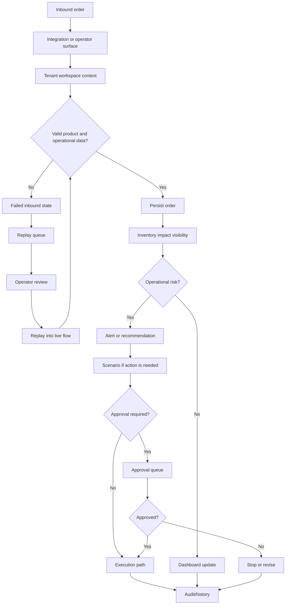
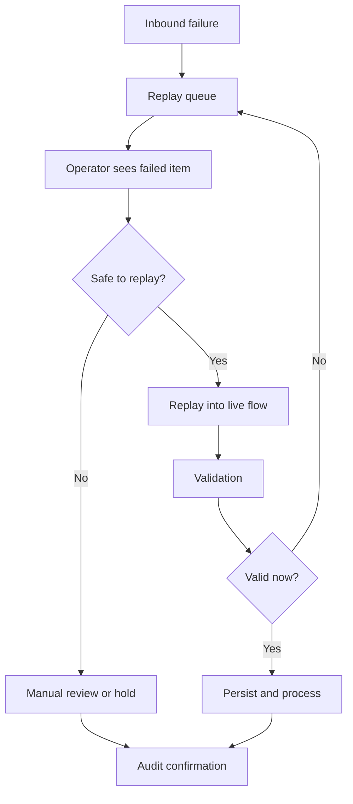
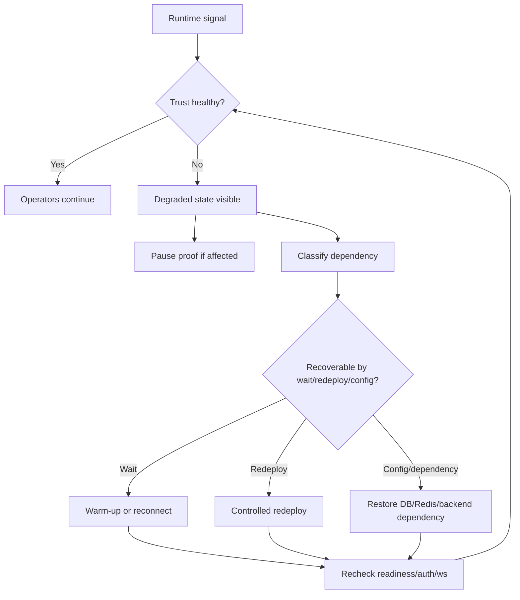

# Business Process Library

This library describes how companies use SynapseCore in operational workflows.

The exact integrations and operating procedures can vary by company, but the product pattern remains consistent: operational work enters, gets validated, becomes visible, triggers guidance when needed, routes approvals when required, and remains recoverable through replay if it fails.

## Process 1: Inbound Order



Business result:

- orders do not disappear when inbound data is unhealthy
- inventory and order pressure become visible
- risky actions can require approval
- recovery is auditable

## Process 2: Inventory Pressure

Trigger examples:

- order demand increases
- warehouse stock becomes constrained
- product availability differs from operational expectation
- planner notices a stock issue

Flow:

```text
Inventory signal
-> dashboard or inventory page
-> alert/recommendation
-> scenario planning if action is needed
-> approval if action is governed
-> execution or rejection
-> audit and realtime visibility
```

What SynapseCore contributes:

- one workspace view of stock pressure
- recommendation and scenario framing
- controlled approval for risky response
- visible history after action

## Process 3: Failed Inbound Recovery

Trigger examples:

- connector disabled
- payload fails validation
- external data cannot be processed safely
- runtime dependency is degraded

Flow:



What SynapseCore contributes:

- failed work remains visible
- replay is intentional, not hidden
- operators can distinguish waiting, failed, and recovered states
- proof can validate recovery behavior

## Process 4: Recommendation To Approval

Trigger examples:

- inventory pressure suggests action
- operational risk needs review
- scenario should not execute without approval

Flow:

```text
Signal
-> recommendation
-> scenario
-> approval queue
-> approve or reject
-> execute, terminate, or revise
-> audit
```

What SynapseCore contributes:

- guidance without unsafe auto-action
- role-aware operational governance
- decision traceability

## Process 5: Runtime Trust Check

Trigger examples:

- backend timeout
- readiness failure
- websocket reconnecting
- DB/Redis unavailable
- connector telemetry stale

Flow:



What SynapseCore contributes:

- live product truth
- safer proof discipline
- fewer false assumptions from frontend-only availability

## Process 6: Operator Daily Control Loop

Daily operators use SynapseCore like this:

```text
Open command center
-> confirm runtime trust
-> inspect dashboard
-> review alerts and recommendations
-> inspect orders/inventory
-> review replay queue
-> act on approvals/scenarios
-> monitor integrations
-> confirm audit/history
```

What stays consistent:

- workspace context
- tenant-scoped visibility
- realtime state
- replay and approval discipline

What changes by company:

- connector sources
- operational thresholds
- approval ownership
- warehouse/site model
- escalation rules
