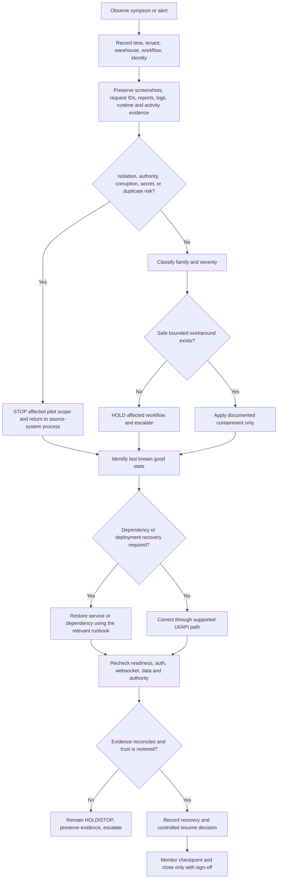
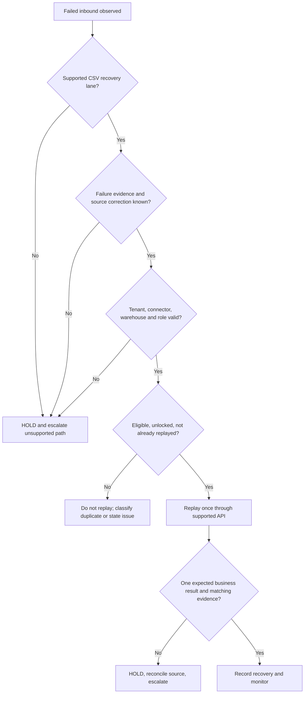

# Company 1 Incident, Rollback, And Recovery Pack

**Status:** Phase 12 operational control document  
**Audience:** Company 1 Pilot Owner, Platform Owner, Tenant Admin, Integration Owner, operators, support, and engineering  
**Scope:** One controlled tenant, one approved operational lane, and the current pilot release candidate  
**Authority:** This pack governs incident response during the Company 1 pilot. It does not expand product scope or replace the source system of record.

## 1. Purpose And Operating Boundary

This pack defines how SynapseCore behaves when an operational workflow, dependency, authority boundary, deployment, or recovery path becomes uncertain. It converts the normal-day controls in the [Company 1 Daily Operator SOP](company-daily-operator-sop.md) into a controlled response model.

The governing rule is:

> **Classify first. Contain second. Recover third. Verify fourth. Resume last.**

The pack is deliberately conservative. It does not claim automatic failover, automatic rollback, automatic database restore, automatic duplicate correction, or automatic customer notification. Those actions remain owned by an identified operator or platform owner unless a current runbook explicitly proves otherwise.

SynapseCore remains an operational coordination and recovery surface. Company source systems remain authoritative for business truth during a pilot incident. When SynapseCore cannot establish trustworthy state, the affected workflow is held or returned to the agreed source-system process.

## 2. Canonical Definitions

### 2.1 Incident

An **incident** is any observed condition that materially reduces confidence in one or more of:

- tenant or warehouse isolation;
- user authority, approval authority, or access identity;
- business data correctness or reconciliation;
- integration and replay safety;
- runtime, database, Redis/session, or realtime trust;
- deployment or release integrity;
- the ability to prove that the pilot lane is safe to continue.

A near miss is recorded as an incident when the condition could have produced material harm even if no incorrect business state was ultimately created.

### 2.2 Event, Alert, Degraded State, And Incident

| Term | Meaning | Required response |
| --- | --- | --- |
| Event | A recorded occurrence or business change with no current evidence of unsafe impact | Observe and retain evidence |
| Alert | A signal that deserves operator attention | Inspect and classify |
| Degraded state | A capability is impaired, but impact and a safe compensating control are understood | Continue only within the bounded control |
| Incident | Trust, safety, recovery, or business continuity requires coordinated action | Assign owner and record response |
| Near miss | A control caught a condition before material impact | Record and review; do not hide it |

### 2.3 Trust Dimensions

Every incident is assessed across five trust dimensions:

1. **Authority trust:** the authenticated identity can perform only intended actions.
2. **Data trust:** the visible and persisted state can be reconciled with the source system.
3. **Runtime trust:** readiness, liveness, database, Redis/session, and application health are understood.
4. **Integration trust:** connector state, inbound evidence, replay eligibility, and duplicate safety are understood.
5. **Realtime trust:** live updates are current enough for the approved workflow, or a known snapshot/manual control is being used.

If one dimension is unknown, the affected workflow is not automatically considered healthy.

## 3. Incident Entry Triggers

Open an incident record when any of the following is observed:

- a user sees another tenant, warehouse, or unauthorized record;
- an allowed or denied action differs from the approved role and warehouse matrix;
- an approval, rejection, escalation, or execution result is not explainable;
- a `PREVIEW` scenario appears executable or creates live side effects;
- a replay item is missing, duplicated, stuck, ineligible, or cannot be reconciled;
- a connector accepts, rejects, or reports an inbound event inconsistently;
- orders, inventory, catalog, or fulfillment state differs from the source system without an explained timing window;
- readiness fails, the backend is hung, or authentication/session cannot be trusted;
- realtime repeatedly reconnects or a stale snapshot could influence a consequential action;
- backup or restore evidence is absent when recovery is required;
- a release or deployment does not match the approved build evidence;
- a secret, credential, session cookie, raw customer payload, or sensitive platform value may have been exposed;
- an operator cannot determine whether a consequential action is safe;
- a previous `HOLD` or `STOP` condition is still unresolved at the next operating checkpoint.

Do not open an incident merely because a harmless browser teardown creates a client-abort or broken-pipe log line. Correlate noise with user-visible failure before escalating it.

## 4. Severity And Operating Decision

Severity describes risk. The operating decision describes whether the approved lane may continue.

### 4.1 Severity

| Severity | Definition | Default action |
| --- | --- | --- |
| `LOW` | Cosmetic, explanatory, or support friction with no authority, data, recovery, or trust risk | Record, correct through support or planned work, continue if the lane remains understood |
| `MEDIUM` | Bounded impairment with a safe workaround and no evidence of isolation, unauthorized authority, corruption, or duplicate risk | Hold the affected sub-flow if needed; assign an owner and review checkpoint |
| `HIGH` | Material workflow, integration, runtime, recovery, or trust concern; the safe boundary is not yet established | Immediate `HOLD`; stop affected actions and escalate |
| `CRITICAL` | Tenant isolation failure, unauthorized authority, corruption, secret exposure, unrecoverable duplicate/wrong-object consequence, or inability to establish operational truth | Immediate `STOP`; preserve evidence and return to the source-system process |

Severity must not be lowered merely because the UI looks normal or because the problem is inconvenient to reproduce.

### 4.2 GO, HOLD, STOP

| Decision | Meaning | Resume condition |
| --- | --- | --- |
| `GO` | The approved lane is trusted for the stated scope and checkpoint | Continue normal operating SOP |
| `HOLD` | A bounded workflow, connector, warehouse, user, or action cannot safely continue | Cause classified, containment in place, and owner authorizes the affected lane |
| `STOP` | Platform trust, authority, isolation, data integrity, or recovery cannot be established | Explicit incident closure, verification evidence, and pilot-owner authorization |

`HOLD` is not a quiet `GO`. `STOP` is not a failure of the pilot; it is a control that prevents uncertain state from becoming customer impact.

## 5. Universal Response Sequence



### 5.1 First Ten Minutes

1. Stop the consequential action that is currently in progress. Do not keep clicking to discover whether the system eventually succeeds.
2. Note the exact time, tenant, workspace, warehouse, page, user role, connector, scenario, replay record, order, or product involved.
3. Decide provisional `GO`, `HOLD`, or `STOP`. Use `HOLD` when the safe boundary is not obvious.
4. Preserve the browser URL, visible state, request ID, response status, screenshot if safe, runtime state, and relevant activity record.
5. Do not retry a mutation, replay, approval, or execution until duplicate and authority checks are understood.
6. Notify the Pilot Owner and the responsible operational owner.
7. Compare against the source system of record and identify the last trusted state.
8. Use the appropriate runbook. Do not improvise database edits or bypass governance.

## 6. Evidence Preservation

### 6.1 Capture

Capture only what is necessary to diagnose the incident:

- incident ID and timestamps with timezone;
- tenant code, workspace, warehouse, workflow, and role, but not passwords;
- page, route, operation, connector, replay ID, scenario ID, order ID, or product SKU as appropriate;
- exact user-visible message and status badge;
- HTTP status and request ID when available;
- `/actuator/health/readiness`, `/actuator/health/liveness`, `/api/auth/session`, and `/ws/info` results when relevant;
- Platform Activity or Tenant Activity reference, runtime state, connector/import/replay state, and release/build reference;
- Playwright report path or test name when the incident arose during proof;
- source-system reconciliation result;
- recent deploy, configuration, role, scope, connector, or data change.

### 6.2 Never Capture

Do not place these in incident records, screenshots, logs, Git, proof JSON, or customer messages:

- passwords, password hashes, session cookies, bearer tokens, bootstrap tokens, or platform-owner credentials;
- connector secrets or customer credentials;
- raw inbound payloads unless an approved secure evidence store is explicitly used;
- unnecessary personal data or customer business data;
- copied `.env` files or browser-visible configuration.

Redact before sharing evidence. A request ID is usually more useful than a copied credential-bearing request.

### 6.3 Trust Decision

The incident owner must state separately:

- authority trusted: yes/no/unknown;
- data trusted: yes/no/unknown;
- runtime trusted: yes/no/unknown;
- integration trusted: yes/no/unknown;
- realtime trusted: yes/no/unknown.

The overall decision cannot be `GO` while a material dimension remains unknown.

## 7. Responsibilities And Escalation

| Role | Primary incident responsibility | Must not do alone |
| --- | --- | --- |
| Company Operator | Stop unsafe action, describe symptom, preserve local evidence | Retry uncertain mutations or replay |
| Tenant Admin | Confirm users, roles, warehouse scope, and tenant settings | Grant emergency authority without approved change control |
| Integration Operator | Inspect failed inbound, eligibility, duplicate state, and replay outcome | Replay when cause, scope, or duplicate state is uncertain |
| Integration Admin | Own connector policy, import lane, and integration containment | Rotate or expose secrets in the incident record |
| Review Owner | Own assigned review decision and evidence | Approve a scenario not assigned to the identity |
| Final Approver | Own assigned final approval for governed execution | Treat preview as executable or bypass assignment |
| Escalation Owner | Acknowledge and coordinate the assigned escalation | Approve, reject, execute, or replay by this role alone |
| Platform Owner | Own platform health, tenant metadata, deployment, runtime, and incident coordination | Browse raw tenant payloads or impersonate tenant users casually |
| Pilot Owner | Decide pilot scope, customer communication, and resume/stop authorization | Close an incident without evidence and sign-off |
| Engineering/Incident Owner | Diagnose code/deployment/data issues and provide correction evidence | Make a manual DB edit as an unrecorded workaround |

For a security, isolation, secret, or authority concern, notify the Pilot Owner and Security/Incident Owner immediately. For a connector or replay concern, include the source-system owner.

## 8. Incident Family Matrix

| Family | Typical symptoms | Default decision | Primary reference |
| --- | --- | --- | --- |
| Access and session | Login fails, stale identity, sign-out does not clear access, unexpected role | `HOLD`; `STOP` if authority is widened | [Support Playbook](support-playbook.md), [Role Authority Gate](role-authority-hardening-gate.md) |
| Tenant isolation | Foreign tenant/workspace/warehouse data or action appears | `STOP` immediately | [Platform Control Plane Access Boundary](platform-control-plane-access-boundary.md) |
| Warehouse scope | Correct role works in wrong warehouse or wrong warehouse is visible | `HOLD` or `STOP` depending on impact | [Company Daily Operator SOP](company-daily-operator-sop.md) |
| Data mismatch | Catalog, inventory, order, or fulfillment differs from source | `HOLD` affected lane | [Data Flow Playbook](data-flow-playbook.md), [Company Data Onboarding](company-data-onboarding-runbook.md) |
| Connector | Connector disabled, stale, malformed, or source unavailable | `HOLD` connector lane | [Integration Operations](integration-operations.md) |
| Failed inbound/replay | Failed item missing, stuck, duplicate risk, or outcome unclear | `HOLD` replay lane | [Replay Recovery](replay-recovery.md) |
| Governance | Approval ownership, preview execution, or escalation assignment is wrong | `STOP` consequential action; otherwise `HOLD` | [Role Authority Gate](role-authority-hardening-gate.md) |
| Realtime | Reconnecting, stale snapshot, missing event, or delayed event | `HOLD` realtime-dependent action | [Operations Reliability](operations-reliability.md) |
| Runtime/backend | Readiness down, backend hung, DB/Redis unavailable | `HOLD` or `STOP` all affected work | [Deployment Recovery](deployment-recovery-guide.md) |
| Backup/restore | Backup missing, restore cannot be read, or recovery target uncertain | `STOP` if data recovery is required | [Backup Restore Runbook](backup-restore-runbook.md) |
| Deployment/release | Wrong revision, startup failure, migration issue, or regression | `HOLD` release; rollback only through approved process | [Release Engineering](release-engineering.md) |
| Security | Secret exposure, CORS/auth bypass, rate-limit bypass, suspicious access | `STOP` affected scope | [Security And Trust Model](security-and-trust-model.md) |
| Support/noise | Client abort, broken pipe, slow telemetry without user impact | Usually `GO` with observation | [Failure Classification Matrix](failure-classification-matrix.md) |

## 9. Access, Tenant, And Warehouse Incidents

### 9.1 Login, Session, Or Stale Access

**Symptoms:** login fails, session endpoint differs from the UI identity, sign-out leaves an authenticated request possible, or a disabled user continues to act.

1. Set the affected user/workflow to `HOLD`.
2. Capture the visible identity, role, workspace, route, status code, and request ID without capturing credentials.
3. Check `/api/auth/session` and the user's active/disabled state through the authorized admin path.
4. Sign out and retry with a fresh session only after recording the stale result.
5. If a disabled or wrong-role identity can perform a protected action, classify `HIGH` or `CRITICAL` and `STOP` the affected scope.
6. Do not rotate production credentials merely to make an incident report green.
7. Resume only after fresh-session identity, allowed actions, denied actions, and sign-out are verified.

### 9.2 Tenant Isolation Or Platform Boundary

Foreign tenant data, foreign Tenant Activity, unintended tenant acquisition, or access to `/api/platform/*` from a tenant identity is a `CRITICAL` stop condition.

1. Stop all pilot actions for the affected session and tenant.
2. Do not continue probing with customer data. Use synthetic fixtures or approved read-only evidence.
3. Preserve route, role, request ID, affected object class, and response status.
4. Notify Platform Owner, Pilot Owner, and Security/Incident Owner.
5. Do not browse raw payloads while diagnosing the platform control plane; its boundary is metadata-first.
6. Resume only after backend denial/allowance is proven, not merely after navigation is hidden.

### 9.3 Warehouse Scope

Wrong-warehouse reads or writes are a `HIGH` concern and become `CRITICAL` if an incorrect business mutation occurred.

1. Hold the user's affected workflow and preserve the warehouse scope before/after evidence.
2. Compare session identity, role, assigned warehouse list, request context, and business object warehouse.
3. Check both allowed and denied backend responses using a fresh authorized session.
4. Reconcile any mutation with the source system and inspect duplicates or wrong-object consequences.
5. Treat empty warehouse scope as tenant-wide authority and require explicit review.

## 10. Data, Catalog, Inventory, Orders, And Fulfillment

When SynapseCore and the source system disagree:

1. Stop downstream actions that rely on the disputed value.
2. Identify whether the mismatch is timing, source data, mapping, validation, persistence, display, or replay related.
3. Record object identifiers and expected/current values without copying unnecessary payloads.
4. Establish the last known good state from the source system and the last trusted SynapseCore evidence.
5. Do not manually edit production tables to repair the display.
6. Correct through the supported API or import path after cause and authority are understood.
7. Reconcile catalog, inventory, orders, alerts/recommendations, and audit/activity after correction.
8. Resume only when the operator-visible state and source truth agree for the approved scope.

Inventory writes require the tenant-admin authority and warehouse rules. Direct operational order and fulfillment writes require the approved integration roles and warehouse scope. A UI that hides a button is not evidence of backend protection.

## 11. Connector And Failed-Inbound Incidents

### 11.1 Connector Failure

**Symptoms:** connector degraded, source unavailable, malformed input, disabled policy, stale telemetry, or repeated import failure.

1. Set the connector lane to `HOLD` if freshness or duplicate risk exists.
2. Record connector identity, type, policy/state, source owner, import ID, failure classification, and time window.
3. Confirm the source system remains authoritative.
4. Do not keep resubmitting identical input while cause is unknown.
5. Correct source or mapping through the supported configuration/data path.
6. Confirm one failure record, one correction, expected import/replay evidence, and final business state.

### 11.2 Proven Company 1 Recovery Lane

The approved Company 1 recovery lane is:

```text
CSV input fails
    -> failure/import evidence is visible
    -> cause or source data is corrected
    -> eligible replay record is identified
    -> Integration Operator/Admin verifies tenant, connector, warehouse, lock, eligibility and duplicate state
    -> replay is performed once
    -> order/business result is reconciled
    -> activity/runtime/replay evidence is retained
```

The operator must not replay when any of these are unknown:

- source correction;
- tenant or connector ownership;
- warehouse scope;
- replay eligibility or lock state;
- duplicate or already-replayed state;
- expected final business result.

### 11.3 Disabled Webhook Boundary

Disabled-webhook failure evidence can be recorded, but deterministic filtered replay-queue readback is not currently proven on Render. The pilot must use the proven CSV failed-inbound recovery lane unless this limitation is resolved and live-proven.

If a customer requires webhook-disabled recovery:

1. classify the requested path as outside the approved lane;
2. place that connector/workflow on `HOLD`;
3. do not improvise database edits or unsupported replay;
4. escalate as `MEDIUM` for the current pilot limitation, or `HIGH` if the customer's pilot depends on it;
5. document the source-system fallback.

## 12. Replay, Duplicate Prevention, And Recovery Verification

Replay is a governed, manual recovery action. It is not a generic retry button.

### 12.1 Replay Decision Tree



### 12.2 After Replay

Verify:

- replay record state and outcome;
- exactly one expected order/business result;
- no duplicate order or item;
- inventory and fulfillment implications;
- Tenant Activity and audit readback;
- connector/import/replay status;
- dashboard snapshot and realtime update when relevant;
- source-system reconciliation;
- operator and incident record.

Do not describe a replay as successful because the HTTP response was `200` alone.

## 13. Approval, Scenario, And Execution Incidents

The supported governed path is:

```text
scenario planning
    -> saved governed plan
    -> assigned Review Owner approval
    -> assigned Final Approver approval where required
    -> assigned Escalation Owner acknowledgement when required
    -> executable governed state
    -> controlled execution
    -> order/audit/activity/realtime confirmation
```

Rules:

- `PREVIEW` is planning evidence and must not execute live orders;
- an unassigned Review Owner or Final Approver must be denied;
- wrong warehouse scope must be denied;
- an Escalation Owner acknowledges assigned escalation but does not approve or execute by that role alone;
- hidden navigation is insufficient; direct route and backend denial must be tested;
- a failed or ambiguous approval action is a `HOLD` on execution, not a reason to retry blindly.

When governance is wrong:

1. stop scenario execution and approvals in the affected scope;
2. preserve scenario ID, type, owner assignment, identity, warehouse, status, and response;
3. verify whether any order or downstream side effect was created;
4. use fresh sessions to retest assigned, different-owner, and wrong-warehouse outcomes;
5. classify as `HIGH`; classify `CRITICAL` if unauthorized execution or cross-tenant impact occurred;
6. resume only after live authority evidence matches the approved matrix.

## 14. Realtime And Runtime Incidents

### 14.1 Realtime Reconnecting Or Stale Snapshot

`/ws/info` and the product connection state are evidence, not decoration.

1. Mark realtime as `DEGRADED` or `HOLD` for actions requiring freshness.
2. Check backend readiness, Redis/session posture, `/ws/info`, browser connection state, and recent runtime/activity evidence.
3. Do not infer that a static dashboard is current because the frontend shell is reachable.
4. Use the approved snapshot/manual fallback only when the operator can see its timestamp and the workflow tolerates it.
5. For a missing consequential event, reconcile the backend snapshot and source system before acting.
6. Resume realtime-dependent work after connection stability and expected event delivery are verified.

### 14.2 Runtime Trust

`HEALTHY` means the approved lane's dependencies and evidence are trusted. `DEGRADED` means impact is understood and bounded. `HOLD` means the affected workflow cannot safely start. `STOP` means truth, authority, isolation, or integrity cannot be established.

Runtime incidents include stale runtime snapshots, connector telemetry lag, repeated auth failures, incident feed disagreement, and unexplained readiness transitions. They are handled as operational trust issues even when no data mutation has yet failed.

## 15. Database, Redis, Readiness, And Backend Incidents

### 15.1 Database Down Or Unreachable

Symptoms may include readiness failure, backend startup failure, Flyway failure, Hikari failure, auth/session failure, replay unavailable, or scenario state unavailable.

1. Stop hosted proof and affected pilot actions.
2. Confirm whether the frontend is merely reachable as a static deployment.
3. Check liveness versus readiness. Liveness alone does not establish database readiness.
4. Inspect backend logs and provider/deployment state.
5. Restore the database dependency or restart the service through the approved deployment process.
6. Verify migrations, Hikari, JPA/EntityManager, Tomcat, Redis/session, readiness, auth, and websocket in that order.
7. Reconcile business state and open incidents before resuming.

### 15.2 Redis Or Session Unavailable

Treat login/session failure, session identity drift, or websocket degradation as potentially related to Redis. Do not bypass production session controls with header assumptions. Restore the dependency, establish fresh sessions, and verify sign-in, sign-out, role identity, and protected API denial.

### 15.3 Backend Hung Or Frontend-Only Reachability

A live frontend shell is not backend readiness. If frontend is `UP` and backend/readiness is not:

- classify backend/runtime as `HIGH`;
- stop proof and backend-dependent pilot actions;
- do not change frontend code to mask the state;
- follow the Render or local recovery playbook;
- rerun connection checks only after the backend is warm and dependencies are healthy.

## 16. Backup, Restore, And Data Recovery

The repository proves an application-level PostgreSQL backup/restore drill. Provider-managed Render backup retention and restore behavior are not proven in repository evidence.

### 16.1 Before Restore

Confirm:

- why restore is safer than forward repair;
- the target database and environment;
- backup timestamp and expected data-loss window;
- backend is stopped or protected from writes;
- schema/migration version matches the approved release;
- the restore owner and approval are recorded;
- customer communication and source-system reconciliation plan exist.

### 16.2 Restore Sequence

1. `STOP` the affected pilot scope.
2. Preserve current logs, runtime state, release reference, and incident evidence.
3. Identify the approved backup and verify it is readable.
4. Stop backend writes and perform restore using the [Backup And Restore Runbook](backup-restore-runbook.md).
5. Start the backend and confirm Flyway/JPA/Hikari/Tomcat/Redis/session startup.
6. Run health, readiness, auth, and websocket checks.
7. Reconcile restored data with the source system for the loss window.
8. Recheck duplicate safety, replay eligibility, approvals, audit, and runtime evidence.
9. Run hosted proof only when all prerequisites are healthy and the release requires it.
10. Resume only with Pilot Owner authorization.

Never delete a local or provider volume casually. A reset can destroy the only available evidence or pilot data.

## 17. Rollback And Deployment Recovery

Rollback is a release-control action, not a first response to every error.

### 17.1 Rollback Criteria

Consider rollback when:

- the approved release introduces a reproducible Critical or High defect;
- migrations or startup cannot complete;
- a proof-critical flow regresses after deployment;
- a security/authority boundary is weakened;
- the prior release is known good and rollback will reduce risk without destroying newer data.

Do not roll back merely because a cold start is slow, a client-abort appears in logs, or a known documented limitation remains unchanged.

### 17.2 Deployment Recovery Sequence

1. Freeze further deploys and set affected scope to `HOLD` or `STOP`.
2. Capture deployment ID, service logs, release commit, health/readiness, auth, websocket, and request IDs.
3. Compare the deployed revision with the approved release evidence.
4. Decide forward fix versus rollback with the Incident Owner and Pilot Owner.
5. If rollback is approved, preserve database migration compatibility and data-loss implications.
6. Redeploy/restart through the provider process; do not manually patch a running container.
7. Warm the service and verify liveness, readiness, auth, websocket, and affected flow.
8. Reconcile data and evidence.
9. Rerun the relevant focused check or full hosted proof when behavior/proof coverage changed.
10. Record the resume decision and monitoring window.

### 17.3 Render-Specific Interpretation

Render cold starts can produce an initially slow request. A warm-up delay alone is not a failed release. A liveness response with readiness failure indicates that the process is alive but not trustworthy for backend-dependent operations. Frontend `200` with backend timeout indicates a split deployment state, not a healthy platform.

## 18. Security And Platform Owner Incidents

The Platform Owner operates a separate control-plane boundary. The normal platform control plane may expose tenant metadata, aggregate health/support state, connector status, attention counts, platform activity metadata, and runtime/platform health. It must not expose raw customer orders, order items, product data, inventory data, inbound/replay payloads, connector secrets, or customer credentials.

For suspected security or privacy failure:

1. `STOP` the affected scope.
2. Do not copy or inspect more data than needed to establish the category.
3. Preserve request IDs, role/session class, endpoint, response status, and timestamp.
4. Revoke or disable affected access through the supported control path when authorized.
5. Rotate secrets only through the approved secret-management process; never put new credentials in the incident record.
6. Assess whether the issue is tenant isolation, role authority, CORS, rate limiting, secret leakage, session revocation, or support-boundary exposure.
7. Notify Security/Incident Owner, Platform Owner, Pilot Owner, and the customer contact when required.
8. Resume only after backend denial/allowance and evidence handling are verified.

## 19. Customer Communication

Communication must be factual, scoped, and free of unsupported assurances.

### Degraded

> SynapseCore is degraded in **[specific capability]** for **[scope]** from **[time]**. The affected workflow is **[continuing under control / on hold]**. The compensating control is **[control]**. We will review again at **[checkpoint]**.

### Hold

> The **[workflow/warehouse/connector]** lane is on hold while we investigate **[factual condition]**. No replay or consequential action is being authorized until **[condition]** is verified. The agreed source-system process remains authoritative.

### Stop

> The affected pilot scope is stopped because operational trust cannot currently be established for **[reason/category]**. We are preserving evidence and following the recovery procedure. Resumption requires verification and explicit authorization.

### Recovery

> The supported recovery for **[scope]** completed at **[time]**. We verified **[health/authority/data/replay/realtime checks]** and reconciled against **[source/system]**. Monitoring continues until **[checkpoint]**.

Do not promise zero data loss, instant recovery, automatic rollback, or a fixed recovery time unless the applicable service agreement and evidence support that statement.

## 20. Incident Status Model

| Status | Meaning |
| --- | --- |
| `OPEN` | A condition is being assessed; no closure decision yet |
| `CONTAINED` | Affected actions are stopped or bounded; evidence is preserved |
| `MITIGATING` | A supported correction, restore, rollback, or replay is in progress |
| `VERIFYING` | Recovery action completed; trust and business reconciliation are being checked |
| `MONITORING` | The lane resumed with a defined observation checkpoint |
| `CLOSED` | Cause, impact, evidence, owner, and follow-up are recorded and signed off |
| `REOPENED` | New evidence shows the prior closure was incomplete or the condition returned |

An incident may not move from `MITIGATING` to `CLOSED` merely because the endpoint returned `200`.

## 21. Required Incident Record

Use [Company Incident Recovery Record](templates/company-incident-recovery-record.md) for every material incident and near miss. At minimum it must contain:

- incident reference, detected time, tenant/workspace/warehouse, workflow, observer, category, severity, and `GO`/`HOLD`/`STOP`;
- symptom, immediate impact, affected capability, last known good state, and customer/source-system impact;
- authority, data, runtime, integration, and realtime trust decisions;
- evidence references, request IDs, activity/runtime/release references, and recent changes;
- containment owner, root-cause owner, correction, rollback/restore/replay action, and duplicate check;
- recovery verification, reconciliation result, communications, risk, reopen rule, closure owner, and sign-off.

## 22. Last Known Good And Root Cause

### 22.1 Symptom

Write what was observed, by whom, at what time, on which route or workflow. Do not write a theory as a symptom.

### 22.2 Immediate Cause

Record the proximate condition that stopped or altered the workflow: database unavailable, wrong role response, malformed CSV, stale snapshot, connector disabled, or deployment startup failure.

### 22.3 Root Cause

Record the confirmed underlying cause only after evidence supports it. If unknown, write `UNKNOWN - INVESTIGATION OPEN`; do not guess.

### 22.4 Last Known Good

Identify the last timestamp and evidence reference at which:

- the correct tenant/warehouse and role were verified;
- the relevant data matched the source system;
- connector/replay state was understood;
- readiness/auth/websocket were healthy when relevant;
- the deployed revision and configuration were known.

## 23. Recovery Verification And Reopen Rules

Recovery verification must match the incident family:

- access: fresh session, allowed/denied actions, direct route/API checks, sign-out;
- tenant/warehouse: foreign and wrong-scope denial plus business reconciliation;
- data: source comparison, duplicate check, audit/activity readback;
- replay: supported lane, one replay, one expected result, replay and source evidence;
- governance: assigned owner allowed, different owner denied, wrong warehouse denied, preview denied, governed path allowed;
- runtime: health, readiness, auth, websocket, snapshot freshness, and runtime/activity agreement;
- deployment: revision, startup, migration, focused proof, and affected user flow;
- security: denial, revocation/rotation evidence, leakage scan, and approved incident review;
- restore: readable backup, startup, schema, reconciliation, and pilot-owner approval.

Reopen when:

- the same symptom returns inside the monitoring window;
- evidence conflicts after closure;
- a previously unknown trust dimension becomes negative;
- reconciliation reveals a duplicate, missing, wrong-scope, or wrong-object result;
- a customer reports impact not covered by the original scope;
- the workaround masks rather than corrects the cause.

## 24. Realistic Incident Examples

### Example A: Frontend Open, Backend Unavailable

The public shell returns `200`, but readiness and auth time out. Classification: `HIGH`, `HOLD` backend-dependent work, `PROOF_ALLOWED=False`. Do not edit frontend code or run hosted proof. Restore backend dependencies, then rerun live connection checks.

### Example B: CSV Failure And Safe Replay

A corrected CSV failure is visible, the Integration Operator has the right warehouse, the item is eligible and not replayed, and the source system confirms the correction. Replay once, reconcile one order result, retain evidence, and monitor. Classification: controlled recovery, `GO` after verification.

### Example C: Replay Item Missing For Disabled Webhook

The disabled webhook records failure evidence but filtered replay readback is empty on Render. Classification: `MEDIUM` current limitation, `HOLD` that webhook lane, use the proven CSV path, and do not manually insert a replay row.

### Example D: Wrong Review Owner Attempts Approval

The different Review Owner receives backend denial and no approval state changes. Classification: `LOW` or `MEDIUM` test observation if expected; `HIGH` if allowed. Preserve response and continue only after the assigned-owner path is verified.

### Example E: Preview Execute Attempt

An execute request for `PREVIEW` returns state rejection and creates no order side effect. This is expected governance behavior. Record as a successful control check, not as an incident.

### Example F: Realtime Reconnecting During a Consequential Action

The dashboard is visible but the socket is reconnecting and snapshot age is unknown. Classification: `MEDIUM` or `HIGH` according to the action. Hold the action, verify snapshot and backend state, and resume only with explicit freshness evidence.

### Example G: Provider Restore Required

The database is corrupted or unavailable and a provider restore is proposed. Classification: `HIGH` or `CRITICAL` depending on integrity/availability. Stop writes, preserve evidence, confirm backup timestamp and loss window, obtain approval, restore, reconcile, and re-prove. Do not claim provider restore capability has been tested if it has not.

## 25. Manual Versus Automated Actions

### Currently manual or operator-controlled

- incident classification and severity;
- GO/HOLD/STOP decision;
- customer communication;
- connector disablement and change approval;
- replay eligibility review and manual replay;
- approval and execution authority;
- backup/restore approval and execution;
- deployment rollback decision;
- data reconciliation;
- closure and sign-off.

### Supported checks and evidence tooling

- live/local connection scripts;
- readiness, liveness, auth-session, and websocket checks;
- frontend verification and hosted proof;
- application-level PostgreSQL backup/restore drill tooling;
- controlled pilot load and realtime checks;
- documentation, secret, and repository hygiene checks.

### Not claimed as automatic

- HA failover;
- provider-managed backup restore;
- queue-backed worker recovery;
- automatic rollback;
- automatic replay or duplicate correction;
- automatic incident classification;
- automatic customer notification;
- unrestricted self-service tenant provisioning.

## 26. Carried Pilot Limitations

These are accepted boundaries, not hidden defects:

- disabled-webhook replay/readback is not deterministic on Render; Company 1 uses CSV failed-inbound recovery;
- import-run records do not carry authoritative warehouse association, limiting further least-privilege filtering;
- provider-managed Render backup retention and restore have not been drilled in repository evidence;
- Gate 3 scale evidence is local, synthetic, single-backend, single-PostgreSQL, single-Redis, and pilot-sized;
- there is no proven HA, automatic failover, horizontal realtime scale, multi-region posture, or queue-backed worker separation;
- enterprise SSO/SAML/OIDC, MFA, and broader delegated administration are not the current default platform story;
- the source system remains authoritative and the pilot is limited to one controlled lane and a small operator group.

A limitation becomes a `HIGH` blocker when the customer's approved pilot depends on the unsupported path. It must not be downgraded to preserve a green report.

## 27. Phase 12 Completion Gate

Phase 12 is complete when:

1. the Company 1 incident owner and escalation contacts are named;
2. the incident record template is available without secrets;
3. operators understand `LOW`/`MEDIUM`/`HIGH`/`CRITICAL` and `GO`/`HOLD`/`STOP`;
4. the source-system fallback is confirmed;
5. the proven CSV replay lane and unsupported webhook limitation are understood;
6. backup/restore, deployment, runtime, security, access, and governance boundaries are acknowledged;
7. evidence preservation and customer communication rules are ready;
8. no unresolved Critical or High incident exists for the approved pilot scope;
9. Phase 13 remains out of scope until the pilot produces real evidence and the Pilot Owner authorizes the next phase.

## 28. Quick Reference Commands

These commands check state; they do not repair production or replace incident ownership.

```powershell
cd C:\Users\asus\Downloads\synapsecore_starter\synapsecore

powershell -ExecutionPolicy Bypass -File scripts\check-live-connections.ps1
powershell -ExecutionPolicy Bypass -File scripts\check-local-connections.ps1
powershell -ExecutionPolicy Bypass -File scripts\docs-link-check.ps1
```

Direct endpoint checks for the live deployment:

```powershell
curl.exe -i https://synapscore-3.onrender.com/actuator/health/liveness
curl.exe -i https://synapscore-3.onrender.com/actuator/health/readiness
curl.exe -i https://synapscore-3.onrender.com/api/auth/session
curl.exe -i https://synapscore-3.onrender.com/ws/info
```

Run hosted proof only when the connection classification reports:

```text
FRONTEND_UP=True
BACKEND_UP=True
DB_READY=True
AUTH_READY=True
WS_READY=True
PROOF_ALLOWED=True
```

The command checks do not authorize a customer-facing resume by themselves. They are evidence for the incident owner's decision.

## 29. Related Canonical References

- [Company 1 Daily Operator SOP](company-daily-operator-sop.md)
- [Company 1 Day-One Pilot Guide](company-day-one-pilot-guide.md)
- [Pilot Rollback And Escalation](pilot-rollback-and-escalation.md)
- [Support Playbook](support-playbook.md)
- [Failure Classification Matrix](failure-classification-matrix.md)
- [Deployment Recovery Guide](deployment-recovery-guide.md)
- [Render Recovery Playbook](render-recovery-playbook.md)
- [Backup And Restore Runbook](backup-restore-runbook.md)
- [Replay And Recovery Guide](replay-recovery.md)
- [Platform Control Plane And Tenant Access Boundary](platform-control-plane-access-boundary.md)
- [Role Authority Hardening Gate](role-authority-hardening-gate.md)
- [Performance And Scale Proof](performance-scale-proof.md)
- [Security And Trust Model](security-and-trust-model.md)
- [API Surface Reference](api-surface-reference.md)

## Final Operating Principle

An incident is not closed when the page looks normal. It is closed when the team can explain what happened, preserve the evidence, establish the last known good state, restore the supported boundary, reconcile business truth, verify authority and runtime trust, communicate accurately, and obtain explicit authorization to resume.
