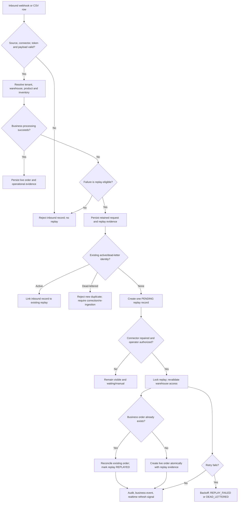

# Integrations / Ingestion Phase 2 Evidence

## Scope

This evidence closes the final Integrations / Ingestion phase for the current controlled-pilot scope. It covers failed inbound orders, replay eligibility, duplicate safety, connector recovery, scheduled pull behavior, warehouse and tenant authority, operational visibility, and the boundary between stored recovery evidence and live business truth.

The starting repository revision was `16c2f2b7d66b717add1b73fe5f784f7aa29531d2`, after Integrations / Ingestion Phase 1. Phase 2 adds replay-identity reconciliation and focused coverage without changing the frontend runtime or the external product scope.

## Classification

- **A - Release blocker:** a supported pilot path is incorrect, unsafe, or silently violates tenant, warehouse, authority, or business-identity rules.
- **B - Pilot contract:** behavior intentionally supported and bounded for the current controlled deployment.
- **C - Evidence gap / hardening:** behavior needs PostgreSQL, multi-process, fault-injection, browser, or live-deployment evidence, but no repository evidence currently demonstrates a release-blocking defect.
- **D - Future evolution:** outside the current supported pilot scope.

## Replay model

The replay record retains the normalized order request, including tenant, source system, connector type, external order ID, warehouse, items, quantities, and prices. Replay uses this retained request rather than silently reconstructing the order from a changed connector policy. Business order identity is tenant-scoped by the existing `CustomerOrder` uniqueness rule for `externalOrderId`; the new active replay identity is tenant plus external order ID.

## Eligibility and identity matrix

| Failure | Replay eligibility | Operator meaning |
| --- | --- | --- |
| `CONNECTOR_DISABLED` | Eligible, manual-only while disabled | Repair or enable the connector, then use manual replay. |
| `PRODUCT_NOT_FOUND` | Eligible | Correct catalog data, then replay. |
| `INVENTORY_NOT_FOUND` | Eligible | Correct warehouse/product inventory, then replay. |
| `INSUFFICIENT_INVENTORY` | Eligible | Reconcile stock, then replay. |
| `DUPLICATE_EXTERNAL_ORDER_ID` | Not eligible | Existing business identity is authoritative; do not create another order. |
| Missing external ID, items, warehouse, source, invalid token, strict policy mismatch, unsupported mapping, or invalid source data | Not eligible | Correct the source payload or connector configuration and re-ingest. |
| `UNKNOWN` | No automatic eligibility guarantee | Investigate manually; internal or unclassified failure must not be hidden. |

The request payload is an evidence snapshot. Connector enablement, mapping, validation, and fallback policies may change after failure, but those changes do not reroute the retained request into a different business identity. A replay still requires the current connector to be enabled unless the existing order can be reconciled, and it still validates the retained warehouse against the acting operator's scope.

## Evidence results

### Replay and duplicate safety

1. A repeated failed delivery with the same tenant and external order identity now reuses one active `PENDING` or `REPLAY_FAILED` replay record. Each inbound record remains linked to that record; duplicate recovery work is not created.
2. An identity that is already `DEAD_LETTERED` is not presented as newly queued. A later duplicate inbound is rejected with source-correction or manual re-ingestion guidance.
3. If another supported path has already created the business order, replay reconciles the existing tenant-scoped order and marks the replay `REPLAYED` without creating a duplicate order.
4. The existing external-order uniqueness boundary remains authoritative. Replay does not bypass tenant scoping or business identity rules.

### Connector repair

Disabled CSV connector failures are recorded immediately with `CONNECTOR_DISABLED`, remain visible in the replay queue, and do not create a business order. Automated replay skips manual-only disabled-connector records. After connector repair, manual replay can proceed once the actor is authorized; a successful replay is not processed a second time.

The same operational contract applies to the supported webhook path where connector resolution identifies the tenant. The current frontend and backend preserve failure code, message, source, warehouse, attempt count, eligibility, and connector state for operator diagnosis. Disabled-webhook browser readback is not claimed as separately rendered proof here unless the current proof run explicitly exercises it.

### Authority and warehouse scope

The replay controller requires integration read access for queue visibility and integration operator access for mutation. `INTEGRATION_OPERATOR` and `INTEGRATION_ADMIN` satisfy the integration-operator policy; unrelated tenant roles are denied by the backend even when navigation is hidden. Replay records are queried with tenant qualification, and warehouse-scoped operators must have access to the replay record's immutable warehouse. Tenant-wide administrators are not given a warehouse restriction by an empty scope.

The operator's warehouse scope is checked again at replay time. A record cannot be moved to another warehouse by changing the request at the UI, and a direct URL or API call does not replace backend authority. Platform control-plane access is a separate boundary and is not a tenant replay mutation path.

### Concurrency and transactions

Manual replay uses a pessimistic row lock for the replay record and an independent transaction for each business attempt. Automated replay selects a bounded batch, but each `IntegrationReplayRecord` executes as an independent transactional recovery unit rather than sharing one batch transaction. If a replayable business attempt fails, its order, reservation, fulfillment, and success evidence roll back together; the replay failure state, audit, and metrics are then committed in a fresh transaction after the record is re-locked and re-checked. The new repository lookup and PostgreSQL partial unique index prevent duplicate active replay identities for a tenant and external order ID.

The current Render topology has one backend web service with the scheduled pull worker enabled. Therefore scheduled-worker overlap across multiple application instances is a controlled-pilot boundary, not a claimed horizontally scaled guarantee. Do not scale scheduled pull or realtime consumers horizontally until a lease/claim or equivalent distributed coordination mechanism exists.

Order creation, reservation, fulfillment setup, replay state, inbound state, audit, and business events follow the existing service transaction boundaries. If live order processing fails before completion, the transaction does not leave a false completed business result. If an existing order is found, reconciliation marks recovery complete without creating a second order.

### Attempts, backoff, and dead letters

Replay attempts increment only when an actual replay/preflight attempt is made. The configured default backoff is 300 seconds and the default maximum is three attempts. Retryable failures remain `REPLAY_FAILED` until eligible; exhaustion produces `DEAD_LETTERED`, clears the next eligibility time, emits the dead-letter operational signal, and keeps the record visible for manual review. Manual replay of a dead-lettered record is blocked; source correction and re-ingestion are required.

### CSV, scheduled pull, and inbound boundaries

The supported inbound types are `WEBHOOK_ORDER` and `CSV_ORDER_IMPORT`; the connector mapping is the current supported mapping version rather than an arbitrary transformation engine. CSV processing is per row/order. Invalid source rows are rejected and do not create replay records. Failed valid rows retain individual replay evidence; a whole file is not replayed as one opaque transaction.

Scheduled pull uses a stable external order ID and feeds the same tenant-scoped order/replay path. Partial batch outcomes are represented in pull/import telemetry. There is no cursor/checkpoint or distributed worker claim model yet. Those are deliberate pilot boundaries.

### Operational visibility

The Integrations surface exposes connector state, last failure code/message, source, support ownership, import/pull telemetry, replay depth, and dead-letter attention. The Replay surface exposes replay identity, source, warehouse, failure, attempts, last attempt, eligibility, and connector state; it disables or blocks action when the record is not currently eligible. The backend remains authoritative if the browser state is stale.

Dashboard integration pressure is derived from the tenant-scoped replay service. Activity/audit entries identify the replay action, actor, source, external order, and replay record; dead-letter signals include tenant/source/order/failure context without exposing connector secrets or raw payloads. Realtime publishes a tenant-scoped operational refresh signal such as `integration-replay`, not the retained business payload.

### Policy, token, and connector changes

Connector token values are stored as hashes with a non-secret hint. Rotating a token causes subsequent authentication to use the new hash; direct in-flight token-rotation behavior is a C evidence gap rather than a claim. Connector enablement, mapping, validation, fallback, and warehouse changes are persisted through the connector administration path. A replay retains its original request identity and does not silently adopt mutable source data.

### No outbound execution

Replay creates or reconciles SynapseCore's internal business order and evidence. It does not call an external ERP, WMS, ecommerce, or source-system execution endpoint. External execution remains the authoritative system's responsibility and is outside this phase.

## Frontend and proof boundary

The frontend has separate Integrations and Replay surfaces for diagnosis and action. Hidden controls are not treated as security; backend authorization and warehouse checks are the source of truth. Existing hosted proof covers the supported tenant-admin, integration, replay, scenario, inventory, and realtime paths. This Phase 2 repository work adds focused local integration coverage for duplicate failed delivery and existing-order reconciliation.

The following are intentionally not claimed as completed by this repository-local phase: a fresh six-role browser replay walk-through, a multi-process PostgreSQL race rehearsal, two independent live connectors colliding on one identity, fault injection after order creation and before evidence finalization, scheduled telemetry overlap, live token rotation while a request is in flight, or a platform-owner browser walk-through. These are operational or deployment evidence items, not reasons to weaken the supported replay contract.

## Focused tests

Added to `MvpFlowIntegrationTest`:

- `duplicateFailedIntegrationDeliverySharesOneActiveReplayRecord`
- `replayReconcilesExistingBusinessOrderWithoutCreatingDuplicate`

The focused run passed both tests with zero failures and zero errors. The full backend result after the Phase 2 changes was **230 tests, 0 failures, 0 errors, and 0 skipped**.

## Limitations and future hardening

Current controlled-pilot limits include the two supported inbound connector types, mapping v1, no arbitrary transformation engine, no outbound execution, tenant-global external order identity, no pull cursor/checkpoint, no distributed scheduled-worker lease, no explicit evidence-retention policy, no HMAC/OAuth/mTLS connector authentication, no generic secret vault, known-DTO payload redaction only, generic realtime refresh signals, and no claim of multi-instance PostgreSQL replay race proof.

Future evolution should add a connector capability model, durable queue and worker separation, distributed claim/lease semantics, versioned mapping/policy snapshots, source cursors/checkpoints, stronger connector authentication, secret management, payload-retention controls, PostgreSQL and multi-process concurrency rehearsals, and richer replay observability. None is required to disguise or weaken the current pilot evidence.

## Final classification

- **Classification A remaining:** 0 after active replay deduplication and existing-order reconciliation fixes.
- **Classification B:** supported replay eligibility, retained identity, tenant/warehouse authority, connector repair, bounded retry/dead-letter behavior, CSV per-row recovery, no outbound execution, single-backend scheduled-worker topology, and current frontend operational visibility.
- **Classification C:** PostgreSQL/multi-process race proof, cross-connector collision rehearsal, fault injection around finalization, scheduled telemetry overlap, in-flight token/connector changes, fresh browser recovery proof, and live platform-owner walkthrough.
- **Classification D:** distributed queue/worker architecture, lease/claim scheduling, policy versioning, cursors/checkpoints, advanced connector authentication, generic secret vault, and horizontal realtime scale.

## Closure

No hosted proof was run by this repository-local Phase 2 change because the frontend runtime was unchanged and the owner-controlled deployment evidence is separate. No frontend/backend product contract was weakened. Unrelated worktree files, including `frontend/Dockerfile`, `.gitattributes`, and the existing scenario evidence files, must remain untouched and unstaged.
