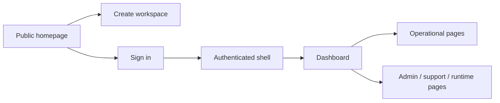
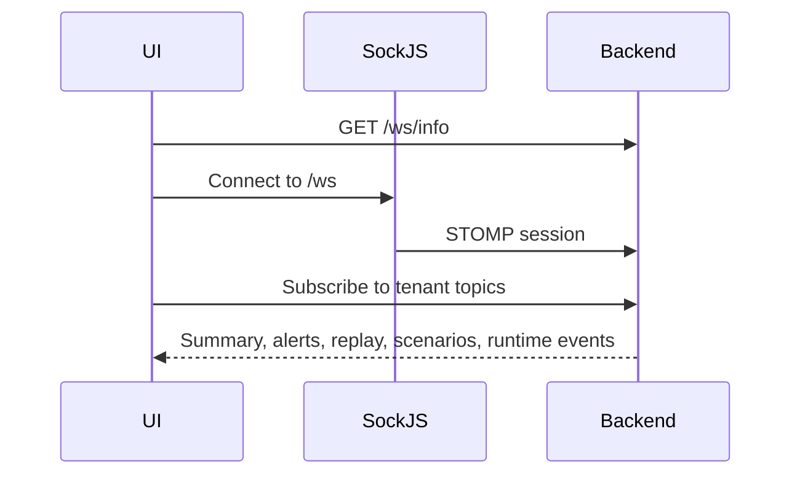

# Frontend Flow

This document explains how the SynapseCore frontend is structured, how users move through it, how it talks to the backend, and which labels must remain stable for hosted proof.

## Frontend Stack

- React single-page application
- Vite build system
- JS/JSX app structure
- runtime backend/frontend configuration through `runtime-config.js`
- dark-first command-center design system

Key frontend areas:

- `frontend/src/pages`
- `frontend/src/layout`
- `frontend/src/components`
- `frontend/src/hooks`
- `frontend/src/config/pageRegistry.js`
- `frontend/src/design-system.css`
- `frontend/src/styles.css`

## User Journey



## Public Flow

### Homepage

Route:

- `/`

Purpose:

- explain what SynapseCore is
- show who it is for
- present the command-center story before login
- hand users into either sign-in or workspace creation

### Create Workspace

Route:

- `/create-workspace`

Purpose:

- explain company setup
- explain workspace code
- guide the first admin through what the rollout needs

Current truth:

- this is a productized frontend onboarding experience
- it does not claim a live backend provisioning flow unless one is implemented

### Sign In

Route:

- `/sign-in`

Purpose:

- enter a company workspace
- explain workspace code
- sign in with username and password

Proof-critical label:

- `Access your operational workspace.`

## Authenticated Shell

The authenticated shell includes:

- sidebar
- topbar
- workspace notices
- route-aware page context

Responsibilities:

- show workspace identity
- show operator identity and role
- show live connection posture
- present a consistent command-center experience

## Dashboard

Route:

- `/dashboard`

Proof-critical label:

- `Live operational command center`

Purpose:

- present live operational posture
- show summary signals
- surface risk, activity, recovery, and trust
- guide first-run setup when a workspace is mostly empty

## Operational Pages

Core operational routes include:

- `/alerts`
- `/recommendations`
- `/orders`
- `/inventory`
- `/catalog`
- `/locations`
- `/fulfillment`
- `/scenarios`
- `/scenario-history`
- `/approvals`
- `/escalations`
- `/integrations`
- `/replay-queue`
- `/runtime`
- `/audit-events`

Examples of proof-critical labels:

- `Operational warning center`
- `Live order operations`
- `Failed inbound recovery`
- `Scenario action console`
- `Approval action console`
- `Replay Into Live Flow`

These should stay stable unless proof selectors are updated deliberately.

## Admin / Support Pages

Settings and support routes include:

- `/users`
- `/company-settings`
- `/profile`
- `/platform-admin`
- `/tenant-management`
- `/system-config`
- `/releases`

These pages now match the command-center product style but still rely on the same backend contracts.

## Frontend Environment Variables

Primary frontend env vars:

- `VITE_API_URL`
- `VITE_WS_URL`
- `VITE_APP_BUILD_VERSION`
- `VITE_APP_BUILD_COMMIT`
- `VITE_APP_BUILD_TIME`

Typical local values:

```text
VITE_API_URL=http://localhost:8080
VITE_WS_URL=http://localhost:8080/ws
```

Typical Render values:

```text
VITE_API_URL=https://synapscore-3.onrender.com
VITE_WS_URL=https://synapscore-3.onrender.com/ws
```

## Local Frontend Run

```powershell
cd C:\Users\asus\Downloads\synapsecore_starter\synapsecore\frontend
npm.cmd install
npm.cmd run dev
```

Default local URL:

```text
http://localhost:5173
```

Quality checks:

```powershell
npm.cmd run lint
npm.cmd run build
npm.cmd run verify
```

## Production Frontend Deployment

The Render frontend is a static site:

- built with `npm ci && npm run build`
- published from `dist`
- configured with SPA rewrite routing to `/index.html`

Frontend deployment is successful when:

- the root shell responds with HTML
- runtime-config loads
- the app can reach the backend API and `/ws` endpoint

## How Frontend Talks To Backend

The frontend uses:

- REST fetches for page and action data
- SockJS + STOMP for live updates

Typical REST surfaces:

- `/api/auth/session`
- `/api/dashboard/summary`
- `/api/dashboard/snapshot`
- `/api/orders/recent`
- `/api/inventory`
- `/api/alerts`
- `/api/recommendations`
- `/api/integrations/orders/replay-queue`
- `/api/scenarios/history`
- `/api/system/runtime`

Typical realtime surface:

- `/ws`
- `/ws/info`

## Realtime Connection Model



The frontend shows live/degraded/offline posture based on what the realtime layer and REST fetches are doing.

## Loading / Error / Empty-State UX

The frontend now uses a clearer command-center UX standard:

- polished loading states and skeletons
- explicit empty states that guide action
- calmer runtime and backend-unavailable messaging
- retry actions where useful
- first-run onboarding guidance when a workspace is not yet operationally seeded

Important truth:

- the frontend should not fake healthy state
- when the backend is unavailable, the UI should say so clearly
- demo mode is documented separately and is not a production substitute

Related docs:

- [frontend-demo-guide.md](frontend-demo-guide.md)
- [frontend-demo-mode.md](frontend-demo-mode.md)
- [frontend-qa-checklist.md](frontend-qa-checklist.md)

## Proof-Critical Labels / Selectors

Hosted proof currently depends on these visible labels remaining stable:

- `Replay Into Live Flow`
- `Scenario action console`
- `Approval action console`
- `Live operational command center`
- `Access your operational workspace.`
- `Failed inbound recovery`
- `Live order operations`
- `Operational warning center`

Do not change these casually.

## Frontend Bottom Line

The frontend is now designed to feel like a premium enterprise operations command surface, but it still depends on real backend readiness and tenant-scoped APIs to become the full live product.
