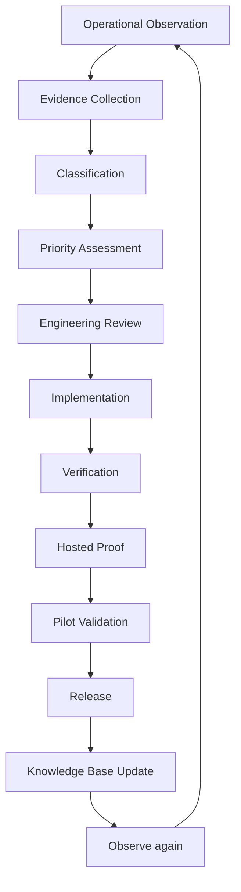

# Improvement Lifecycle

This is the official lifecycle for turning operational evidence into SynapseCore product improvements.

Future work should follow this process unless there is an urgent security or availability incident.

## Lifecycle Overview

## 1. Operational Observation

An observation is something seen in real use or credible review.

Examples:

- an operator struggles to classify a replay item
- approval ownership is unclear
- a connector failure repeats
- runtime trust is hard to interpret
- hosted proof exposes a timing or selector drift issue
- pilot users report manual reconciliation is still needed

Observations should describe what happened, who saw it, where it happened, and why it matters.

## 2. Evidence Collection

Evidence turns observation into actionable product work.

Collect:

- screenshots if useful
- logs or runtime check output
- hosted proof result
- user feedback quote or support note
- affected route/page/API
- frequency
- operational impact
- workaround used

Evidence should be attached before implementation begins.

## 3. Classification

Classify the improvement by primary type:

| Type | Meaning |
| --- | --- |
| Product clarity | Users do not understand state, terms, or actions |
| Operational reliability | System behavior reduces trust or uptime |
| Replay recovery | Failed inbound work is hard to recover or classify |
| Approval governance | Scenario/approval ownership or action is unclear |
| Connector visibility | External-system state is unclear or incomplete |
| Runtime trust | Health, readiness, websocket, or dependency truth is unclear |
| Proof stability | Hosted proof reveals drift, timing, or selector weakness |
| Documentation | The platform is correct but poorly explained |
| Maintainability | Code or scripts are too hard to safely evolve |

## 4. Priority Assessment

Priority should be evidence-based.

Assessment questions:

- How many users/workflows are affected?
- Does this affect operational trust?
- Does this block proof?
- Does this create manual reconciliation?
- Does this hide failed work?
- Does this increase support burden?
- Is there a safe workaround?
- Is the fix small and low-risk?

Suggested priority levels:

- `P0`: availability, data safety, security, or proof-critical production break
- `P1`: pilot-blocking operational trust issue
- `P2`: important pilot friction or maintainability risk
- `P3`: useful improvement with limited urgency
- `Watch`: evidence exists but is not strong enough yet

## 5. Engineering Review

Engineering review should happen before implementation.

Review:

- affected modules
- contract impact
- database/migration impact
- frontend selector impact
- proof impact
- rollback posture
- security/session/tenant implications
- runtime or dependency assumptions
- documentation updates required

The design should prefer the smallest safe change that solves the observed problem.

## 6. Implementation

Implementation must stay within the approved scope.

Rules:

- do not add adjacent features casually
- do not weaken proof checks
- do not hide failures
- do not change backend contracts unless the evidence requires it
- do not edit database rows manually for product behavior
- preserve tenant context and runtime truth

## 7. Verification

Verification depends on the change.

Possible gates:

- frontend verify/build
- backend tests
- docs link check
- repo health
- local connection checks
- live connection checks
- release readiness
- targeted manual validation

Every change should state what was verified and what was not verified.

## 8. Hosted Proof

Hosted proof is required when the change affects proof-covered behavior.

Proof-covered behavior includes:

- auth/session
- tenant onboarding
- dashboard/realtime
- catalog/product onboarding
- replay recovery
- approvals/scenarios/execution
- operational pages
- auth rate limiting

Hosted proof should not run when readiness, auth, websocket, DB, or backend availability is unhealthy.

## 9. Pilot Validation

Pilot validation asks whether the change improved the real workflow.

Validation may include:

- operator confirmation
- before/after support notes
- reduced manual workaround
- clearer replay recovery
- faster approval response
- improved runtime classification
- fewer proof or deployment surprises

## 10. Release

A release should include:

- change summary
- evidence source
- verification output
- proof result if applicable
- known risks
- rollback posture
- docs updated

## 11. Knowledge Base Update

If the product meaning changed, update the knowledge base.

Possible docs:

- [operational-concepts.md](operational-concepts.md)
- [synapsecore-dictionary.md](synapsecore-dictionary.md)
- [business-process-library.md](business-process-library.md)
- [support-playbook.md](support-playbook.md)
- [operations-handbook.md](operations-handbook.md)
- role or industry guides

## Bottom Line

No improvement is complete until the product, engineering, proof, pilot, and knowledge layers all agree.
