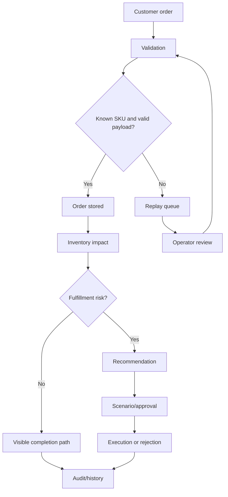

# Industry Guide: Distribution

This guide explains how distributors can understand SynapseCore.

## Distribution Operating Problem

Distribution teams often deal with:

- many SKUs
- warehouse-aware inventory pressure
- customer order urgency
- fragmented supplier/customer data
- manual exception handling
- delayed visibility into failed inbound records
- approval gaps around constrained fulfillment

SynapseCore helps by connecting orders, inventory, replay recovery, recommendations, approvals, and runtime trust in one command-center workspace.

## What Stays The Same

SynapseCore always follows:

```text
Operational input
-> tenant workspace
-> validation and persistence
-> dashboard visibility
-> alerts/recommendations
-> scenario/approval if needed
-> replay if failed
-> audit
```

## What Changes In Distribution

Distribution emphasis is usually on:

- SKU and warehouse accuracy
- customer order priority
- inventory pressure
- connector reliability
- recovery from failed customer or partner inputs
- clear approval on constrained decisions

## Useful SynapseCore Surfaces

Most important surfaces:

- catalog
- inventory
- orders
- integrations
- replay
- recommendations
- approvals
- dashboard
- runtime

## Distribution Example Flow



## Distribution Pilot Fit

Good fit:

- multi-SKU operational complexity
- failed inbound order data
- inventory/order mismatch
- manual approval and escalation gaps

Less ideal:

- distributors that only need end-of-month reporting
- teams requiring deep ERP replacement before a command-center pilot

## Distribution Success Signals

- faster exception recovery
- less manual reconciliation
- clearer inventory/order pressure
- improved connector visibility
- better approval traceability
