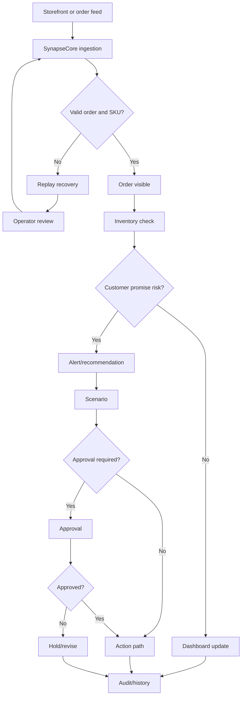

# Industry Guide: E-commerce

This guide explains how ecommerce and fulfillment teams can understand SynapseCore.

## E-commerce Operating Problem

E-commerce operations often face:

- fast-moving orders
- product/catalog pressure
- inventory mismatch
- fulfillment exceptions
- CSV/webhook/scheduled data movement
- failed inbound order records
- customer promise risk
- manual reconciliation between storefront, warehouse, and operations

SynapseCore helps by giving operators one command-center surface for order visibility, inventory pressure, replay recovery, recommendations, approvals, and runtime trust.

## What Stays The Same

SynapseCore follows:

```text
Order/event input
-> tenant workspace
-> validation
-> order/inventory visibility
-> recommendation/alert
-> scenario/approval if needed
-> replay if failed
-> audit/runtime truth
```

## What Changes In E-commerce

E-commerce emphasis is usually on:

- order freshness
- SKU quality
- fulfillment pressure
- failed import/webhook recovery
- customer-impacting stock mismatch
- connector reliability

## Useful SynapseCore Surfaces

Most important surfaces:

- dashboard
- catalog
- inventory
- orders
- integrations
- replay
- alerts
- recommendations
- approvals
- runtime

## E-commerce Example Flow



## E-commerce Pilot Fit

Good fit:

- order import or webhook failure pain
- inventory mismatch between sales and fulfillment
- manual reconciliation across ecommerce and warehouse teams
- need for one command-center surface during operational pressure

Less ideal:

- stores that only need simple ecommerce analytics
- teams needing full storefront, OMS, or WMS replacement immediately

## E-commerce Success Signals

- fewer hidden failed orders
- faster stock-pressure awareness
- clearer customer-impacting exception visibility
- improved replay and recovery discipline
- better approval traceability
