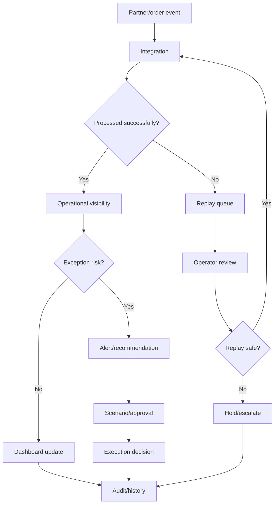

# Industry Guide: Logistics

This guide explains how logistics companies can understand SynapseCore.

## Logistics Operating Problem

Logistics teams often operate under pressure from:

- moving orders and fulfillment commitments
- warehouse and transport coordination
- partner data arriving late or failing
- manual status reconciliation
- exceptions that need quick escalation
- disconnected visibility across teams

SynapseCore helps by providing a live command-center layer around orders, integrations, replay, recommendations, approvals, and runtime trust.

## What Stays The Same

The core flow stays:

```text
Operational event
-> workspace context
-> validation
-> operational visibility
-> alert/recommendation
-> scenario/approval if needed
-> replay if failed
-> audit/runtime trust
```

## What Changes In Logistics

Logistics emphasis is usually on:

- exception visibility
- inbound partner reliability
- operational timing
- escalation ownership
- replay of failed inbound status/order events
- runtime trust during active operations

## Useful SynapseCore Surfaces

Most important surfaces:

- dashboard
- orders
- integrations
- replay queue
- alerts
- recommendations
- scenarios
- approvals
- runtime

## Logistics Example Flow



## Logistics Pilot Fit

Good fit:

- partner integration failure pain
- manual exception tracking
- order/status visibility gaps
- approval ownership issues during operational exceptions

Less ideal:

- teams needing full TMS replacement immediately
- highly automated network operations requiring enterprise-scale event streaming on day one

## Logistics Success Signals

- failed inbound events are visible and recoverable
- exceptions are classified faster
- operators trust realtime status more
- fewer status issues are hidden in emails or spreadsheets
- approval/escalation paths are clearer
