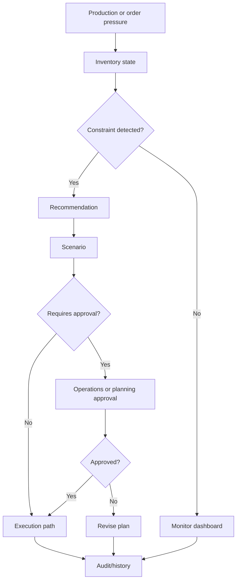

# Industry Guide: Manufacturing

This guide explains how manufacturing teams can understand SynapseCore.

## Manufacturing Operating Problem

Manufacturing operations often involve:

- material availability pressure
- order and production demand changes
- supplier or inbound data failures
- disconnected planning, inventory, and operations views
- manual escalation around shortages
- delayed operational risk visibility

SynapseCore helps by turning operational pressure into visible alerts, recommendations, scenarios, approvals, replay recovery, and runtime-aware command-center state.

## What Stays The Same

The SynapseCore operating model stays consistent:

```text
Workspace
-> operational input
-> validation
-> catalog/inventory/order state
-> recommendation or alert
-> scenario and approval if governed
-> execution or rejection
-> audit/runtime truth
```

## What Changes In Manufacturing

Manufacturing emphasis is usually on:

- material constraints
- production-impacting inventory pressure
- exception visibility
- approval governance before operational changes
- integration reliability from planning or supplier-related inputs

## Useful SynapseCore Surfaces

Most important surfaces:

- inventory
- orders
- recommendations
- scenarios
- approvals
- integrations
- replay
- runtime
- audit/history

## Manufacturing Example Flow



## Manufacturing Pilot Fit

Good fit:

- teams that need live visibility into material or order pressure
- operations groups with manual exception reconciliation
- manufacturers with inbound integration failure pain
- environments where approvals affect operational changes

Less ideal:

- teams needing full MRP/ERP replacement immediately
- highly automated plants requiring mature industrial protocol integrations on day one

## Manufacturing Success Signals

- faster visibility into constraints
- fewer hidden failed inbound records
- clearer approval governance
- better operational evidence after incidents
- improved coordination between planning and operations
