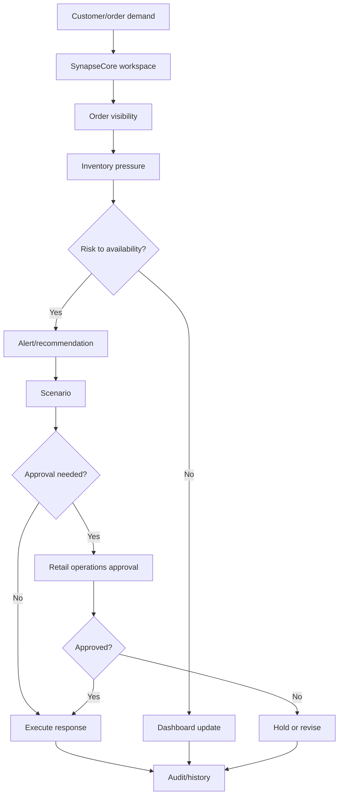

# Industry Guide: Retail

This guide explains how retail companies can understand SynapseCore.

## Retail Operating Problem

Retail operations often involve:

- multiple sales channels
- store or warehouse inventory pressure
- product catalog complexity
- delayed order visibility
- manual replenishment conversations
- disconnected ecommerce, warehouse, and planning systems
- exceptions that move faster than reporting cycles

SynapseCore helps by giving teams a live command-center surface for operational visibility, replay, recommendations, approvals, and runtime trust.

## What Stays The Same

The core SynapseCore pattern stays the same:

```text
Workspace
-> orders/catalog/inventory
-> alerts/recommendations
-> scenarios/approvals
-> replay for failed inbound work
-> realtime visibility
-> audit/runtime trust
```

## What Changes In Retail

Retail emphasis is usually on:

- product availability
- SKU quality
- stock pressure
- fulfillment promises
- store or warehouse coordination
- exception visibility
- order/inventory mismatch

## Useful SynapseCore Surfaces

Most important surfaces:

- dashboard
- catalog
- inventory
- orders
- alerts
- recommendations
- replay queue
- approvals
- integrations
- runtime

## Retail Example Flow



## Retail Pilot Fit

Good fit:

- multi-location inventory visibility pain
- order pressure and manual reconciliation
- failed inbound data causing fulfillment confusion
- teams that need approval visibility around operational decisions

Less ideal:

- very small single-store operations
- teams that only need static sales reporting
- companies requiring full ERP/WMS replacement immediately

## Retail Success Signals

- fewer hidden order/inventory mismatches
- faster response to stock pressure
- clearer approval ownership
- better connector failure visibility
- less reliance on side-channel spreadsheets
