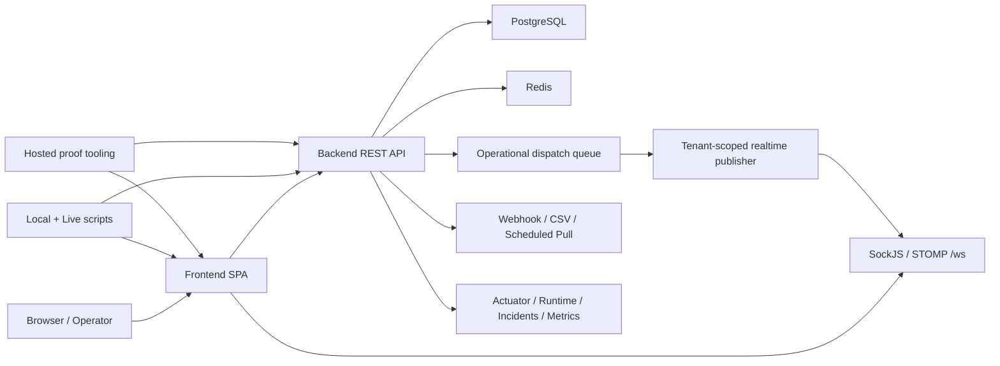
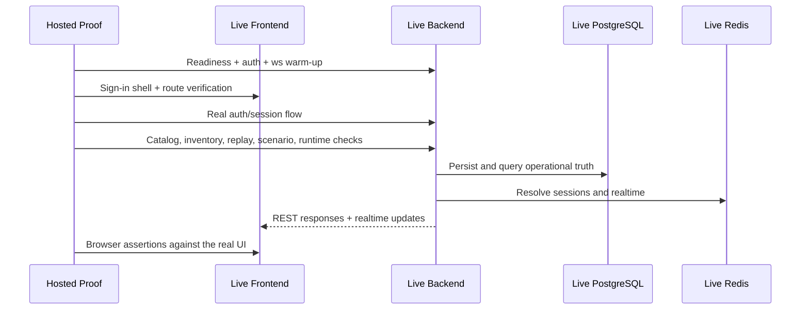
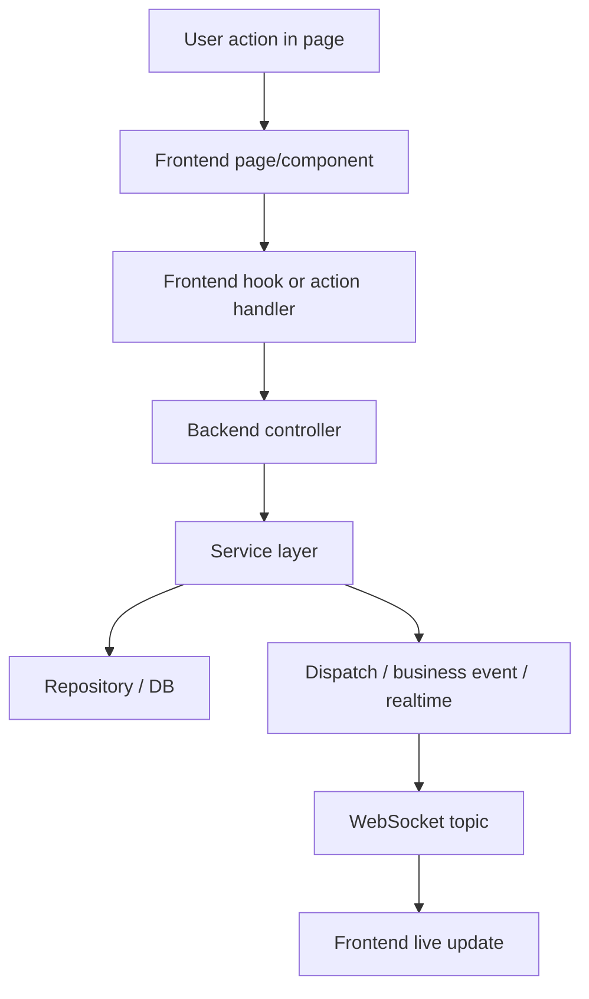
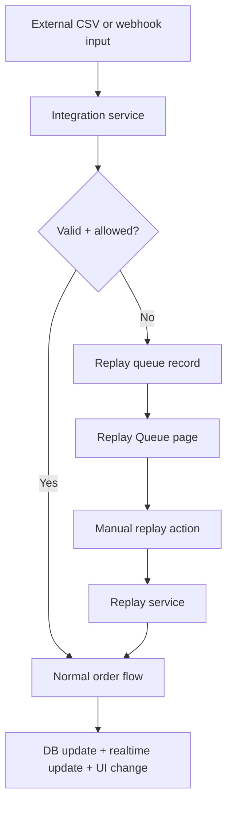
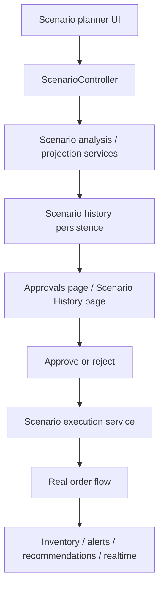

# Infrastructure Communication Map

This document explains how the SynapseCore infrastructure communicates end to end, from the browser all the way through PostgreSQL, Redis, realtime, integrations, replay, and hosted proof tooling.

## High-Level Communication Map

## Frontend -> Backend API

The frontend communicates with the backend through `VITE_API_URL`.

Typical route families:

- auth and session
- dashboard summary and snapshot
- catalog and product APIs
- inventory APIs
- orders APIs
- alerts and recommendations
- integrations and replay
- scenario history / approvals / execution
- runtime / incidents
- users / settings / profile / admin pages

Purpose:

- fetch page state
- perform mutations
- confirm session and trust posture

## Frontend -> WebSocket Endpoint

The frontend connects to:

- `VITE_WS_URL`
- typically `/ws`

The browser first checks:

- `/ws/info`

Then it opens a SockJS/STOMP session and subscribes to tenant-scoped topics.

This is how the UI stays current without full-page refreshes.

## Backend -> PostgreSQL

PostgreSQL is the operational record of truth.

It stores:

- tenants and workspace identity
- users and operators
- catalog and warehouses
- inventory
- orders and fulfillment
- alerts and recommendations
- scenario history and approvals
- connectors, import runs, replay records
- audit and business events

Without PostgreSQL:

- readiness should not pass
- hosted proof should not run
- runtime trust is incomplete

## Backend -> Redis / Session

Redis provides:

- session persistence in production
- distributed realtime pub/sub

Communication roles:

- backend reads and writes session state
- backend publishes and subscribes to realtime fanout channels

When Redis is unavailable:

- readiness may fail
- auth/session behavior may degrade
- realtime behavior may degrade

## Backend -> Realtime Events

The backend does not only answer REST calls. It also emits operational updates.

Typical event families:

- dashboard summary
- alerts
- recommendations
- inventory posture
- recent orders
- fulfillment changes
- audit and business events
- integrations and replay queue updates
- scenario notifications and escalations

The realtime publisher takes authoritative backend state and pushes it into tenant-scoped browser subscriptions.

## Backend -> Integration / Replay Services

Integration services normalize external activity into the main order flow.

Inbound lanes:

- direct webhook orders
- CSV import
- scheduled pull orders

When those fail:

- normalized failure state is preserved
- replay queue captures the recoverable work
- operators can inspect and replay the record intentionally

This means integration and replay are not side systems. They are part of the core communication chain.

## Backend -> Runtime / Observability

The backend exposes multiple trust and observability layers:

- `/actuator/health`
- `/actuator/health/readiness`
- `/actuator/health/liveness`
- `/api/system/runtime`
- `/api/system/incidents`

Anonymous production actuator exposure is limited to health, liveness, and readiness. Metrics/prometheus scraping requires a controlled monitoring path.

These surfaces communicate:

- whether the backend is alive
- whether it is ready for traffic
- whether DB and Redis are available
- whether runtime or dispatch pressure is growing

## Scripts -> Local / Live Endpoints

The repository includes operational scripts that talk directly to the system:

- local smoke verification
- realtime verification
- hosted proof preparation
- live connection checks
- system explanation scripts

Examples:

- `scripts\verify-deployment.ps1`
- `scripts\verify-realtime.ps1`
- `scripts\prepare-hosted-proof.ps1`
- `scripts\check-live-connections.ps1`
- `scripts\check-local-connections.ps1`

These scripts are part of the platform operations layer, not random extras.

## Hosted Proof -> Deployed Frontend / Backend

Hosted proof exists to prove that the entire communication chain is real:

- frontend shell
- backend API
- DB-backed state
- Redis-backed runtime/session/realtime posture
- browser-visible outcomes

## Request Flow Map

## Replay Communication Map

## Scenario Communication Map

## Failure Interpretation

### If frontend responds but backend times out

Likely meaning:

- static frontend is deployed
- backend is unavailable, startup-blocked, or waiting on dependencies

### If backend liveness responds but readiness fails

Likely meaning:

- app process is running
- DB or Redis is not ready enough for real traffic

### If auth or websocket info fails while readiness is up

Likely meaning:

- core app may be alive
- auth/session or realtime lane is degraded

## Bottom Line

SynapseCore infrastructure is valuable because it is not one isolated app tier. It is a coordinated communication system:

- browser command center
- backend control and decision engine
- PostgreSQL truth layer
- Redis session and realtime layer
- replay and integration recovery lane
- runtime trust surfaces
- proof tooling that validates the whole chain
