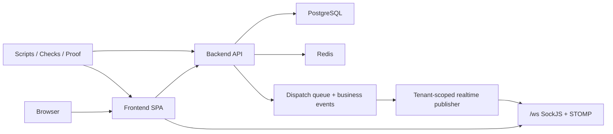

# Infrastructure Handbook

This handbook exists to remove confusion about how SynapseCore is actually wired in practice.

Use it when you need to answer questions like:

- which environment am I working in?
- is the problem frontend, backend, database, or Redis?
- should I use host processes or Docker?
- should I run hosted proof right now?
- what does "live but not ready" really mean?

This is the single plain-language guide for local, Docker, Render, proof, and operational boundary questions.

## 1. Environments

SynapseCore is used in multiple modes. Confusion usually starts when people mix them up.

### Local host frontend

What it is:

- the edited React/Vite frontend running on the host machine

Typical use:

- UI/UX work
- route checks
- frontend verification
- command-center polish

Default URL:

- `http://localhost:5173`

### Local host backend

What it is:

- the Spring Boot backend running directly on the host machine

Typical use:

- local API debugging
- local full-stack verification
- controller/service/runtime checks

Default URL:

- `http://localhost:8080`

### Docker infra

What it is:

- Docker running supporting infrastructure only:
  - PostgreSQL
  - Redis

Typical use:

- easiest local full-stack backing services
- host backend + host frontend with Docker-backed infra

### Full Docker Compose

What it is:

- frontend container
- backend container
- PostgreSQL container
- Redis container

Typical use:

- containerized local stack
- less host runtime setup

### Render frontend

What it is:

- live deployed static frontend

Current URL:

- `https://synapscore-frontend-3.onrender.com`

### Render backend

What it is:

- live deployed Spring Boot backend

Current URL:

- `https://synapscore-3.onrender.com`

### Render DB / Redis

What it is:

- managed Postgres
- managed Redis

Purpose:

- production-style persistence
- session storage
- distributed realtime pub/sub

Important:

- if DB or Redis is down, hosted proof should not run

## 2. Services And Ports

### Local ports

- frontend local: `5173`
- backend local: `8080`
- Postgres: `5432`
- Redis: `6379`

### Live URLs

- frontend live: `https://synapscore-frontend-3.onrender.com`
- backend live: `https://synapscore-3.onrender.com`

### Local endpoint examples

- frontend: `http://localhost:5173`
- backend health: `http://localhost:8080/actuator/health`
- backend readiness: `http://localhost:8080/actuator/health/readiness`
- backend websocket info: `http://localhost:8080/ws/info`

## 3. Communication Map



### Frontend -> backend API

The frontend fetches state and sends mutations through `VITE_API_URL`.

Examples:

- sign in
- dashboard summary and snapshot
- orders
- inventory
- replay queue
- scenario history
- runtime

### Frontend -> websocket

The frontend connects through `VITE_WS_URL`, typically `/ws`, and uses SockJS/STOMP.

The browser checks:

- `/ws/info`

Then subscribes to tenant-scoped live topics.

### Backend -> PostgreSQL

PostgreSQL stores the operational record of truth:

- tenants
- users
- products
- inventory
- orders
- alerts
- recommendations
- replay records
- scenario history
- audit and business events

### Backend -> Redis

Redis supports:

- session persistence in prod
- realtime pub/sub distribution

### Backend -> realtime

The backend publishes tenant-scoped updates for:

- dashboard summary
- alerts
- recommendations
- orders
- inventory
- integrations
- replay
- scenarios
- runtime-related surfaces

### Scripts -> endpoints

Scripts in `scripts\` are part of the operational tooling layer.

They check:

- localhost endpoints
- live Render endpoints
- proof readiness
- runtime and deployment assumptions

### Proof -> deployed services

Hosted proof is not a fake UI walkthrough.
It uses the deployed frontend and backend together.

That means proof depends on:

- live frontend
- live backend
- working DB
- working Redis
- auth/session
- websocket info
- readiness

## 4. When To Use What

### Local UI-only work

Use when:

- backend is off
- DB is unavailable
- you are doing frontend design, layout, route, or doc work

Use:

- host frontend only
- frontend verify
- docs and script explainers

Do not use:

- hosted proof

### Local full-stack work

Use when:

- you need frontend + backend + DB + Redis together

Prefer:

- Docker infra only
- backend on host
- frontend on host

### Docker infra-only mode

Use when:

- you want stable local Postgres and Redis
- but still want host-run backend/frontend for easier iteration

### Full Docker mode

Use when:

- you want everything containerized
- you are testing the compose topology

### Render hosted proof

Use only when:

- frontend live URL responds
- backend health responds
- readiness responds
- liveness responds
- auth session responds
- websocket info responds
- DB/Redis are available

### Frontend-only deploy

Use when:

- frontend UX/docs/hardening changed
- backend contracts did not change

Good for:

- public homepage changes
- shell/dashboard UI changes
- page polish
- docs and scripts that do not change runtime behavior

### Backend deploy

Use when:

- API behavior changed
- runtime/security/CORS/session/replay changes were made
- migrations or env-sensitive changes were introduced

### DB-off situation

If DB is off:

- backend may not answer cleanly
- readiness will not be trustworthy
- auth session may not answer
- websocket info may not answer
- hosted proof should stay paused

## 5. Common Confusion Fixes

### Backend down vs DB down

If backend endpoints all time out:

- backend may be unavailable
- or startup-blocked because DB/Redis are unavailable

If liveness works but readiness fails:

- app process is alive
- DB or Redis is not ready enough for real traffic

### Frontend live but backend not responding

This means:

- static frontend deployment is healthy
- backend service is not healthy enough to answer API traffic

It does not automatically mean the frontend broke.

### `localhost` vs `127.0.0.1`

Use `127.0.0.1` when local host resolution or service routing is suspicious.

This matters especially when:

- Windows services and Docker are both involved
- JDBC connection target ambiguity is suspected

### Docker Postgres vs Windows Postgres conflict

This is one of the most common local problems.

Symptom:

- Docker Postgres works internally
- host backend still fails auth or hits the wrong DB

Cause:

- Windows PostgreSQL service also owns or interferes with port `5432`

Fix path:

- inspect who owns `5432`
- temporarily stop Windows PostgreSQL services if Docker should own the port

### Backend container using port `8080`

If the host backend should run on `8080`, but `synapse_backend` is already using it:

- stop the backend container first

### `.env.local` not committed

Never stage:

- `frontend/.env.local`
- other personal env files with local overrides

These are machine-local, not repo truth.

### Hosted proof env vars

Hosted proof depends on proof credential env vars being set correctly.

If readiness is healthy but proof still cannot start, check:

- `PLAYWRIGHT_BASE_URL`
- `PLAYWRIGHT_API_BASE_URL`
- tenant/user proof env vars

### Demo mode vs real proof

Demo mode docs are for controlled frontend preview ideas.

Demo mode is not:

- hosted proof
- production validation
- a replacement for real backend availability

## 6. Decision Tree

### “Frontend opens but login fails”

Check:

1. backend health
2. readiness
3. `/api/auth/session`
4. browser console for fetch/session errors

Likely classes:

- backend unavailable
- readiness down
- auth/session issue
- CORS/session issue

### “Backend health times out”

Interpretation:

- backend is unavailable or startup-blocked

Do not run hosted proof.

Check:

- backend logs
- DB availability
- Redis availability

### “Readiness is down but liveness works”

Interpretation:

- backend process is alive
- DB or Redis or another readiness dependency is not ready

Do not run hosted proof yet.

### “Postgres password fails”

Check:

1. is Docker Postgres actually serving `5432`?
2. is Windows PostgreSQL also running?
3. does login work inside the container?
4. does host login work to `127.0.0.1:5432`?

### “Port 8080 already in use”

Likely cause:

- `synapse_backend` container is already running

Fix:

- stop that container before starting host backend

### “Render frontend is live but backend times out”

Interpretation:

- frontend deploy succeeded
- backend app or DB/Redis dependency is not healthy

This is not proof-ready.

### “Should I run hosted proof now?”

Only if:

- frontend responds
- backend health responds
- liveness responds
- readiness responds
- auth session responds
- websocket info responds

If any of those are not true:

- do not run hosted proof

## 7. Safe Commands

### Check live

```powershell
cd C:\Users\asus\Downloads\synapsecore_starter\synapsecore
powershell -ExecutionPolicy Bypass -File scripts\check-live-connections.ps1
```

### Check local

```powershell
cd C:\Users\asus\Downloads\synapsecore_starter\synapsecore
powershell -ExecutionPolicy Bypass -File scripts\check-local-connections.ps1
```

### Start local frontend

```powershell
cd C:\Users\asus\Downloads\synapsecore_starter\synapsecore\frontend
npm.cmd run dev
```

### Start Docker Postgres / Redis

```powershell
cd C:\Users\asus\Downloads\synapsecore_starter\synapsecore\infrastructure
docker compose up -d postgres redis
docker compose ps
```

### Stop backend container

```powershell
docker stop synapse_backend
```

### Test Postgres login

Inside Docker:

```powershell
docker exec -e PGPASSWORD=postgres synapse_postgres psql -h localhost -U postgres -d synapsecore -c "select current_user, current_database();"
```

From host:

```powershell
$env:PGPASSWORD="postgres"
psql -h 127.0.0.1 -p 5432 -U postgres -d synapsecore -c "select current_user, current_database();"
```

### Run frontend verify

```powershell
cd C:\Users\asus\Downloads\synapsecore_starter\synapsecore\frontend
npm.cmd run verify
```

### Run hosted proof only when allowed

```powershell
cd C:\Users\asus\Downloads\synapsecore_starter\synapsecore
powershell -ExecutionPolicy Bypass -File scripts\check-live-connections.ps1
powershell -ExecutionPolicy Bypass -File scripts\prepare-hosted-proof.ps1

cd frontend
npm.cmd run test:e2e:prod
```

Only continue to `prepare-hosted-proof.ps1` if the live connection check says proof is allowed.

## Bottom Line

The main rule is simple:

do not mix environments mentally.

Know whether you are in:

- local UI mode
- local full-stack mode
- Docker infra mode
- full Docker mode
- live Render mode
- proof mode

Most confusion disappears once that is explicit.
