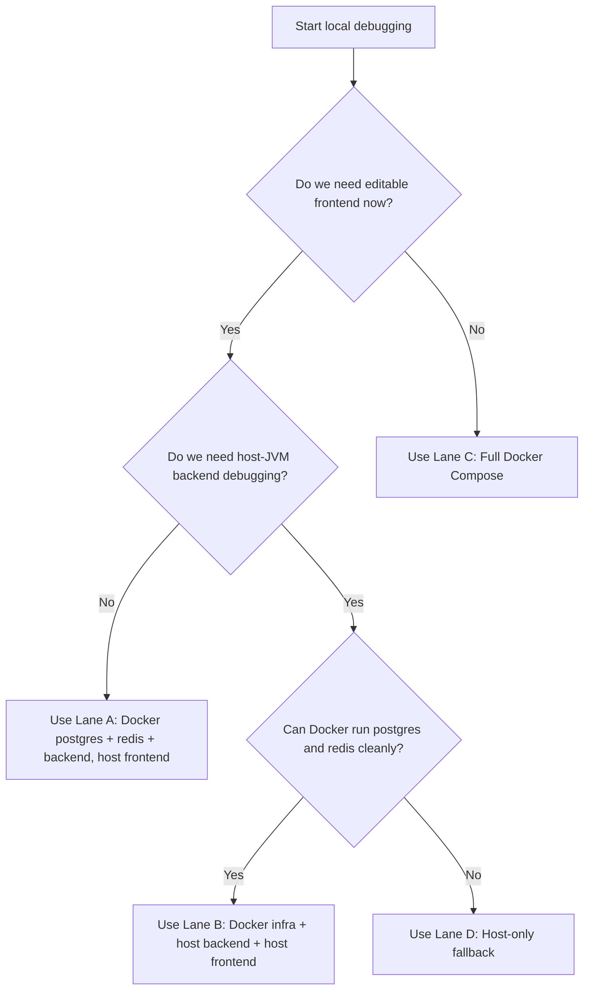
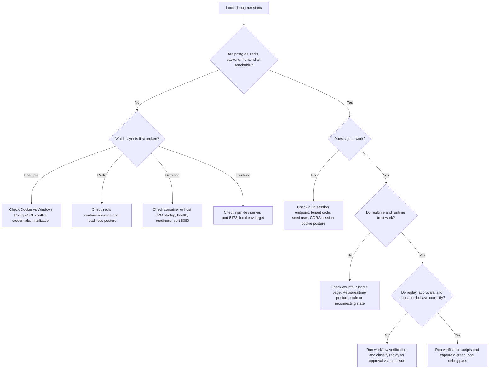

# Local Debug Plan

This document is the master local debugging plan for SynapseCore.

It is not a deployment guide and it is not a hosted-proof guide.

Its job is to answer one question clearly:

how do we debug the full SynapseCore system locally, in the right order, without confusing frontend issues, backend issues, Docker issues, PostgreSQL issues, Redis issues, or proof issues?

## Why This Exists

SynapseCore has several valid local run modes, but they are not equally stable for every kind of debugging.

The main local confusion points already seen in this repo are:

- Docker PostgreSQL vs Windows PostgreSQL conflicts on `5432`
- host backend vs Docker backend conflicts on `8080`
- frontend opening successfully while backend or auth is unhealthy
- raw backend `dev` profile defaults not matching Docker Compose assumptions
- local success being mistaken for hosted-proof success

This plan gives one disciplined local-debug sequence so we can classify first, debug the real seam, and avoid wasting time on the wrong layer.

## Current Local Debug Reality

At the time of writing, these truths matter:

- Render DB availability has been a live blocker for hosted proof, so local debugging is the correct focus
- there are already separate runbooks for bring-up and recovery, but this document is the end-to-end debug plan
- the working tree may contain unrelated local edits, so debugging must not accidentally overwrite them
- the raw backend `dev` profile defaults are not the same as the Docker Compose datasource defaults

Important backend detail:

- `backend/src/main/resources/application-dev.yml` defaults to:
  - `jdbc:postgresql://localhost:5432/postgres`
  - username `postgres`
  - password `Relative123@`
- `infrastructure/docker-compose.yml` and `infrastructure/env/backend.env` use:
  - database `synapsecore`
  - username `postgres`
  - password `postgres`

That means:

- if we run the backend on the host, we must be explicit about the datasource target
- if we rely on the backend container, it already follows the Docker Compose wiring

## Local Debug Goal

A full local debug pass should prove all of these, in order:

1. the chosen local infrastructure mode is stable
2. PostgreSQL and Redis are reachable
3. the backend is healthy and ready
4. auth/session works
5. websocket info responds
6. the frontend connects to the correct backend
7. the authenticated shell loads correctly
8. operational pages load correctly
9. realtime behaves correctly
10. replay, approvals, and scenario flows can be exercised
11. local verification scripts pass

Only after that should we claim local full-stack confidence.

## Existing Documents This Plan Depends On

This doc is the master sequence. These docs remain the supporting references:

- [local-runbook.md](local-runbook.md)
- [local-recovery-playbook.md](local-recovery-playbook.md)
- [troubleshooting-index.md](troubleshooting-index.md)
- [environment-reference.md](environment-reference.md)
- [infrastructure-handbook.md](infrastructure-handbook.md)
- [proof-and-validation.md](proof-and-validation.md)

## Existing Scripts This Plan Depends On

These are the main scripts used in the local debugging sequence:

- `scripts\check-local-connections.ps1`
- `scripts\verify-deployment.ps1`
- `scripts\verify-realtime.ps1`
- `scripts\verify-company-readiness.ps1`
- `scripts\repo-health.ps1`
- `scripts\env-sanity-check.ps1`

## Local Debug Lanes

There are four real local-debug lanes. We should choose one intentionally instead of mixing them.

### Lane A: Recommended Hybrid Lane

Use:

- PostgreSQL in Docker
- Redis in Docker
- backend in Docker
- frontend on host

This is the best first debugging lane when:

- we want the editable local frontend
- we do not want to fight host Spring Boot datasource confusion
- we want backend wiring to match Compose

Why it is the best default:

- backend already uses `infrastructure/env/backend.env`
- backend talks to Docker Postgres and Redis by service name
- frontend stays local and easy to iterate on
- it avoids the most common host backend vs Windows Postgres mismatch

### Lane B: Host Backend Lane

Use:

- PostgreSQL in Docker or manually installed
- Redis in Docker or manually installed
- backend on host
- frontend on host

Use this only when:

- we need to debug backend code directly in the host JVM
- we need local IDE stepping or breakpoint work

Important:

- do not trust the raw `dev` profile defaults here
- always set explicit datasource and Redis env vars

### Lane C: Full Docker Compose Lane

Use:

- PostgreSQL in Docker
- Redis in Docker
- backend in Docker
- frontend in Docker

Use this when:

- we want a production-like local posture
- we are validating containerized startup behavior
- we are not actively editing the frontend during the session

### Lane D: Host-Only Fallback

Use:

- manually installed PostgreSQL
- manually installed Redis
- backend on host
- frontend on host

Use this only when Docker is unavailable.

## Lane Decision Tree



## Recommended Primary Sequence

The disciplined default sequence is:

1. start with Lane A
2. only move to Lane B if host backend debugging is necessary
3. only move to Lane C when validating fully containerized behavior
4. only move to Lane D if Docker is unavailable

That order minimizes false failures.

## Stage 0: Protect The Worktree

Before local debugging, always capture the current working-tree state.

Run:

```powershell
cd C:\Users\asus\Downloads\synapsecore_starter\synapsecore
git status --short
```

Use this to classify local changes into:

- unrelated edits we must not touch
- deliberate debug-only files such as local env files
- real product changes being tested

Current discipline rule:

- do not reset or overwrite local work just to get a green startup

## Stage 1: Preflight Classification

Before starting services, run these cheap checks:

```powershell
cd C:\Users\asus\Downloads\synapsecore_starter\synapsecore
powershell -ExecutionPolicy Bypass -File scripts\repo-health.ps1
powershell -ExecutionPolicy Bypass -File scripts\env-sanity-check.ps1
```

Then check the local target ports:

```powershell
Get-NetTCPConnection -LocalPort 5432 -State Listen
Get-NetTCPConnection -LocalPort 6379 -State Listen
Get-NetTCPConnection -LocalPort 8080 -State Listen
Get-NetTCPConnection -LocalPort 5173 -State Listen
```

If `Get-NetTCPConnection` looks wrong on Windows, verify real connectability instead:

```powershell
Test-NetConnection 127.0.0.1 -Port 5432
Test-NetConnection 127.0.0.1 -Port 6379
Test-NetConnection 127.0.0.1 -Port 8080
Test-NetConnection 127.0.0.1 -Port 5173
```

Interpretation:

- if `5432` is already owned by Windows PostgreSQL, Docker Postgres may collide
- if `8080` is already owned by `synapse_backend`, host backend cannot bind there
- if `5173` is already in use, local frontend may fail to start or move to another port

## Stage 2: Bring Up Infrastructure

### For Lane A or Lane C

Run:

```powershell
cd C:\Users\asus\Downloads\synapsecore_starter\synapsecore\infrastructure
docker compose up -d postgres redis backend
docker compose ps
```

If full containerized mode is required:

```powershell
cd C:\Users\asus\Downloads\synapsecore_starter\synapsecore\infrastructure
docker compose up --build -d
docker compose ps
```

Then verify PostgreSQL and Redis:

```powershell
docker exec synapse_postgres pg_isready -U postgres -d synapsecore
docker exec synapse_redis redis-cli ping
```

Expected:

- PostgreSQL: `accepting connections`
- Redis: `PONG`

### For Lane B

Bring up infrastructure only:

```powershell
cd C:\Users\asus\Downloads\synapsecore_starter\synapsecore\infrastructure
docker compose up -d postgres redis
docker compose ps
docker exec synapse_postgres pg_isready -U postgres -d synapsecore
docker exec synapse_redis redis-cli ping
```

### For Lane D

Verify manual services:

```powershell
Get-Service | Where-Object { $_.Name -match 'postgres|redis' -or $_.DisplayName -match 'PostgreSQL|Redis' }
Get-NetTCPConnection -LocalPort 5432 -State Listen
Get-NetTCPConnection -LocalPort 6379 -State Listen
```

## Stage 3: Backend Bring-Up

### Lane A

The backend container is already part of the lane.

Verify:

```powershell
curl.exe http://127.0.0.1:8080/actuator/health
curl.exe http://127.0.0.1:8080/actuator/health/readiness
curl.exe http://127.0.0.1:8080/api/auth/session
curl.exe http://127.0.0.1:8080/ws/info
```

Docker backend startup can take around `60-70` seconds. Do not classify empty replies during that window as product failures until readiness is rechecked after startup.

### Lane B

First free port `8080` if the backend container is running:

```powershell
docker ps --filter "name=synapse_backend" --format "table {{.Names}}\t{{.Status}}\t{{.Ports}}"
docker stop synapse_backend
```

If Docker Postgres should own `5432`, confirm Windows PostgreSQL is not taking the port:

```powershell
Get-NetTCPConnection -LocalPort 5432 -State Listen
Get-Process -Id (Get-NetTCPConnection -LocalPort 5432 -State Listen | Select-Object -First 1).OwningProcess
Get-Service | Where-Object { $_.Name -match 'postgres' -or $_.DisplayName -match 'PostgreSQL' }
```

If a Windows PostgreSQL service is the conflict, stop it temporarily only if safe on the machine:

```powershell
Stop-Service postgresql-x64-17
Stop-Service postgresql-x64-18
```

Then start the backend with explicit overrides:

```powershell
cd C:\Users\asus\Downloads\synapsecore_starter\synapsecore\backend
$env:SPRING_PROFILES_ACTIVE="dev"
$env:SERVER_PORT="8080"
$env:SPRING_DATASOURCE_URL="jdbc:postgresql://127.0.0.1:5432/synapsecore"
$env:SPRING_DATASOURCE_USERNAME="postgres"
$env:SPRING_DATASOURCE_PASSWORD="postgres"
$env:REDIS_HOST="127.0.0.1"
$env:REDIS_PORT="6379"
$env:CORS_ALLOWED_ORIGINS="http://localhost:5173,http://127.0.0.1:5173"
$env:SESSION_COOKIE_SECURE="false"
$env:SESSION_COOKIE_SAME_SITE="Lax"
$env:ALLOW_HEADER_FALLBACK="true"
cmd /c mvnw.cmd spring-boot:run
```

Important:

- this explicit env block is required because raw `application-dev.yml` points at a different database name and password
- if we skip the override, a failed JDBC login may be an environment mismatch, not a product bug

### Lane D

Use the same host backend command as Lane B, but point it at the actual manual PostgreSQL and Redis targets.

## Stage 4: Frontend Bring-Up

For any lane where the frontend runs on the host:

local frontend should point at:

```text
VITE_API_URL=http://127.0.0.1:8080
VITE_WS_URL=http://127.0.0.1:8080/ws
```

The local env file must stay local-only:

- `frontend/.env.local`

Do not commit it.

Run:

```powershell
cd C:\Users\asus\Downloads\synapsecore_starter\synapsecore\frontend
npm.cmd run dev
```

Expected output:

- Vite reports `Local: http://127.0.0.1:5173/`
- the frontend shell responds at `http://127.0.0.1:5173`

## Stage 5: Hard Health Gates

Before we open the UI and start blaming screens, these endpoints must be checked:

```powershell
curl.exe http://127.0.0.1:8080/actuator/health
curl.exe http://127.0.0.1:8080/actuator/health/readiness
curl.exe http://127.0.0.1:8080/api/auth/session
curl.exe http://127.0.0.1:8080/ws/info
curl.exe http://127.0.0.1:5173
```

Then run:

```powershell
cd C:\Users\asus\Downloads\synapsecore_starter\synapsecore
powershell -ExecutionPolicy Bypass -File scripts\check-local-connections.ps1 -FrontendUrl http://127.0.0.1:5173 -BackendUrl http://127.0.0.1:8080
```

Success interpretation:

- `FRONTEND_UP=True`
- `BACKEND_UP=True`
- `DB_READY=True`
- `AUTH_READY=True`
- `WS_READY=True`

If those are not true, do not jump into page debugging yet.

Local startup note:

- Docker backend startup can take about `60-70` seconds before readiness is trustworthy.
- An early empty reply or closed connection can be normal while Spring Boot is still starting.
- Recheck readiness after the startup window before classifying a backend bug.

## Stage 6: Auth And Session Gates

The default seeded workspace and users used across the local verification layer are:

- workspace: `STARTER-OPS`
- `operations.lead` / `lead-2026`
- `operations.planner` / `planner-2026`
- `operations.operator` / `operations-operator-2026`
- `integration.lead` / `integration-admin-2026`
- `integration.operator` / `integration-ops-2026`

Source of truth:

- `backend/src/main/java/com/synapsecore/auth/StarterAccessUsers.java`

Local auth validation goals:

1. sign-in request succeeds
2. session is created
3. the workspace shell loads for the tenant
4. role-specific pages are reachable as expected
5. websocket setup does not immediately fail

## Stage 7: Local Manual Validation Order

Once health and auth gates are green, validate the UI in this order.

### Public Pages

Open and confirm:

- `/`
- `/product`
- `/sign-in`
- `/contact`

### Core Authenticated Shell

Sign in, then confirm:

- sidebar renders
- topbar renders
- session identity renders
- workspace identity renders
- no obvious auth loop or redirect loop appears

### Operational Pages

Validate in this order:

1. `/dashboard`
2. `/alerts`
3. `/recommendations`
4. `/orders`
5. `/inventory`
6. `/locations`
7. `/fulfillment`
8. `/scenarios`
9. `/scenario-history`
10. `/approvals`
11. `/escalations`
12. `/integrations`
13. `/replay-queue`
14. `/runtime`
15. `/audit-events`
16. `/users`
17. `/company-settings`
18. `/profile`
19. `/platform-admin`
20. `/tenant-management`
21. `/system-config`
22. `/releases`

What we are checking on each page:

- route loads
- API-backed data resolves
- no permanent loading state remains
- empty state is believable when applicable
- websocket-dependent surfaces do not lie about freshness
- actions that should be disabled remain disabled
- runtime or degraded notices are understandable

## Stage 8: Scripted Local Validation Order

After manual shell validation, run the local verification scripts in this order.

### 1. Connection Posture

```powershell
cd C:\Users\asus\Downloads\synapsecore_starter\synapsecore
powershell -ExecutionPolicy Bypass -File scripts\check-local-connections.ps1 -FrontendUrl http://127.0.0.1:5173 -BackendUrl http://127.0.0.1:8080
```

### 2. Deployment Smoke

```powershell
cd C:\Users\asus\Downloads\synapsecore_starter\synapsecore
powershell -ExecutionPolicy Bypass -File scripts\verify-deployment.ps1 -FrontendUrl http://127.0.0.1:5173 -BackendUrl http://127.0.0.1:8080
```

This verifies:

- backend health
- backend readiness
- backend runtime trust
- frontend health
- frontend runtime config
- sign-in
- dashboard summary
- runtime endpoints

### 3. Realtime Verification

```powershell
cd C:\Users\asus\Downloads\synapsecore_starter\synapsecore
powershell -ExecutionPolicy Bypass -File scripts\verify-realtime.ps1 -FrontendUrl http://127.0.0.1:5173 -BackendUrl http://127.0.0.1:8080
```

This verifies:

- local realtime test lane from the frontend Playwright suite

### 4. Wider Workflow Rehearsal

```powershell
cd C:\Users\asus\Downloads\synapsecore_starter\synapsecore
powershell -ExecutionPolicy Bypass -File scripts\verify-company-readiness.ps1 -FrontendUrl http://127.0.0.1:5173 -BackendUrl http://127.0.0.1:8080
```

This is the broadest local rehearsal and should be treated as a serious end-to-end lane.

It exercises:

- frontend route availability
- backend sign-in
- workspace creation path for a transient tenant
- integration and replay behavior
- planning and approval behavior
- fulfillment behavior
- runtime trust surfaces

## Stage 9: Replay, Approval, And Runtime Focus

Local full debugging is not complete unless we explicitly validate the product’s differentiating surfaces.

### Replay

We need to know:

- failed inbound work becomes visible
- replay records are accessible
- replay actions are not silently blocked
- successful replay re-enters the live flow correctly

### Approvals And Scenarios

We need to know:

- approval-required paths do not bypass review
- rejection paths stop execution correctly
- escalation paths remain visible
- execution after approval changes the live operational state

### Runtime Truth

We need to know:

- the runtime page reflects real backend trust posture
- degraded states remain visible
- the frontend does not fake healthy status if realtime or backend trust is degraded

## Stage 10: Failure Classification

When something fails locally, classify it before changing code.

### If frontend opens but login fails

Likely classes:

- backend unavailable
- session/auth issue
- wrong frontend env target
- cookie or CORS mismatch

First checks:

- `/api/auth/session`
- local frontend env target
- `scripts/check-local-connections.ps1`

### If backend health fails entirely

Likely classes:

- backend not started
- backend container crashed
- JVM startup failure
- datasource or Redis startup failure

First checks:

- `docker compose ps`
- backend console output
- `/actuator/health`

### If readiness fails but health works

Likely classes:

- DB or Redis dependency not ready
- startup trust incomplete
- runtime dependency degraded

First checks:

- `/actuator/health/readiness`
- Postgres reachability
- Redis reachability

### If websocket info fails

Likely classes:

- backend websocket layer not ready
- wrong backend target
- Redis or realtime posture degraded

First checks:

- `/ws/info`
- runtime page
- `scripts/verify-realtime.ps1`

### If host backend fails with PostgreSQL password errors

Likely classes:

- wrong PostgreSQL instance
- Windows PostgreSQL owns `5432`
- raw `dev` profile defaults being used unintentionally

First checks:

- who owns `5432`
- explicit datasource env block
- Docker internal `psql`

### If port `8080` is unavailable

Likely classes:

- backend container already owns it
- old host backend process still running

First checks:

- `docker ps --filter "name=synapse_backend"`
- `Get-NetTCPConnection -LocalPort 8080 -State Listen`

## Local Failure Decision Tree



## Stage 11: Logging And Evidence Capture

When a local debug run fails, capture evidence before changing anything.

Keep:

- `git status --short`
- `docker compose ps`
- backend console output or container logs
- the exact failing endpoint and body
- `scripts/check-local-connections.ps1` output
- screenshots only if the issue is UI-specific

Do not reduce failures to:

- “it didn’t work”
- “frontend is broken”
- “backend is down”

The evidence should identify the first broken trust point.

## Stage 12: Local Debug Exit Criteria

A full local debug pass is considered complete only when all of these are true:

1. chosen lane is stable and repeatable
2. PostgreSQL is reachable
3. Redis is reachable
4. backend health passes
5. backend readiness passes
6. auth session endpoint passes
7. websocket info endpoint passes
8. frontend connects to the right backend
9. seeded sign-in works
10. core operational routes load
11. `scripts/check-local-connections.ps1` passes cleanly
12. `scripts/verify-deployment.ps1` passes
13. `scripts/verify-realtime.ps1` passes
14. `scripts/verify-company-readiness.ps1` passes

## What This Plan Does Not Mean

Even a perfect local debug run does not automatically mean:

- Render is healthy
- hosted proof is ready
- production dependencies are healthy
- deployment problems have been solved

Local debugging proves local truth.

Hosted proof remains gated by live readiness, auth, websocket, and backend dependency health.

## Recommended Immediate Execution Order

When we are ready to actually debug locally, use this order:

1. `git status --short`
2. `scripts/repo-health.ps1`
3. `scripts/env-sanity-check.ps1`
4. choose Lane A unless there is a strong reason not to
5. `docker compose up -d postgres redis backend`
6. verify Postgres and Redis
7. verify backend health, readiness, auth, and websocket info
8. start local frontend
9. run `scripts/check-local-connections.ps1`
10. sign in as `STARTER-OPS / operations.lead / lead-2026`
11. validate dashboard, replay queue, approvals, runtime
12. run `scripts/verify-deployment.ps1`
13. run `scripts/verify-realtime.ps1`
14. run `scripts/verify-company-readiness.ps1`
15. only then classify the local stack as fully debugged

## Bottom Line

The disciplined local-debug posture for SynapseCore is:

- choose one lane intentionally
- verify dependencies before blaming the app
- verify backend trust before blaming the frontend
- verify auth before blaming pages
- verify realtime before trusting freshness
- verify replay and approvals before claiming operational correctness
- capture evidence before changing code

That is how we debug the full project locally without games.
