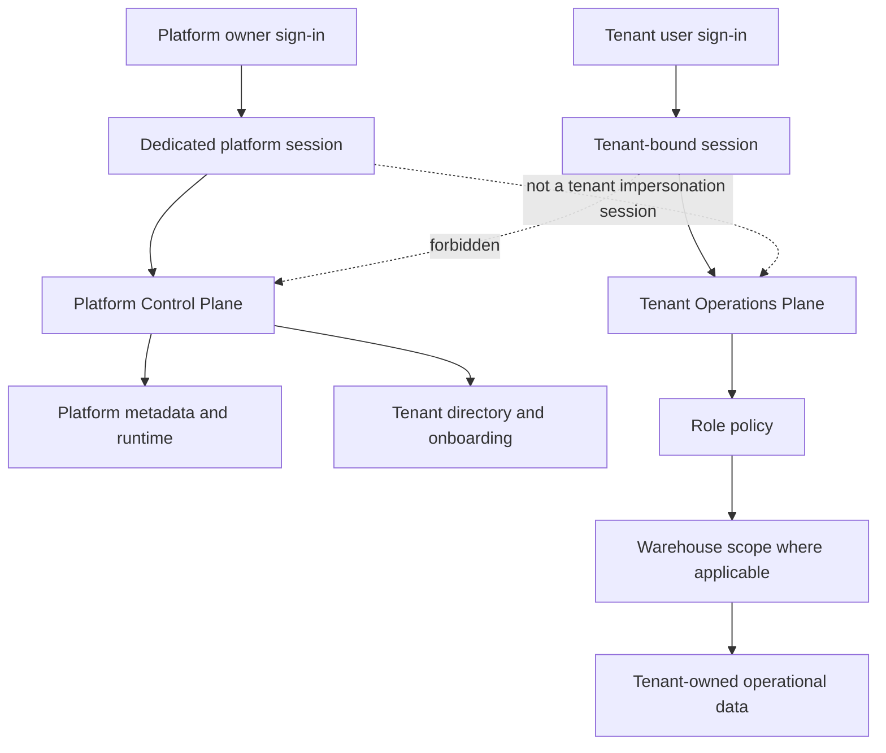

# Platform Control Plane And Tenant Access Boundary

## Status And Scope

This document is the authoritative access-boundary model for the SynapseCore pilot build. It describes implemented behavior, not a future IAM design.

The governing rule is:

> Platform owner sees the platform. Tenant sees its company. Role sees its responsibility. Warehouse scope limits the operation. Backend authority is final.

`TENANT_ADMIN` is a customer workspace role. It is not platform authority and cannot become platform authority through a tenant API.

## Two Security Planes



The platform and tenant identities use separate session attributes. Signing into a tenant invalidates the prior platform session. The control plane does not assign a customer role to the platform owner and does not provide implicit tenant impersonation.

## Previous Access Model And Defect

Before this gate, `/platform-admin` was rendered by `PlatformAdmin.jsx` inside the authenticated tenant shell. It was registered as an ordinary application page and had no distinct platform-owner authority. Tenant bootstrap data also loaded the global `/api/access/tenants` directory. The page mixed tenant session assumptions with platform-oriented runtime and tenant portfolio information.

Platform-wide tenant creation was separately protected by either:

- `X-Synapse-Bootstrap-Token`, backed by `SYNAPSECORE_BOOTSTRAP_INITIAL_TOKEN`, for initial bootstrap; or
- `X-Synapse-Platform-Admin-Token`, backed by `SYNAPSECORE_PLATFORM_ADMIN_TOKEN`, for trusted automation.

Those header credentials are appropriate for controlled scripts and deployment automation. They are not appropriate human browser credentials. The old UI therefore had no safe, coherent platform-owner access path: a tenant session could render a platform-looking page, while the real global mutation authority remained a deployment secret that the browser did not and should not possess.

## Final Platform-Owner Authentication

Human platform access uses a dedicated username/password session:

1. The operator opens `/platform-sign-in` or a platform route.
2. The frontend posts username and password to `POST /api/platform/session/login`.
3. `PlatformOwnerSessionService` verifies the configured username and BCrypt password hash.
4. A dedicated server session is created with a bounded inactivity timeout.
5. Login and logout are written to the audit log as `PLATFORM_AUTH_LOGIN` and `PLATFORM_AUTH_LOGOUT` under tenant marker `PLATFORM`.
6. Subsequent platform API requests rely on the session cookie. No platform token is sent to, stored by, or read from browser code.

Required deployment configuration:

| Variable | Purpose | Secret |
| --- | --- | --- |
| `SYNAPSECORE_PLATFORM_OWNER_USERNAME` | Dedicated human platform-owner username | Treat as sensitive identity metadata |
| `SYNAPSECORE_PLATFORM_OWNER_PASSWORD_HASH` | BCrypt hash of the platform-owner password | Yes |
| `SYNAPSECORE_PLATFORM_OWNER_DISPLAY_NAME` | Control-plane display name | No |
| `SYNAPSECORE_PLATFORM_OWNER_SESSION_TIMEOUT_MINUTES` | Session inactivity limit; default 120 | No |

The plaintext password is not a repository setting. The hash must be supplied through the deployment secret store. If username or hash is absent, human platform sign-in returns service unavailable rather than falling back to a tenant role or automation token.

Automation credentials remain supported only for bootstrap/proof operations. Token comparisons are constant-time. The browser control-plane component contains neither token header names nor token storage.

## Platform Routes And APIs

### Routes

| Route | Control-plane purpose |
| --- | --- |
| `/platform-sign-in` | Dedicated platform-owner authentication |
| `/platform-admin` | Platform health, tenant posture, and metadata-only activity overview |
| `/tenant-management` | Tenant summary directory and controlled tenant onboarding |
| `/system-config` | Platform runtime and deployment trust metadata |
| `/releases` | Release/build trust view |

`PlatformApplication.jsx` is the only executable renderer for these routes. Tenant `AppRoutes.jsx` does not import or render the former platform pages. Direct navigation without a platform session renders the platform sign-in surface, and protected backend requests return `403`.

### APIs

| API | Authority | Response purpose |
| --- | --- | --- |
| `GET /api/platform/session` | Public session probe | Signed-in state only |
| `POST /api/platform/session/login` | Platform credentials | Establish platform session |
| `POST /api/platform/session/logout` | Platform session | End platform session |
| `GET /api/platform/overview` | Platform session | Runtime, tenant summaries, platform activity metadata |
| `GET /api/platform/tenants` | Platform session | Tenant summaries |
| `GET /api/platform/runtime` | Platform session | Platform runtime metadata |
| `GET /api/platform/activity` | Platform session | Metadata-only cross-tenant support signals |
| `GET /api/access/tenants` | Platform session, bootstrap token, or automation token | Global tenant directory |
| `POST /api/access/tenants` | Platform session, bootstrap token, or automation token | Tenant provisioning |

Tenant sessions cannot use the last two APIs. The old optional tenant-admin onboarding branch has been removed from the controller.

## Platform Information Boundary

### Platform owner sees

- tenant ID, code, name, active state, and last update time;
- active user and operator counts;
- connector count and disabled connector count;
- failed inbound, replay-attention, and active-alert counts;
- derived tenant support state: `HEALTHY`, `ATTENTION`, or `INACTIVE`;
- platform liveness, readiness, build, deployment identity, active profiles, session-cookie posture, realtime mode/configuration flags, alert-hook configuration state, and global dispatch queue counts;
- activity metadata containing tenant code, category, condition, status, and observed time.

### Normal control plane intentionally does not return

- orders or order items;
- inventory quantities or product records;
- raw inbound or replay payloads;
- connector credentials, inbound tokens, passwords, or other secrets;
- audit details, target references, request payloads, or business-event payload summaries;
- tenant user password data;
- unrestricted tenant-session access.

The platform summary APIs use dedicated DTOs. They do not return business entities and do not over-fetch raw customer payloads into the browser.

### Support/deep access

No platform-owner tenant impersonation or hidden raw-data support backdoor is implemented. A future support-access capability, if justified, must be explicit, tenant-specific, time-bounded, purpose-recorded, and audited. It must not be added to the normal overview response.

## Activity Boundary

Tenant activity comes from tenant-scoped event and audit repositories exposed by `/api/events/recent` and `/api/audit/recent`. Tenant context is resolved server-side; changing a tenant header while holding another tenant's session does not switch ownership.

Platform activity comes from recent business events and audit logs but is mapped to `PlatformActivityResponse`:

| Field | Meaning |
| --- | --- |
| `tenantCode` | Tenant or `PLATFORM` condition owner |
| `category` | `BUSINESS_EVENT` or `AUDIT` |
| `condition` | Event type or audit action |
| `status` | Recorded/audit result state |
| `observedAt` | Timestamp |

Payload summaries, audit detail, target references, actor detail, order IDs, and raw inbound content are not included. Platform activity answers which platform or tenant condition needs attention; tenant activity remains the detailed operational timeline for that tenant.

## Runtime Boundary

The tenant route remains `/runtime`, backed by `GET /api/system/runtime`. Platform runtime uses `/system-config` and `/releases`, backed by `GET /api/platform/runtime` or the overview response.

Before this gate, the tenant runtime response included active profiles, header-fallback state, CORS origins, Render service and instance identifiers, public endpoint configuration, alert-hook state, and dispatch configuration. Those fields exceeded the tenant trust question.

### Final field matrix

| Runtime field/category | Tenant | Platform owner | Classification |
| --- | --- | --- | --- |
| Application name | Yes | Yes | Both |
| Build version, commit, build time | Yes | Yes | Both |
| Build branch, hosting platform, service/instance IDs | No/null | Yes | Platform owner only |
| Active Spring profiles | No | Yes | Platform owner only |
| Overall/liveness/readiness | Yes | Yes | Both |
| Secure-session-cookie state | Yes | Yes | Both trust signal |
| Tenant disabled connectors/replay/import/alert/fulfillment counts | Yes, current tenant | Aggregate tenant summary only | Tenant operational trust |
| Tenant connector diagnostic source/status/failure metadata | Yes, current tenant | Counts/support state only | Tenant operational trust |
| Realtime broker mode | Yes | Yes | Both |
| Realtime deployment configuration flags | No | Yes | Platform owner only |
| Tenant dispatch queue posture and operational metrics | Yes, current tenant | Global queue counts only | Split |
| CORS origins, public URLs, header-fallback config | No | No | Internal configuration, not response data |
| Secrets and credentials | No | No | Never returned |

## Tenant Role Capability Matrix

All roles require an authenticated tenant session. All data remains tenant-scoped. Warehouse scope further limits warehouse-bound reads and writes. A user may hold multiple roles; effective authority is the union of assigned roles, never the role name assumed by the browser.

| Role | Primary reads/pages | Protected writes/high-impact actions | Expected denials |
| --- | --- | --- | --- |
| `TENANT_ADMIN` | All common workspace pages; Users; Company Settings | Manage tenant operators/users, passwords, workspace/security policy, warehouse metadata, connector support ownership, operational policy, product create/update/import | Platform APIs, global tenant directory without platform authority, unrelated tenant mutation; integration/governance actions unless separately assigned |
| `REVIEW_OWNER` | Common workspace pages; Approvals | Assigned review-stage approve/reject for in-scope scenarios | Tenant administration, platform control plane, final approval, escalation acknowledgement, connector management |
| `FINAL_APPROVER` | Common workspace pages; Approvals | Assigned final-stage approve/reject for in-scope scenarios | Tenant administration, platform control plane, review-stage substitution, escalation acknowledgement, connector management |
| `ESCALATION_OWNER` | Common workspace pages; Escalations | Acknowledge assigned in-scope SLA escalations | Tenant administration, platform control plane, approval substitution, connector management |
| `INTEGRATION_ADMIN` | Common workspace pages; Integrations; Replay | Create/update connector policy; perform replay actions allowed to integration operators | Tenant administration, platform control plane, governance actions unless separately assigned |
| `INTEGRATION_OPERATOR` | Common workspace pages; Integrations; Replay | Replay failed inbound work in assigned warehouse scope | Connector management, tenant administration, platform control plane, governance actions unless separately assigned |

Common workspace pages are Dashboard, Alerts, Recommendations, Orders, Inventory, Catalog, Locations, Fulfillment, Scenarios, Scenario History, Runtime, Audit, and Profile. Catalog reads are common; catalog writes are tenant-admin only.

Current backend policy allows authenticated workspace users to view connector/import/replay APIs, while the tenant navigation and dashboard integration sections are limited to integration roles. Mutating connectors and replay execution remain role-protected. This read-policy breadth is documented as a future least-privilege refinement, not a cross-tenant leak.

## Platform Owner Capability Matrix

| Capability | Platform owner | Tenant role |
| --- | --- | --- |
| Platform shell and overview | Allowed | Denied |
| Tenant summary directory | Allowed | Denied |
| Create tenant | Allowed through platform session | Denied |
| Platform runtime/release metadata | Allowed | Denied |
| Metadata-only platform activity | Allowed | Denied |
| Tenant raw order/inventory/replay payload browser | Not implemented | Own tenant only through tenant session |
| Tenant impersonation | Not implemented | Not applicable |
| Deployment/bootstrap token retrieval | Never returned | Never returned |

## Navigation And Direct-Route Policy

The UI hides capabilities that are irrelevant to a role. Backend checks remain authoritative.

| Navigation item | Visible to |
| --- | --- |
| Dashboard, Alerts, Recommendations, Orders, Inventory, Catalog, Locations, Fulfillment, Scenarios, Scenario History, Runtime, Audit, Profile | All tenant roles |
| Approvals | `REVIEW_OWNER`, `FINAL_APPROVER` |
| Escalations | `ESCALATION_OWNER` |
| Integrations, Replay Queue | `INTEGRATION_ADMIN`, `INTEGRATION_OPERATOR` |
| Users, Company Settings | `TENANT_ADMIN` |
| Platform Overview, Tenant Directory, Platform Runtime, Release Trust | Platform-owner session only, separate shell |

If a tenant user navigates directly to a tenant page excluded by role policy, the frontend returns them to Dashboard. If they call its protected API directly, backend authorization decides the outcome. If any tenant user navigates to a platform route, the tenant shell is not reused and the platform sign-in is shown; the tenant session cannot satisfy platform APIs.

## Warehouse Scope Semantics

Effective warehouse authority is:

```text
tenant session + active operator + assigned roles + warehouse scopes
```

- A non-empty scope list permits only listed warehouse codes.
- An empty scope list means tenant-wide warehouse access. It is a high-impact assignment and must be reviewed as such.
- Scope is enforced server-side for inventory reads/writes, recent-order reads, order creation and lifecycle transitions, fulfillment reads/updates, scenario analysis/save/history/approval/rejection/escalation/execution, replay queue visibility, and manual replay.
- Dashboard inventory, fulfillment, recent order, connector, replay, scenario, and notification collections are filtered before response serialization.
- Tenant scope remains mandatory before warehouse scope; a warehouse code cannot move a session into another tenant.

## Synthetic Rehearsal Evidence

The automated integration rehearsal provisions only ephemeral H2 test data through supported HTTP APIs.

| Evidence | Value |
| --- | --- |
| Primary tenant | `ACCESS-BOUNDARY-REHEARSAL` |
| Isolation tenant | `ACCESS-BOUNDARY-ISOLATION` |
| Tenant admin | `boundary.admin` |
| Role identities | `boundary.review`, `boundary.final`, `boundary.escalation`, `boundary.integration.admin`, `boundary.integration.operator` |
| Warehouse scopes | Two starter warehouse codes; each non-admin role receives one scope, while tenant admin has empty/tenant-wide scope |

Passwords are test fixtures inside the test process and are not operational credentials. No customer data or real company name is used.

`PlatformTenantAccessBoundaryIntegrationTest` proves:

- wrong platform password rejection and successful dedicated platform session;
- platform overview/runtime/activity access and metadata privacy;
- tenant admin and all five non-admin role identities denied platform and tenant-user administration APIs;
- tenant session cannot inherit platform authority;
- tenant admin cannot list or create unrelated tenants;
- two-tenant event isolation;
- tenant runtime excludes profiles, origins, header fallback, and instance identity;
- scoped inventory, order, fulfillment, scenario, and replay-related views/actions do not disclose or mutate the other warehouse;
- empty-scope tenant admin sees both tenant warehouses.

The existing `SecurityVerificationIntegrationTest` covers products, inventory, orders, alerts, recommendations, replay, dashboard, runtime, users, and operator-directory isolation across tenants. Existing MVP and security tests cover governance role matching, assigned actor checks, connector management, replay role enforcement, and session lifecycle.

## Information-Boundary Rule

**Platform owner sees:** platform health, tenant metadata, aggregate support state, platform activity metadata, and approved administrative information.

**Tenant sees:** its operational data, activity, connector/replay state, alerts/recommendations, runtime trust, and governed workflows.

**Platform owner does not casually see:** raw tenant business payloads.

**Tenant does not see:** other tenants, global platform internals, platform authority, or the global tenant directory.

## Current Limitations And Deployment Prerequisite

- Human platform authority is one configured owner identity. It does not yet provide MFA, SSO/OIDC, multiple platform-owner accounts, platform RBAC, self-service credential rotation, or session inventory.
- The live deployment must configure the platform-owner username and BCrypt password hash before human control-plane sign-in can succeed. This must be verified after deployment without printing credentials.
- Platform activity is a recent metadata projection over current event/audit records, not a separate durable platform incident ledger.
- Platform support is metadata-first. There is intentionally no deep tenant support/impersonation workflow.
- Tenant connector/import/replay read endpoints remain workspace-readable at backend level; frontend navigation limits them to integration roles and all mutations remain role-protected. Narrowing those reads is a future least-privilege improvement if pilot evidence requires it.

These limitations do not permit cross-tenant access or tenant acquisition of platform authority.

## Verification Commands

```powershell
cd C:\Users\asus\Downloads\synapsecore_starter\synapsecore\backend
cmd /c mvnw.cmd test

cd ..\frontend
npm.cmd run lint
npm.cmd run build
npm.cmd run verify

cd ..
powershell -ExecutionPolicy Bypass -File scripts\docs-link-check.ps1
powershell -ExecutionPolicy Bypass -File scripts\secret-scan.ps1
git diff --check
```

Hosted proof is required only after the deployed backend has the platform-owner settings and the deployment is healthy. Do not place human passwords, BCrypt hashes, bootstrap tokens, or automation tokens in this document or in browser configuration.
