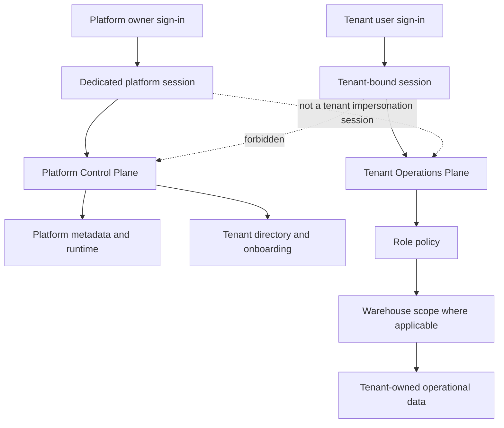

# Platform Control Plane And Tenant Access Boundary

## Status And Scope

This document is the authoritative access-boundary model for the SynapseCore pilot build. It describes implemented behavior, not a future IAM design.

Current gate status:

- dedicated platform-owner configuration and sign-in are live on Render;
- the platform-owner and all six single-role tenant identities were exercised through the rendered UI and direct APIs on 2026-08-22;
- scenario execution now requires an approved `SAVED_PLAN` with stored request payload plus `REVIEW_OWNER` or `FINAL_APPROVER` authority and warehouse scope;
- inventory, order, fulfillment, ingestion, replay, and governance write boundaries are role-specific and backend enforced;
- backend verification passes `152/152`; frontend lint, build, and verify pass;
- Critical blockers: `0`; High blockers: `0`;
- the gate is technically complete with the documented disabled-webhook replay limitation below. Phase 10 remains stopped until the gate owner accepts this record.

The governing rule is:

> Platform owner sees the platform. Tenant sees its company. Role sees its responsibility. Warehouse scope limits the operation. Backend authority is final.

`TENANT_ADMIN` is a customer workspace role. It is not platform authority and cannot become platform authority through a tenant API.

## Two Security Planes



The platform and tenant identities use separate session attributes. Signing into a tenant invalidates the prior platform session. The control plane does not assign a customer role to the platform owner and does not provide implicit tenant impersonation.

## Previous Access Model And Defect

Before this gate, `/platform-admin` was rendered by `PlatformAdmin.jsx` inside the authenticated tenant shell. It was registered as an ordinary application page and had no distinct platform-owner authority. Tenant bootstrap data also loaded the global `/api/access/tenants` directory. The page mixed tenant session assumptions with platform-oriented runtime and tenant portfolio information.

Platform-wide tenant creation was separately protected by either:

- `X-Synapse-Bootstrap-Token`, backed by `SYNAPSECORE_BOOTSTRAP_INITIAL_TOKEN`, for initial bootstrap; or
- `X-Synapse-Platform-Admin-Token`, backed by `SYNAPSECORE_PLATFORM_ADMIN_TOKEN`, for trusted automation.

Those header credentials are appropriate for controlled scripts and deployment automation. They are not appropriate human browser credentials. The old UI therefore had no safe, coherent platform-owner access path: a tenant session could render a platform-looking page, while the real global mutation authority remained a deployment secret that the browser did not and should not possess.

## Final Platform-Owner Authentication

Human platform access uses a dedicated username/password session:

1. The operator opens `/platform-sign-in` or a platform route.
2. The frontend posts username and password to `POST /api/platform/session/login`.
3. `PlatformOwnerSessionService` verifies the configured username and BCrypt password hash.
4. A dedicated server session is created with a bounded inactivity timeout.
5. Login and logout are written to the audit log as `PLATFORM_AUTH_LOGIN` and `PLATFORM_AUTH_LOGOUT` under tenant marker `PLATFORM`.
6. Subsequent platform API requests rely on the session cookie. No platform token is sent to, stored by, or read from browser code.

Required deployment configuration:

| Variable | Purpose | Secret |
| --- | --- | --- |
| `SYNAPSECORE_PLATFORM_OWNER_USERNAME` | Dedicated human platform-owner username | Treat as sensitive identity metadata |
| `SYNAPSECORE_PLATFORM_OWNER_PASSWORD_HASH` | BCrypt hash of the platform-owner password | Yes |
| `SYNAPSECORE_PLATFORM_OWNER_DISPLAY_NAME` | Control-plane display name | No |
| `SYNAPSECORE_PLATFORM_OWNER_SESSION_TIMEOUT_MINUTES` | Session inactivity limit; default 120 | No |

The plaintext password is not a repository setting. The hash must be supplied through the deployment secret store. If username or hash is absent, human platform sign-in returns service unavailable rather than falling back to a tenant role or automation token.

Automation credentials remain supported only for bootstrap/proof operations. Token comparisons are constant-time. The browser control-plane component contains neither token header names nor token storage.

## Platform Routes And APIs

### Routes

| Route | Control-plane purpose |
| --- | --- |
| `/platform-sign-in` | Dedicated platform-owner authentication |
| `/platform-admin` | Platform health, tenant posture, and metadata-only activity overview |
| `/tenant-management` | Tenant summary directory and controlled tenant onboarding |
| `/system-config` | Platform runtime and deployment trust metadata |
| `/releases` | Release/build trust view |

`PlatformApplication.jsx` is the only executable renderer for these routes. Tenant `AppRoutes.jsx` does not import or render the former platform pages. Direct navigation without a platform session renders the platform sign-in surface, and protected backend requests return `403`.

### APIs

| API | Authority | Response purpose |
| --- | --- | --- |
| `GET /api/platform/session` | Public session probe | Signed-in state only |
| `POST /api/platform/session/login` | Platform credentials | Establish platform session |
| `POST /api/platform/session/logout` | Platform session | End platform session |
| `GET /api/platform/overview` | Platform session | Runtime, tenant summaries, platform activity metadata |
| `GET /api/platform/tenants` | Platform session | Tenant summaries |
| `GET /api/platform/runtime` | Platform session | Platform runtime metadata |
| `GET /api/platform/activity` | Platform session | Metadata-only cross-tenant support signals |
| `GET /api/access/tenants` | Platform session, bootstrap token, or automation token | Global tenant directory |
| `POST /api/access/tenants` | Platform session, bootstrap token, or automation token | Tenant provisioning |

Tenant sessions cannot use the last two APIs. The old optional tenant-admin onboarding branch has been removed from the controller.

## Platform Information Boundary

### Platform owner sees

- tenant ID, code, name, active state, and last update time;
- active user and operator counts;
- connector count and disabled connector count;
- failed inbound, replay-attention, and active-alert counts;
- derived tenant support state: `HEALTHY`, `ATTENTION`, or `INACTIVE`;
- platform liveness, readiness, build, deployment identity, active profiles, session-cookie posture, realtime mode/configuration flags, alert-hook configuration state, and global dispatch queue counts;
- activity metadata containing tenant code, category, condition, status, and observed time.

### Normal control plane intentionally does not return

- orders or order items;
- inventory quantities or product records;
- raw inbound or replay payloads;
- connector credentials, inbound tokens, passwords, or other secrets;
- audit details, target references, request payloads, or business-event payload summaries;
- tenant user password data;
- unrestricted tenant-session access.

The platform summary APIs use dedicated DTOs. They do not return business entities and do not over-fetch raw customer payloads into the browser.

### Support/deep access

No platform-owner tenant impersonation or hidden raw-data support backdoor is implemented. A future support-access capability, if justified, must be explicit, tenant-specific, time-bounded, purpose-recorded, and audited. It must not be added to the normal overview response.

## Activity Boundary

Tenant activity comes from tenant-scoped event and audit repositories exposed by `/api/events/recent` and `/api/audit/recent`. Tenant context is resolved server-side; changing a tenant header while holding another tenant's session does not switch ownership.

Platform activity comes from recent business events and audit logs but is mapped to `PlatformActivityResponse`:

| Field | Meaning |
| --- | --- |
| `tenantCode` | Tenant or `PLATFORM` condition owner |
| `category` | `BUSINESS_EVENT` or `AUDIT` |
| `condition` | Event type or audit action |
| `status` | Recorded/audit result state |
| `observedAt` | Timestamp |

Payload summaries, audit detail, target references, actor detail, order IDs, and raw inbound content are not included. Platform activity answers which platform or tenant condition needs attention; tenant activity remains the detailed operational timeline for that tenant.

## Runtime Boundary

The tenant route remains `/runtime`, backed by `GET /api/system/runtime`. Platform runtime uses `/system-config` and `/releases`, backed by `GET /api/platform/runtime` or the overview response.

Before this gate, the tenant runtime response included active profiles, header-fallback state, CORS origins, Render service and instance identifiers, public endpoint configuration, alert-hook state, and dispatch configuration. Those fields exceeded the tenant trust question.

### Final field matrix

| Runtime field/category | Tenant | Platform owner | Classification |
| --- | --- | --- | --- |
| Application name | Yes | Yes | Both |
| Build version, commit, build time | Yes | Yes | Both |
| Build branch, hosting platform, service/instance IDs | No/null | Yes | Platform owner only |
| Active Spring profiles | No | Yes | Platform owner only |
| Overall/liveness/readiness | Yes | Yes | Both |
| Secure-session-cookie state | Yes | Yes | Both trust signal |
| Tenant disabled connectors/replay/import/alert/fulfillment counts | Yes, current tenant | Aggregate tenant summary only | Tenant operational trust |
| Tenant connector diagnostic source/status/failure metadata | Yes, current tenant | Counts/support state only | Tenant operational trust |
| Realtime broker mode | Yes | Yes | Both |
| Realtime deployment configuration flags | No | Yes | Platform owner only |
| Tenant dispatch queue posture and operational metrics | Yes, current tenant | Global queue counts only | Split |
| CORS origins, public URLs, header-fallback config | No | No | Internal configuration, not response data |
| Secrets and credentials | No | No | Never returned |

## Tenant Role Capability Matrix

All roles require an authenticated tenant session. All data remains tenant-scoped. Warehouse scope further limits warehouse-bound reads and writes. A user may hold multiple roles; effective authority is the union of assigned roles, never the role name assumed by the browser.

| Role | Primary reads/pages | Protected writes/high-impact actions | Expected denials |
| --- | --- | --- | --- |
| `TENANT_ADMIN` | All common workspace pages; Users; Company Settings | Manage tenant operators/users, passwords, workspace/security policy, warehouse metadata, connector support ownership, operational policy, product create/update/import, inventory update/receive/adjust/reconcile | Platform APIs, global tenant directory without platform authority, direct order/fulfillment writes, human-session ingestion, integration/replay detail, governance actions unless separately assigned |
| `REVIEW_OWNER` | Common workspace pages; Approvals | Assigned review-stage approve/reject for in-scope scenarios; execute only approved saved plans with stored request payloads | Tenant administration, platform control plane, final approval, escalation acknowledgement, connector management, inventory/order/fulfillment/ingestion writes |
| `FINAL_APPROVER` | Common workspace pages; Approvals | Assigned final-stage approve/reject for in-scope scenarios; execute only approved saved plans with stored request payloads | Tenant administration, platform control plane, review-stage substitution, escalation acknowledgement, connector management, inventory/order/fulfillment/ingestion writes |
| `ESCALATION_OWNER` | Common workspace pages; Escalations | Acknowledge assigned in-scope SLA escalations | Tenant administration, platform control plane, approval substitution, connector management, inventory/order/fulfillment/ingestion writes, scenario execution by this role alone |
| `INTEGRATION_ADMIN` | Common workspace pages; Integrations; Replay | Create/update connector policy; human-session webhook/CSV ingestion; direct operational order and fulfillment writes; perform replay actions allowed to integration operators | Tenant administration, platform control plane, governance actions unless separately assigned, inventory maintenance writes |
| `INTEGRATION_OPERATOR` | Common workspace pages; Integrations; Replay | Human-session webhook/CSV ingestion; direct operational order and fulfillment writes; replay failed inbound work in assigned warehouse scope | Connector management, tenant administration, platform control plane, governance actions unless separately assigned, inventory maintenance writes |

Common workspace pages are Dashboard, Alerts, Recommendations, Orders, Inventory, Catalog, Locations, Fulfillment, Scenarios, Scenario History, Runtime, Audit, and Profile. Catalog reads are common; catalog writes are tenant-admin only.

### State-changing authority boundary

The pilot build deliberately separates setup, integration, and governance mutation paths:

| Operation family | Required authority | Additional boundary |
| --- | --- | --- |
| Product/catalog create, update, and import | `TENANT_ADMIN` | Tenant scope |
| Inventory update, receive, adjust, reconcile | `TENANT_ADMIN` | Tenant and warehouse scope |
| Direct order creation and order transition | `INTEGRATION_ADMIN` or `INTEGRATION_OPERATOR` | Tenant and warehouse scope |
| Fulfillment status update | `INTEGRATION_ADMIN` or `INTEGRATION_OPERATOR` | Tenant and warehouse scope |
| Human-session webhook or CSV ingestion | `INTEGRATION_ADMIN` or `INTEGRATION_OPERATOR` | Tenant and connector policy |
| Connector create/update | `INTEGRATION_ADMIN` | Tenant scope and connector policy |
| Manual replay | `INTEGRATION_ADMIN` or `INTEGRATION_OPERATOR` | Tenant, connector, warehouse, duplicate, and eligibility checks |
| Standard review approve/reject | Assigned `REVIEW_OWNER` | Scenario assignment, stage, tenant, and warehouse scope |
| Final approval approve/reject | Assigned `FINAL_APPROVER` | Scenario assignment, stage, tenant, and warehouse scope |
| Escalation acknowledgement | Assigned `ESCALATION_OWNER` | Scenario assignment, escalation state, tenant, and warehouse scope |
| Scenario execution | `REVIEW_OWNER` or `FINAL_APPROVER` | Only approved `SAVED_PLAN` records with stored request payloads; `PREVIEW` records are loadable but not executable |

Hidden navigation is not accepted as proof. The backend denies wrong-role, wrong-actor, wrong-stage, wrong-warehouse, and wrong-tenant attempts directly.

### Integration and replay read matrix

The backend, navigation, dashboard projection, and realtime subscriptions now use the same responsibility boundary. The three full-detail read APIs are:

- `GET /api/integrations/orders/connectors`;
- `GET /api/integrations/orders/imports/recent`;
- `GET /api/integrations/orders/replay-queue`.

| Role | Connector configuration/policy | Import history | Failed inbound/replay queue | Classification |
| --- | --- | --- | --- | --- |
| `TENANT_ADMIN` | No full endpoint; dedicated Company Settings workspace support metadata only | No | No | Full integration reads not required; limited support ownership metadata is optional but justified |
| `REVIEW_OWNER` | No | No | No | Not required; scenario and approval APIs carry the governance evidence |
| `FINAL_APPROVER` | No | No | No | Not required; scenario and approval APIs carry the governance evidence |
| `ESCALATION_OWNER` | No | No | No | Not required; escalation and scenario APIs carry the assigned evidence |
| `INTEGRATION_ADMIN` | Yes | Yes | Yes | Required for connector administration and recovery ownership |
| `INTEGRATION_OPERATOR` | Yes, read-only | Yes | Yes | Required for operational monitoring and authorized replay |

The three APIs reject all sessions without `INTEGRATION_ADMIN` or `INTEGRATION_OPERATOR`, regardless of frontend navigation. Connector mutations remain `INTEGRATION_ADMIN` only. Manual replay remains `INTEGRATION_ADMIN` or `INTEGRATION_OPERATOR`. Tenant admins can still read the purpose-specific connector support metadata returned by `/api/access/admin/workspace`; this does not grant the full connector, import, or replay resources.

### Realtime read boundary

Realtime authorization is enforced during STOMP subscription, not only when the browser builds navigation:

- every tenant topic must match the authenticated session tenant;
- raw integration topics require an integration role;
- warehouse-scoped sessions cannot subscribe to tenant-wide raw inventory, order, fulfillment, scenario, or integration collections;
- scoped integration sessions subscribe to the metadata-only `integrations.changed` signal and refresh through warehouse-filtered REST APIs;
- governance and tenant-admin-only sessions do not subscribe to integration topics.

The change signal carries only `changedAt`; it does not contain connector, import, replay, order, or payload data.

## Platform Owner Capability Matrix

| Capability | Platform owner | Tenant role |
| --- | --- | --- |
| Platform shell and overview | Allowed | Denied |
| Tenant summary directory | Allowed | Denied |
| Create tenant | Allowed through platform session | Denied |
| Platform runtime/release metadata | Allowed | Denied |
| Metadata-only platform activity | Allowed | Denied |
| Tenant raw order/inventory/replay payload browser | Not implemented | Own tenant only through tenant session |
| Tenant impersonation | Not implemented | Not applicable |
| Deployment/bootstrap token retrieval | Never returned | Never returned |

## Navigation And Direct-Route Policy

The UI hides capabilities that are irrelevant to a role. Backend checks remain authoritative.

| Navigation item | Visible to |
| --- | --- |
| Dashboard, Alerts, Recommendations, Orders, Inventory, Catalog, Locations, Fulfillment, Scenarios, Scenario History, Runtime, Audit, Profile | All tenant roles |
| Approvals | `REVIEW_OWNER`, `FINAL_APPROVER` |
| Escalations | `ESCALATION_OWNER` |
| Integrations, Replay Queue | `INTEGRATION_ADMIN`, `INTEGRATION_OPERATOR` |
| Users, Company Settings | `TENANT_ADMIN` |
| Platform Overview, Tenant Directory, Platform Runtime, Release Trust | Platform-owner session only, separate shell |

If a tenant user navigates directly to a tenant page excluded by role policy, the frontend returns them to Dashboard. If they call its protected API directly, backend authorization decides the outcome. If any tenant user navigates to a platform route, the tenant shell is not reused and the platform sign-in is shown; the tenant session cannot satisfy platform APIs.

## Warehouse Scope Semantics

Effective warehouse authority is:

```text
tenant session + active operator + assigned roles + warehouse scopes
```

- A non-empty scope list permits only listed warehouse codes.
- An empty scope list means tenant-wide warehouse access. It is a high-impact assignment and must be reviewed as such.
- Scope is enforced server-side for inventory reads/writes, recent-order reads, order creation and lifecycle transitions, fulfillment reads/updates, scenario analysis/save/history/approval/rejection/escalation/execution, replay queue visibility, and manual replay.
- Dashboard inventory, fulfillment, recent order, connector, replay, scenario, and notification collections are filtered before response serialization.
- Tenant scope remains mandatory before warehouse scope; a warehouse code cannot move a session into another tenant.

## Session Revocation And Access Changes

- Disabling a tenant user increments that user's session version. Existing sessions become invalid on their next session probe or protected request.
- Remapping a user to another operator also increments the session version and requires a new sign-in.
- Operator role, active-state, and warehouse-scope checks are resolved from persisted authority during session validation. An active session therefore receives the updated operator boundary rather than retaining a stale browser-side role or scope.
- Explicit logout invalidates the current server session. A signed-out request cannot retain tenant or platform authority.
- An empty warehouse-scope assignment remains tenant-wide and must be handled as a high-impact access change.

## Synthetic Rehearsal Evidence

The automated integration rehearsal provisions only ephemeral H2 test data through supported HTTP APIs.

| Evidence | Value |
| --- | --- |
| Primary tenant | `ACCESS-BOUNDARY-REHEARSAL` |
| Isolation tenant | `ACCESS-BOUNDARY-ISOLATION` |
| Tenant bootstrap administrator | `boundary.admin` (multi-role provisioning identity) |
| Six single-role identities | `boundary.tenant.admin`, `boundary.review`, `boundary.final`, `boundary.escalation`, `boundary.integration.admin`, `boundary.integration.operator` |
| Warehouse scopes | Two starter warehouse codes; each non-admin role receives one scope, while tenant admin has empty/tenant-wide scope |

Passwords are test fixtures inside the test process and are not operational credentials. No customer data or real company name is used.

`PlatformTenantAccessBoundaryIntegrationTest` proves:

- wrong platform password rejection and successful dedicated platform session;
- platform logout, signed-out platform denial, and platform-session denial from tenant operations;
- platform overview/runtime/activity access and metadata privacy;
- all six single-role tenant identities expose only their own session identity, roles, tenant, and warehouse scopes;
- tenant admin and all five non-admin role identities are denied every protected platform API and the global tenant directory;
- all five non-admin roles are denied tenant-user administration APIs;
- role clashes do not grant product writes, tenant administration, connector mutation, or unrelated governance authority;
- single-role tenant admin and all three governance roles denied full connector/import/replay reads;
- both integration roles allowed the three required integration/replay reads;
- tenant admin retained only the purpose-specific workspace support projection;
- tenant session cannot inherit platform authority;
- tenant admin cannot list or create unrelated tenants;
- disabled-user sessions are revoked and protected requests are denied;
- warehouse-scope changes take effect for an existing session, and logout removes subsequent authority;
- two-tenant event isolation;
- tenant runtime excludes profiles, origins, header fallback, and instance identity;
- scoped inventory, order, fulfillment, scenario, and replay-related views/actions do not disclose or mutate the other warehouse;
- empty-scope tenant admin sees both tenant warehouses.

`WebSocketAccessBoundaryTest` additionally proves cross-tenant topic denial, governance-role integration topic denial, warehouse-scoped raw-topic denial, safe change-signal access for scoped integration users, and raw integration-topic access for tenant-wide integration users.

The expanded `SecurityVerificationIntegrationTest` covers products, inventory, orders, alerts, recommendations, connectors, replay, dashboard, runtime, workspace settings, events, audit, scenarios, users, and operator-directory isolation across two tenants. Existing MVP and security tests cover governance role matching, assigned actor checks, connector management, replay role enforcement, and session lifecycle.

`frontend/scripts/frontend-check.mjs` executes the six-role navigation and direct-route matrix for Approvals, Escalations, Integrations, Replay Queue, Users, and Company Settings. This supplements, but never replaces, backend authorization.

## Live Closure Evidence

Live environment: Render frontend and backend, using synthetic rehearsal tenants only. No customer data, plaintext password, password hash, token, session cookie, connector secret, or raw inbound payload is recorded here.

### Platform owner

- `/platform-sign-in` loaded and established the dedicated server-side platform session.
- Platform Overview, Tenant Directory, Platform Runtime, Platform Activity, and Release Trust loaded in the platform shell.
- Platform Activity remained metadata-only. The control plane did not expose raw orders, order items, product rows, inventory rows, inbound/replay payloads, connector secrets, or customer credentials.
- Platform sign-out removed authority; signed-out platform APIs were denied.
- Every tested tenant role was denied `/api/platform/*`, and direct platform navigation returned the separate platform sign-in surface.

### Six-role rendered matrix

| Role | Rendered authority | Direct/backend denial evidence | Result |
| --- | --- | --- | --- |
| `TENANT_ADMIN` | Tenant-wide identity, Users, and Company Settings; tenant administration controls | Integration/replay, approvals, and platform authority denied; scenario execution now denied | PASS |
| `INTEGRATION_ADMIN` | `WH-COAST`; Integrations, Replay Queue, connector policy controls | Users, governance, platform, unrelated product writes, and scenario execution denied | PASS |
| `INTEGRATION_OPERATOR` | `WH-COAST`; integration reads and replay/recovery lane | Users, connector policy mutation, governance, platform, and scenario execution denied | PASS |
| `REVIEW_OWNER` | `WH-COAST`; Approvals and review actions; eligible scenario execution | Integrations, Users, Escalations, and platform authority denied | PASS |
| `FINAL_APPROVER` | `WH-COAST`; Approvals and final-decision actions; eligible scenario execution | Integrations, Users, Escalations, and platform authority denied | PASS |
| `ESCALATION_OWNER` | `WH-COAST`; Escalations and acknowledgement lane | Approvals, Integrations, Users, platform authority, and scenario execution denied | PASS |

All roles showed the expected identity and warehouse scope, retained general workspace reads, loaded tenant Runtime and Activity rather than platform variants, and signed out safely. Hidden navigation was not accepted as security evidence: direct routes and protected APIs were attempted separately. Cross-tenant reads/writes, wrong-warehouse mutations, global tenant directory access, and platform APIs were denied.

### Corrective findings closed during the walkthrough

1. Scenario execution previously required only workspace and warehouse access. The backend now requires `REVIEW_OWNER` or `FINAL_APPROVER`; a new integration test denies tenant-admin, integration, and escalation-only identities. The deployed UI hides execution from non-governance roles. Live fresh-session evidence returned `403` for non-governance roles and `200` for a scoped Review Owner.
2. Top-bar shortcuts and global page search previously used the unfiltered workspace page list. They now reuse `canAccessWorkspacePage`; the deployed Escalation Owner dashboard shows Escalations but does not advertise Approvals.
3. Approved scenarios no longer render a misleading rejection action. Rejection remains available only while a saved plan is pending approval.

### Realtime, session, and recovery evidence

- Cross-tenant topics, governance-role integration topics, warehouse-scoped raw topics, and wrong-tenant topics were denied.
- Scoped integration roles received the metadata-only change signal and refreshed filtered REST state; tenant-wide integration scope received only its authorized raw topic.
- Disable/re-enable, role/scope refresh, explicit tenant logout, explicit platform logout, and signed-out denial were exercised. One pre-redeploy PowerShell session retained from the deliberate revocation exercise returned a transient `500`; a fresh active session repeated the same forbidden scenario action as `403`. No authority was granted. This remains a Low support observation for stale clients across deployment boundaries.
- The supported CSV failure -> evidence -> correction -> replay -> duplicate-safety lane passed live.
- Disabled `WEBHOOK_ORDER` currently returns `403` and records failure/import evidence, but the corresponding filtered replay queue can remain empty on Render. Local integration coverage expects a `CONNECTOR_DISABLED` pending replay row. The mismatch is a Medium limitation because disabled-webhook replay is not in the approved pilot recovery lane. If a pilot requires this webhook recovery path, it becomes a High blocker until resolved and live-proven.

## Information-Boundary Rule

**Platform owner sees:** platform health, tenant metadata, aggregate support state, platform activity metadata, and approved administrative information.

**Tenant sees:** its operational data, activity, connector/replay state, alerts/recommendations, runtime trust, and governed workflows.

**Platform owner does not casually see:** raw tenant business payloads.

**Tenant does not see:** other tenants, global platform internals, platform authority, or the global tenant directory.

## Current Limitations And Deployment Prerequisite

- Human platform authority is one configured owner identity. It does not yet provide MFA, SSO/OIDC, multiple platform-owner accounts, platform RBAC, self-service credential rotation, or session inventory.
- The live deployment must configure the platform-owner username and BCrypt password hash before human control-plane sign-in can succeed. This must be verified after deployment without printing credentials.
- Platform activity is a recent metadata projection over current event/audit records, not a separate durable platform incident ledger.
- Platform support is metadata-first. There is intentionally no deep tenant support/impersonation workflow.
- Import-run records are tenant-level operational metadata and do not currently carry a warehouse identifier. They are restricted to integration roles, but cannot be further warehouse-filtered until the import data model records an authoritative warehouse association. This is a medium least-privilege limitation, not cross-tenant exposure.
- Disabled-webhook failure visibility is not yet deterministic between local integration proof and Render replay-queue readback. The Company 1 pilot must use the proven CSV recovery lane unless this mismatch is fixed and re-proven.
- A stale client session retained across deliberate revocation and redeployment produced one `500` denial response; fresh sessions denied correctly with `403`. Treat unexpected stale-session errors as support evidence and require a fresh sign-in.

These limitations do not permit cross-tenant access or tenant acquisition of platform authority.

## Verification Commands

```powershell
cd C:\Users\asus\Downloads\synapsecore_starter\synapsecore\backend
cmd /c mvnw.cmd test

cd ..\frontend
npm.cmd run lint
npm.cmd run build
npm.cmd run verify

cd ..
powershell -ExecutionPolicy Bypass -File scripts\docs-link-check.ps1
powershell -ExecutionPolicy Bypass -File scripts\secret-scan.ps1
git diff --check
```

Hosted proof is required only after the deployed backend has the platform-owner settings and the deployment is healthy. Do not place human passwords, BCrypt hashes, bootstrap tokens, or automation tokens in this document or in browser configuration.

**Final access-gate classification:** `ACCEPTED WITH DOCUMENTED LIMITATIONS`, pending gate-owner review before Phase 10. Critical blockers: `0`. High blockers: `0`.
