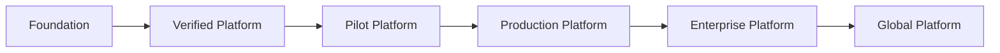

# Platform Maturity Model

This model describes how SynapseCore matures over time.

It is evidence-based. It should not be used to inflate product claims.

## Maturity Levels

## Level 1: Foundation

Meaning:

- the product architecture exists
- core frontend/backend surfaces exist
- infrastructure model exists
- basic local and hosted deployment paths exist

Required evidence:

- codebase structure
- core docs
- initial build/test capability
- architecture explained

Engineering expectations:

- coherent modules
- basic testability
- clear env setup

Operational expectations:

- local runbook
- deployment docs
- known limitations

Customer expectations:

- not customer-ready yet
- internal validation only

## Level 2: Verified Platform

Meaning:

- the platform can be verified through repeatable checks
- frontend/backend contracts are stable enough for proof
- runtime and readiness are visible

Required evidence:

- build passes
- verify passes
- live connection check exists
- proof tooling exists
- docs link check exists

Engineering expectations:

- proof-critical selectors protected
- scripts reduce guesswork
- config drift documented

Operational expectations:

- readiness/liveness understood
- local and Render runbooks exist

Customer expectations:

- can be reviewed technically
- not yet broad pilot without full proof evidence

## Level 3: Pilot Platform

Meaning:

- SynapseCore is usable for controlled pilot evaluation within the current supported scope

Required evidence:

- hosted proof passed
- Pilot Release Candidate packaged
- support and operations docs exist
- product knowledge base exists
- current limitations documented

Engineering expectations:

- no fake proof claims
- quality gates defined
- release evidence captured
- engineering readiness tracked

Operational expectations:

- support playbook
- recovery playbooks
- incident classification
- proof pause rules

Customer expectations:

- controlled pilot only
- scope must be explicit
- feedback should drive improvement

Current SynapseCore classification:

- `Level 3: Pilot Platform`

## Level 4: Production Platform

Meaning:

- the platform can support real production operations for defined customer segments with repeatable support and recovery processes

Required evidence:

- repeated pilot success
- production incident handling
- backup/restore evidence
- release cadence discipline
- customer acceptance evidence
- security posture review

Engineering expectations:

- stronger integration test coverage
- better observability
- safer migration/release process
- release rollback evidence

Operational expectations:

- support ownership
- maintenance cadence
- monitoring routines
- restore drills

Customer expectations:

- production use within a defined supported envelope
- known limitations remain visible

## Level 5: Enterprise Platform

Meaning:

- the platform is mature enough for enterprise evaluation and deployment with stronger governance, security, scale, and support expectations

Required evidence:

- enterprise security review
- SSO/RBAC maturity
- mature audit/event storage
- metrics/tracing stack
- connector scalability evidence
- stronger backup/restore posture
- formal release and incident process

Engineering expectations:

- HA-aware architecture decisions
- background job separation where justified
- capacity planning
- advanced tenant governance

Operational expectations:

- documented SLAs/SLOs
- support escalation model
- enterprise onboarding process
- production monitoring

Customer expectations:

- serious enterprise rollout possible within contracted scope
- not unlimited global scale unless separately proven

## Level 6: Global Platform

Meaning:

- the platform can support large-scale, multi-region, high-availability operational usage

Required evidence:

- multi-region architecture
- global realtime strategy
- HA database posture
- disaster recovery validation
- advanced observability and alerting
- capacity and load evidence
- enterprise-grade connector ecosystem

Engineering expectations:

- platform engineering discipline
- automated deployment maturity
- robust event/queue architecture
- global incident response process

Operational expectations:

- 24/7 support readiness
- DR drills
- advanced compliance posture
- mature customer success operations

Customer expectations:

- global operational platform claims only after proof and contractual maturity

## Bottom Line

SynapseCore is currently a pilot platform with strong foundations and proof evidence.

The next maturity leap is not feature breadth. It is repeated operational evidence, production support discipline, and hardened reliability over time.
