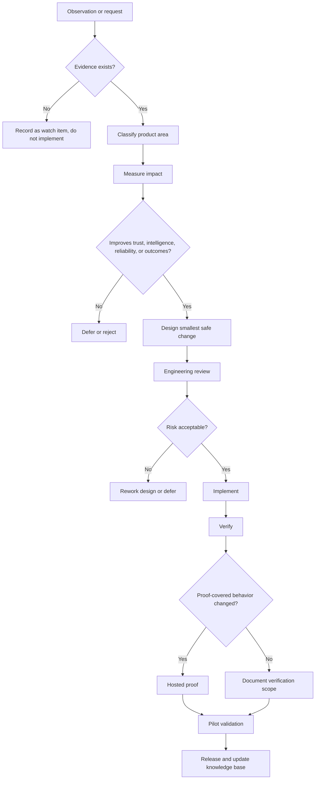

# Product Evolution Framework

SynapseCore has moved from foundational product development into product evolution.

This means future work should not start with feature brainstorming. It should start with operational evidence.

## Purpose

The product evolution framework explains how SynapseCore becomes better without losing the engineering quality, operational trust, proof discipline, and product philosophy established during the Pilot Release Candidate phase.

Future changes should improve one or more of:

- operational intelligence
- reliability
- runtime trust
- replay recovery
- approval governance
- supportability
- customer confidence
- maintainability
- verification depth
- documentation quality

If a change does not improve one of those qualities, it should not be treated as a priority.

## Evolution Philosophy

Before the Pilot Release Candidate, the central question was:

```text
Can we build SynapseCore?
```

After the Pilot Release Candidate, the central question becomes:

```text
What operational evidence proves SynapseCore should change?
```

That shift protects the platform from becoming noisy, speculative, or bloated.

## Evidence Sources

Valid product evolution inputs include:

- pilot operator observations
- customer workflow evidence
- hosted proof failures
- support incidents
- runtime or readiness instability
- replay recovery evidence
- approval workflow bottlenecks
- connector failure patterns
- measurable operational outcomes
- technical reviewer feedback grounded in the current system

Weak inputs include:

- vague feature ideas
- competitor imitation without customer evidence
- broad enterprise wish lists
- UI preference changes without workflow impact
- speculative architecture not justified by scale evidence

## Idea To Product Path



## Product Improvement Qualification

A proposed improvement qualifies when it can answer at least one of these questions:

- Did a pilot operator experience this?
- Did a customer request this during a real workflow?
- Did hosted proof expose a gap?
- Did monitoring reveal instability?
- Did production evidence justify the work?
- Does it increase operational intelligence?
- Does it increase trust?
- Does it increase reliability?
- Does it reduce manual reconciliation?
- Does it improve replay recovery or approval clarity?

If the answer is no, the idea should remain parked.

## Product And Engineering Alignment

Product and engineering stay aligned by using the same evidence packet.

Every accepted improvement should define:

- observed problem
- affected users
- affected product surfaces
- operational impact
- evidence source
- proposed behavior change
- proof impact
- rollback posture
- docs that must update

Engineering should reject work that lacks product evidence. Product should reject designs that weaken proof, runtime truth, or maintainability.

## Release Planning

Future releases should be planned around evidence clusters, not feature volume.

Examples:

- replay reliability cluster
- approval ownership cluster
- operator visibility cluster
- connector failure classification cluster
- runtime trust cluster
- pilot onboarding clarity cluster

Each release should have:

- measurable purpose
- limited scope
- explicit quality gates
- proof plan
- support plan
- knowledge-base update

## Evidence Collection

Evidence should be captured in durable form:

- support notes
- incident reports
- proof output
- release evidence
- pilot feedback
- screenshots or reports when useful
- runtime check output
- acceptance criteria

Avoid relying on memory or chat history alone.

## Decision Ownership

Product decisions should be made with a clear owner.

Typical ownership:

- product owner: value, scope, user impact
- engineering owner: feasibility, risk, implementation quality
- operations owner: supportability, rollout posture
- pilot/customer owner: real-world workflow validation

No single role should push a change through if another role identifies a trust or proof risk.

## Evolution Guardrails

Do not:

- expand scope without evidence
- hide degraded states
- automate risky decisions invisibly
- weaken hosted proof
- add connectors without recovery posture
- add dashboards that do not improve operational action
- treat demo mode as product proof
- claim enterprise maturity before evidence exists

## Bottom Line

SynapseCore should evolve like an operational platform, not like a feature pile.

Evidence comes first. Design follows. Engineering proves. Pilots validate. Releases preserve trust.
