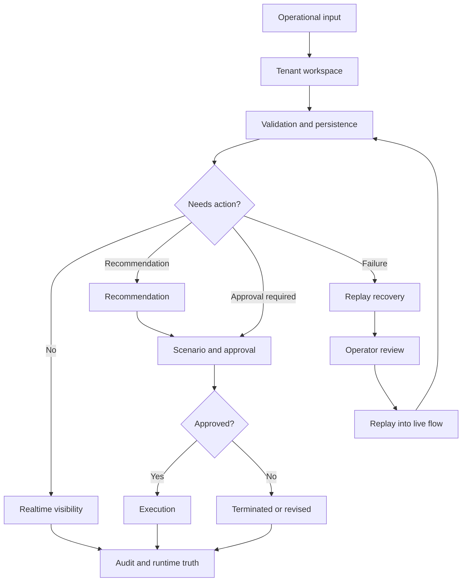

# Product Knowledge Base

This is the entry point for SynapseCore product knowledge.

It is not a marketing layer and it is not an engineering runbook. It explains the product language, operating model, roles, business processes, and industry usage patterns so customers, implementation partners, operators, architects, and internal teams can speak about SynapseCore consistently.

## What This Knowledge Base Covers

SynapseCore is an operations command-center platform. It connects operational visibility, tenant workspace control, orders, catalog, inventory, integrations, replay recovery, approvals, scenarios, alerts, recommendations, realtime state, and runtime trust into one coordinated surface.

This knowledge base explains:

- the core product concepts
- the product dictionary
- how business processes move through SynapseCore
- how different industries use the same platform differently
- how executives, operations managers, warehouse managers, IT administrators, and solution architects should understand the system
- what the long-term product vision is without pretending that future capabilities already exist

## First-Read Path

For someone trying to understand SynapseCore as a product, read in this order:

1. [operational-concepts.md](operational-concepts.md)
2. [synapsecore-dictionary.md](synapsecore-dictionary.md)
3. [business-process-library.md](business-process-library.md)
4. [executive-product-guide.md](executive-product-guide.md)
5. [operations-manager-guide.md](operations-manager-guide.md)
6. [solution-architect-guide.md](solution-architect-guide.md)

Then use the role and industry guides as needed.

## Core Product Loop

The simplest way to understand SynapseCore is this loop:

## Current Supported Product Scope

The current product scope is real but intentionally bounded.

Currently supported and proven:

- tenant workspace creation and sign-in
- authenticated command-center shell
- catalog and product onboarding
- inventory visibility and operational pages
- order surfaces
- integrations visibility
- replay recovery through supported proof flows
- scenario approval and execution through supported proof flows
- alerts and recommendations surfaces
- runtime, readiness, websocket, auth/session, and proof checks
- hosted proof against deployed frontend/backend when dependencies are healthy

Not currently claimed as complete enterprise breadth:

- broad ERP connector marketplace
- global high-availability deployment architecture
- enterprise SSO and advanced RBAC across all customer patterns
- unlimited horizontal realtime scale
- mature external event bus architecture
- full multi-region operations

## Product Knowledge Principles

SynapseCore should be explained with these principles:

- Operational truth is more important than a pretty green status.
- Failed inbound work should be visible, recoverable, and auditable.
- Operators need action context, not only analytics.
- Approvals exist to control risky operational execution.
- Realtime status matters because operations move while people are looking.
- Tenant workspaces keep customer/company context explicit.
- Proof exists to protect real behavior from drifting into demo theater.

## Related Docs

- [operational-concepts.md](operational-concepts.md)
- [synapsecore-dictionary.md](synapsecore-dictionary.md)
- [business-process-library.md](business-process-library.md)
- [executive-product-guide.md](executive-product-guide.md)
- [operations-manager-guide.md](operations-manager-guide.md)
- [warehouse-manager-guide.md](warehouse-manager-guide.md)
- [it-administrator-guide.md](it-administrator-guide.md)
- [solution-architect-guide.md](solution-architect-guide.md)
- [future-product-vision.md](future-product-vision.md)
