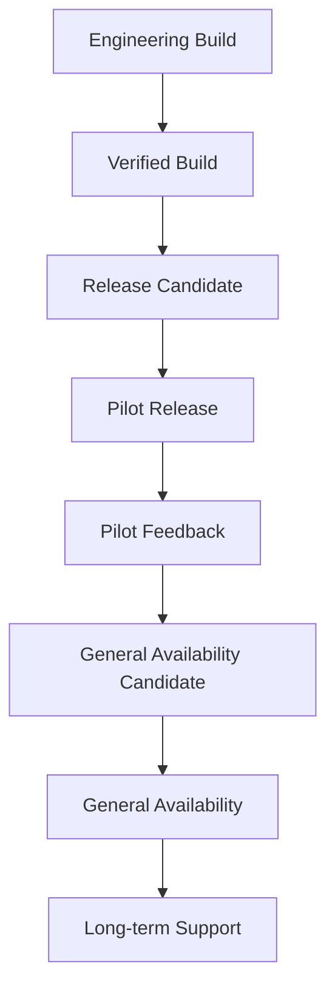

# Release Evolution Model

This document explains how SynapseCore releases mature over time.

It complements [release-engineering.md](release-engineering.md), [release-process.md](release-process.md), and [quality-gates.md](quality-gates.md).

## Release Path

## Stage 1: Engineering Build

An engineering build is an internal change set.

Requirements:

- scoped issue or evidence
- implementation complete
- local verification passes
- no known risky artifacts staged
- docs updated if behavior or meaning changed

Not enough for:

- pilot release
- customer confidence
- broad product claims

## Stage 2: Verified Build

A verified build has passed the appropriate technical checks.

Requirements:

- frontend verify/build if frontend touched
- backend tests if backend touched
- docs link check if docs touched
- repo health review
- live connection check if deployment status matters

Still needed:

- hosted proof if proof-covered behavior changed
- release evidence
- pilot validation when user workflows are affected

## Stage 3: Release Candidate

A release candidate is a controlled proposed release.

Requirements:

- scope frozen
- evidence captured
- quality gates passed
- known limitations documented
- rollback posture clear
- support notes prepared

Current example:

- `v0.9.0-pilot-rc1`

## Stage 4: Pilot Release

A pilot release is used by a controlled company/team within the supported scope.

Requirements:

- pilot acceptance criteria
- operator onboarding
- support playbook
- runtime and recovery guidance
- hosted proof evidence when relevant
- operational success metrics

Pilot release does not equal broad enterprise GA.

## Stage 5: Pilot Feedback

Pilot feedback turns real usage into evidence.

Capture:

- what operators did
- what slowed them down
- what failed
- what required manual workaround
- which recommendations/approvals helped
- whether replay recovery reduced pain
- whether runtime trust was clear

Feedback becomes product work only after classification and priority assessment.

## Stage 6: General Availability Candidate

A GA candidate should be considered only after repeated pilot evidence shows the platform is stable, understandable, supportable, and valuable.

Likely requirements:

- broader operational validation
- stronger support process
- more complete backup/restore evidence
- mature release evidence
- known risk reduction
- security and operations review
- proof stability over time

## Stage 7: General Availability

General availability means the product is ready for broader customer use within a clearly defined supported scope.

GA should not imply:

- unlimited scale
- every connector exists
- every enterprise feature exists
- global HA exists

GA should imply:

- supportable deployment posture
- clear documentation
- known limitations
- repeatable verification
- reliable recovery posture
- predictable release process

## Stage 8: Long-Term Support

Long-term support is a maturity stage where customers can depend on predictable maintenance, compatibility, support response, and upgrade posture.

Likely requirements:

- versioning policy
- support SLAs
- security patch process
- backup/restore drills
- migration discipline
- incident history and lessons learned
- release notes and deprecation policy

## Bottom Line

SynapseCore releases should mature through evidence and gates, not enthusiasm.

Each stage should earn the next one.
