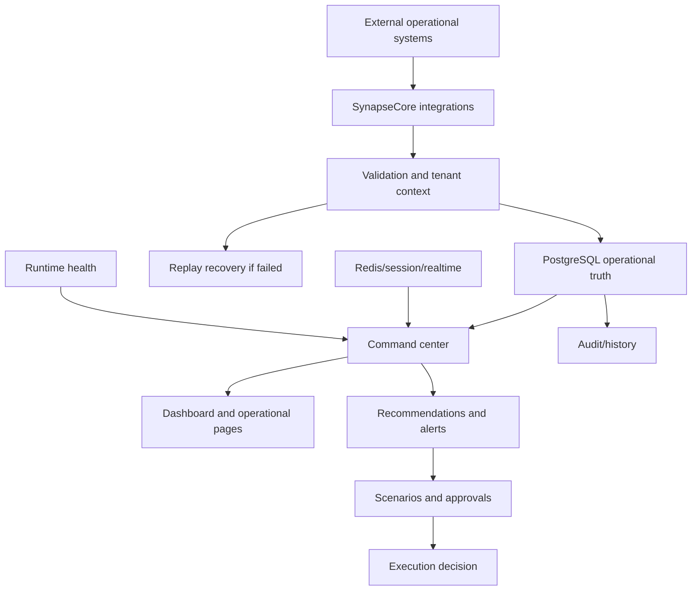

# Solution Architect Guide

This guide explains where SynapseCore fits in a company architecture and where it does not.

## Architectural Position

SynapseCore is an operations command-center platform.

It should be positioned as a coordination and control layer across operational domains, not as a replacement for every transactional system.

It fits above or alongside:

- order sources
- inventory systems
- warehouse tools
- integration feeds
- operational support workflows
- runtime and incident visibility

## What SynapseCore Does Well

SynapseCore is strong when the company needs:

- tenant-scoped operational visibility
- one command-center shell
- inventory/order coordination
- connector visibility
- replay recovery for failed inbound work
- recommendation and scenario framing
- approval governance
- realtime dashboard updates
- runtime trust visibility
- hosted proof discipline

## Where SynapseCore Does Not Fit Yet

Do not position the current platform as:

- a full ERP replacement
- a complete WMS replacement
- a complete TMS replacement
- a mature enterprise integration marketplace
- a global HA control plane
- a multi-region event platform
- a fully mature SSO/RBAC enterprise suite

Those may be future directions or integration partners, but they are not current claims.

## Integration Patterns

Current supported patterns should be understood as controlled and bounded:

- webhook-style inbound order/event ingestion
- CSV import
- scheduled pull style ingestion
- connector visibility and replay recovery

The architectural goal is not just data movement. The goal is operational control around what arrives, what fails, what needs review, and what becomes visible.

## Deployment Philosophy

Current posture:

- Render frontend
- Render backend
- PostgreSQL
- Redis
- Spring Boot backend
- React frontend
- hosted proof validation

Local posture:

- Docker infra or full compose
- host frontend/backend when needed
- local Postgres/Redis or Docker Postgres/Redis

Future deployment hardening may include:

- separated workers
- stronger queue architecture
- metrics and tracing stack
- HA database posture
- backup/restore maturity
- advanced secrets management
- horizontal realtime scale

These are future evolution items, not current proof claims.

## Conceptual System Fit

## Implementation Questions Architects Should Ask

- What systems will send operational work into SynapseCore?
- Which entities must be tenant-scoped?
- Which failures should become replay records?
- Which recommendations require approval?
- Which roles can approve or execute scenarios?
- Which operational pages matter most in the pilot?
- What is the acceptable dependency posture for Postgres and Redis?
- What proof evidence is required before pilot expansion?
- What enterprise hardening is required before production expansion?

## Architect Bottom Line

SynapseCore fits best as a live operational coordination layer that turns fragmented data movement into governed visibility, recovery, and action.

It should be piloted with clear integration boundaries, honest infrastructure assumptions, and proof-backed acceptance criteria.
