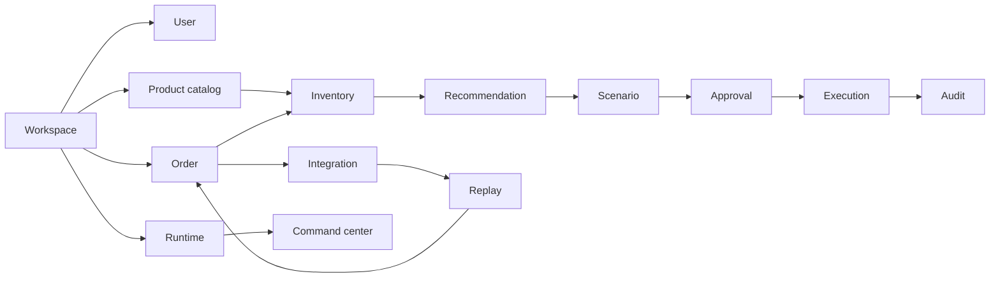

# SynapseCore Dictionary

This dictionary defines the product language of SynapseCore and how each term relates to the rest of the system.

## Relationship Chain

The main operational relationship chain is:

## Terms

### Alert

An operator-visible warning that something needs attention. Alerts may come from inventory pressure, runtime issues, connector degradation, or operational risk.

Related to: recommendation, dashboard, runtime, incident.

### Approval

A controlled decision step before a scenario or operational action can proceed.

Related to: scenario, role gating, execution, audit.

### Audit

The historical trace of events, approvals, replay actions, execution, and operational changes.

Related to: runtime trust, incident review, support, compliance posture.

### Catalog

The tenant-scoped set of products and product identifiers that operations refer to.

Related to: product, SKU, inventory, order validation.

### Command Center

The authenticated operational shell where teams see live state, review issues, approve actions, recover failures, and monitor runtime trust.

Related to: dashboard, replay, approvals, integrations, runtime.

### Connector

An integration path or external system connection that brings operational work into SynapseCore or exposes external operational status.

Related to: integration, replay, orders, runtime.

### Dashboard

The high-level live view of operational state inside the command center.

Related to: realtime snapshot, alerts, recommendations, inventory, orders.

### Degraded

A visible product state indicating that part of the system is unhealthy or waiting.

Related to: runtime, websocket, readiness, connector visibility.

### Execution

The point where an approved or allowed operational action proceeds.

Related to: scenario, approval, audit, runtime.

### Integration

The product area that shows external-system connectivity, connector behavior, and recovery posture.

Related to: connector, replay, CSV import, webhook ingestion, scheduled pull.

### Inventory

The tenant-scoped operational quantity and warehouse-aware stock context connected to products and orders.

Related to: catalog, order, recommendation, warehouse.

### Order

An operational demand record entering or tracked by SynapseCore.

Related to: integration, validation, inventory, recommendation, replay.

### Operational Intelligence

Action-oriented interpretation of live operational state.

Related to: alert, recommendation, scenario, runtime trust.

### Product

A catalog item identified by SKU and used by inventory and order flows.

Related to: catalog, inventory, order.

### Proof

The hosted validation path that checks real deployed behavior through frontend, backend, auth, realtime, replay, approvals, and operational surfaces.

Related to: readiness, release evidence, selectors, proof tenant.

### Recommendation

Guidance generated from operational context that can lead to a scenario or operator action.

Related to: alert, inventory, scenario, approval.

### Replay

The recovery path for failed inbound work.

Related to: connector, integration failure, operator review, audit.

### Runtime

The live trust posture of the system and its dependencies.

Related to: readiness, liveness, DB, Redis, websocket, incidents.

### Scenario

A proposed operational response that may require approval and may lead to execution.

Related to: recommendation, approval, execution.

### Session

The authenticated state connecting a user to a tenant workspace.

Related to: auth, Redis, command center, websocket auth posture.

### Tenant

The isolated customer or workspace context used to scope data and user actions.

Related to: workspace, users, auth, proof tenant.

### Websocket

The realtime channel used to update live operational state without a full browser refresh.

Related to: dashboard, runtime, realtime snapshot, reconnecting state.

### Workspace

The customer/company operating boundary for SynapseCore.

Related to: tenant, users, operations, catalog, inventory, orders.
