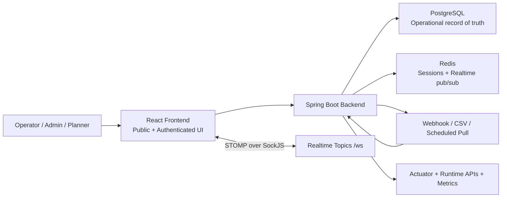
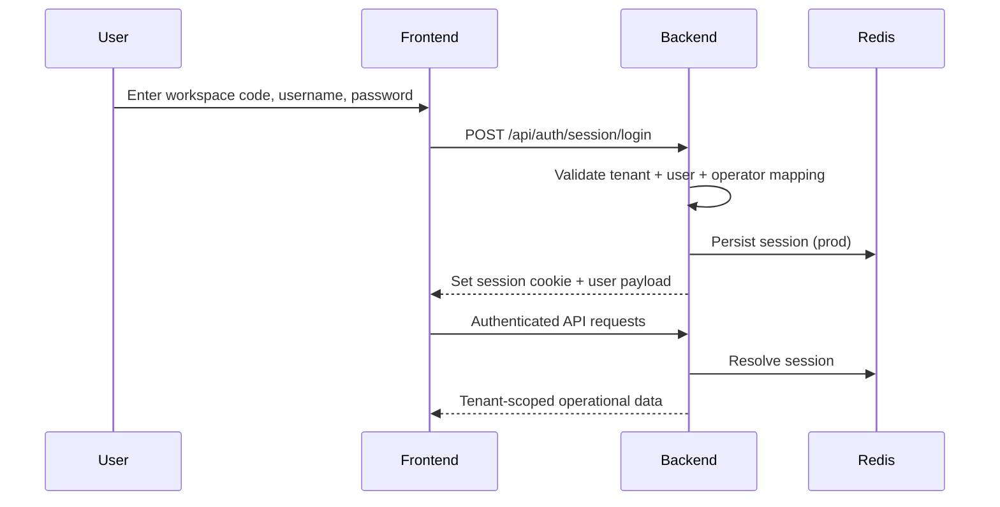
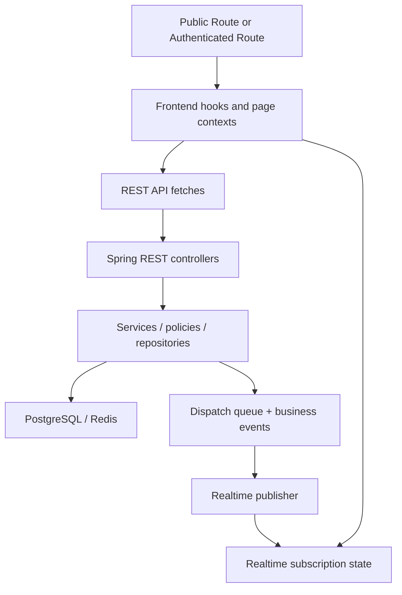
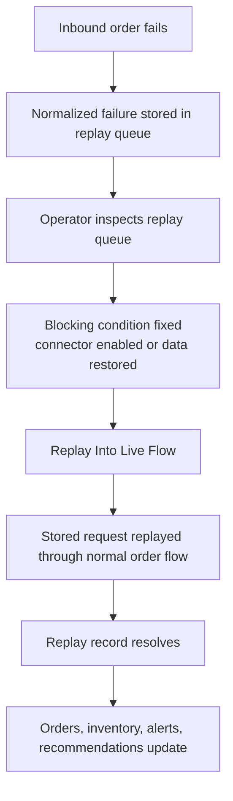
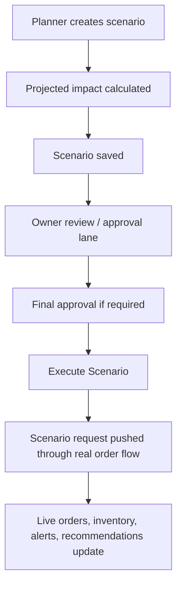
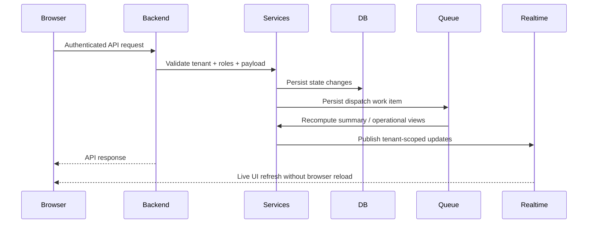

# SynapseCore System Architecture

SynapseCore is a tenant-based operations control platform that turns fragmented business activity into one live command surface for visibility, recovery, approvals, and execution.

This document explains the full system shape as it exists in the repository today. It is intended for builders, reviewers, deployment operators, and pilot teams.

## What SynapseCore Is

SynapseCore sits above operational systems and keeps one tenant-scoped control loop visible:

1. receive activity
2. persist state
3. evaluate risk and pressure
4. generate alerts and recommendations
5. route approvals or replay recovery when needed
6. push live updates into the control center

The platform is designed for:

- logistics companies
- warehouses and 3PL operations
- ecommerce fulfillment
- retail chains
- distributors
- manufacturers
- procurement-heavy businesses
- operations centers
- field or fleet operations

## High-Level Architecture



## Runtime Components

### Frontend

The frontend is a React single-page application built with Vite. It has two major modes:

- public experience
  - homepage
  - create workspace
  - sign in
- authenticated command center
  - dashboard
  - operational pages
  - admin/support/runtime pages

Frontend responsibilities:

- route users through public, auth, and authenticated flows
- load operational state from backend APIs
- maintain tenant-scoped session UX
- subscribe to live realtime topics
- show polished loading, empty, degraded, and recovery states

### Backend

The backend is a Spring Boot application that owns:

- REST APIs
- WebSocket/SockJS realtime publishing
- auth/session lifecycle
- tenant enforcement
- intelligence and decision services
- scenario planning and approvals
- integration connector management
- replay and recovery
- runtime and observability surfaces

The main backend package lanes are:

- `access`
- `alert`
- `api`
- `audit`
- `auth`
- `bootstrap`
- `config`
- `decision`
- `domain`
- `event`
- `fulfillment`
- `integration`
- `intelligence`
- `observability`
- `prediction`
- `realtime`
- `scenario`
- `security`
- `simulation`
- `tenant`

### PostgreSQL

PostgreSQL is the operational record of truth. It stores:

- tenants and workspace identity
- users and operators
- products and warehouses
- inventory and thresholds
- orders and fulfillment state
- alerts and recommendations
- integration connectors and import history
- replay queue records
- scenario history and approvals
- audit and business-event history

### Redis

Redis currently supports:

- browser session storage in production profile
- realtime distributed publishing in `REDIS_PUBSUB` mode

In local H2 demo mode, Redis health can be disabled, but production and hosted proof expect Redis-backed session and realtime posture.

### Realtime / WebSocket Role

The frontend connects to the backend SockJS endpoint at `/ws`, then subscribes to tenant-scoped topics for:

- dashboard summary
- alerts
- recommendations
- inventory
- fulfillment
- recent orders
- recent business events
- recent audit activity
- integration telemetry
- replay queue state
- scenario notifications and escalations

Realtime is tenant-scoped. One workspace should never receive another workspace's operational events.

## Tenant / Workspace Model

SynapseCore is built around a company workspace model:

- each company operates inside its own tenant/workspace
- operational data is tenant-scoped
- authenticated users sign in with:
  - workspace code
  - username
  - password
- access control is role-aware and, in some cases, warehouse-aware

The workspace code is the human-facing identifier that routes users into the correct company environment.

## Auth / Session Model



Important auth truths:

- session-first auth is the real product path
- header fallback exists for local/test or non-UI flows only
- production disables header fallback
- rate limiting is enforced on auth and sensitive operational mutations

## Frontend / Backend Data Flow



## Product Flows

### Product / Catalog Flow

- products are tenant-owned
- catalog onboarding supports create, update, and CSV import
- catalog data feeds order validation, inventory tracking, alerts, and scenario planning

Primary API surfaces include:

- `/api/products`
- CSV import lanes exposed through the catalog UI and backend product services

### Inventory Flow

- inventory is tracked per tenant, per SKU, per warehouse
- updates can change:
  - on-hand quantity
  - reorder threshold
- stock pressure triggers downstream intelligence

Flow:

1. inventory update arrives
2. inventory record persists
3. low-stock and depletion logic runs
4. alerts/recommendations refresh
5. summary and realtime topics update

### Orders Flow

- orders can enter via direct API, webhook, CSV import, replay, or scenario execution
- order creation opens fulfillment work and consumes inventory
- order flow is a major source of downstream operational pressure

Flow:

1. order request arrives
2. product and warehouse references validate
3. order persists with line items
4. fulfillment task opens
5. inventory adjusts
6. business events and audit traces record the action
7. alerts/recommendations/runtime signals refresh
8. realtime broadcasts update the command center

### Integrations Flow

Supported connector breadth today is intentionally narrow and honest:

- webhook order ingestion
- CSV order import
- scheduled pull order ingestion

Connectors can be:

- enabled or disabled
- assigned sync policy and transformation policy
- given support ownership
- inspected through integration telemetry and history

### Replay / Recovery Flow



Replay truths:

- failures should stay visible
- manual replay is intentional
- connector-disabled CSV proof records are manual-only while disabled
- replay should never silently hide a failed inbound lane

### Scenario Approval / Execution Flow



Scenario system responsibilities:

- what-if analysis
- plan comparison
- save and reload
- approval and rejection
- SLA-based escalation
- execution into the live order flow

### Alerts / Recommendations Flow

These are the decision layer outputs of the system.

- alerts communicate operational problems or risks
- recommendations communicate next-best actions

Typical sources:

- low stock
- depletion risk
- fulfillment backlog
- delayed shipments
- connector failures
- replay backlog
- runtime trust issues

### Runtime / Observability Flow

The platform exposes both operator-friendly and technical runtime surfaces:

- `/api/system/runtime`
- `/api/system/incidents`
- `/actuator/health`
- `/actuator/health/liveness`
- `/actuator/health/readiness`

Anonymous production actuator exposure is limited to health, liveness, and readiness. Metrics/prometheus scraping requires a controlled monitoring path.

Runtime purpose:

- show whether the control plane is safe
- distinguish live, degraded, and unavailable states
- expose queue and incident posture
- support hosted proof and deployment checks

## Request Flow



## Hosted Proof Flow

Hosted proof is the real end-to-end validation path for the deployed platform.

Proof sequence:

1. prepare hosted proof
2. warm backend readiness, auth session, SockJS, dashboard snapshot
3. run Playwright hosted proof
4. validate:
   - auth/session
   - catalog onboarding
   - realtime dashboard updates
   - replay recovery
   - scenario approval and execution
   - runtime/integration/settings/users/profile pages
   - auth rate limiting

Key commands:

```powershell
powershell -ExecutionPolicy Bypass -File scripts\prepare-hosted-proof.ps1
cd frontend
npm.cmd run test:e2e:prod
```

Hosted proof should only run when backend readiness and DB-backed runtime are healthy.

## Deployment Flow

Current repo deployment stories:

- local Docker infrastructure
- local host backend/frontend
- full Docker Compose
- live Render frontend + backend + managed Postgres + managed Redis

Render truths:

- frontend and backend are separate services
- backend health check path is `/actuator/health/liveness`
- readiness should include database and Redis
- if DB is off, backend may stop responding cleanly enough for proof

## Architectural Bottom Line

SynapseCore is not just a CRUD admin panel. It is a tenant-scoped operational control system with:

- a polished React command center
- a Spring Boot state and decision engine
- PostgreSQL as the record of truth
- Redis for session/realtime distribution
- realtime tenant-scoped updates
- explicit replay and scenario control loops
- runtime trust and hosted proof as first-class operating surfaces
