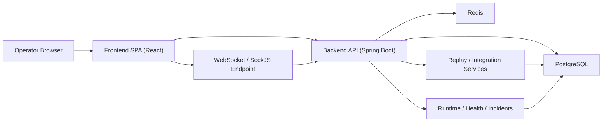
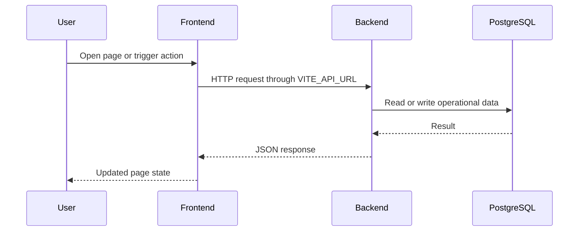
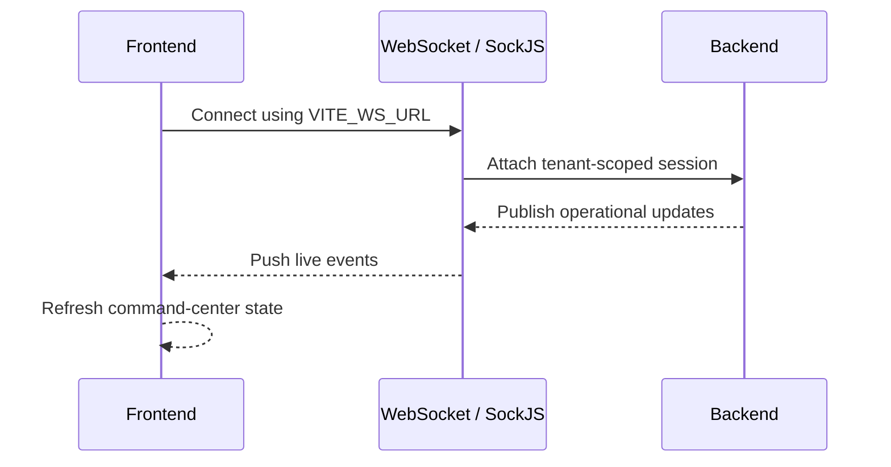
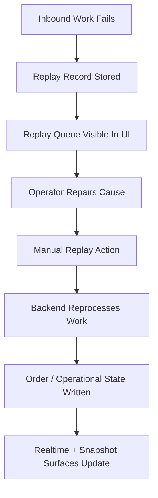
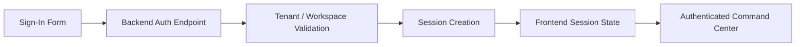
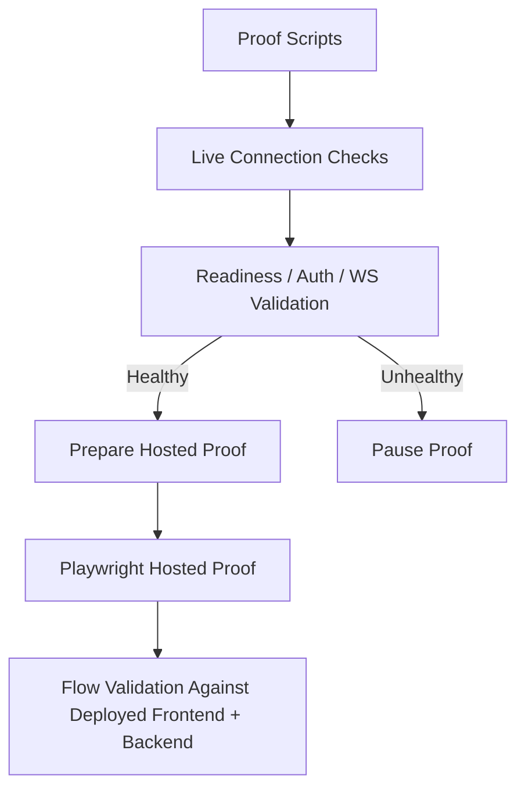

# System Communication Map

This document explains how SynapseCore communicates across the frontend, backend, database, Redis, realtime layer, proof tooling, and operator-facing flows.

## High-Level Communication Map

## Core Communication Types

SynapseCore uses both synchronous and asynchronous communication.

### Synchronous Flows

These are request/response interactions:

- sign-in
- session checks
- dashboard snapshot fetches
- catalog, inventory, and order reads
- scenario save and approval actions
- replay actions
- runtime page fetches

These flows matter when a user expects an immediate result or acknowledgement.

### Asynchronous Or Event-Like Flows

These are update or propagation flows:

- websocket tenant updates
- post-action operational broadcasts
- replay state evolution
- runtime incident and trust surface changes

These flows matter when the UI should stay live without a full page refresh.

## Frontend To Backend API Flow

Used for:

- auth/session checks
- page snapshots
- CRUD-like operational actions
- replay actions
- scenario decisions

## Frontend To WebSocket Flow

Used for:

- live dashboard posture
- alerts or state changes
- recent activity updates
- command-center freshness

## Backend To PostgreSQL Flow

PostgreSQL is the main operational record of truth.

Backend services use it for:

- workspace and auth-related persisted state
- product and inventory data
- orders
- replay records
- scenario and approval records
- incidents, events, and audit trails

This is the most important persistence dependency in the system.

If PostgreSQL is unavailable:

- readiness may fail
- backend startup may hang or fail
- session and business flows may become unavailable
- hosted proof should pause

## Backend To Redis Flow

Redis is used for:

- session support in production-oriented flows
- distributed realtime posture
- pub/sub style operational update coordination

Redis is not just a cache convenience. It affects operational trust, auth behavior, and live update posture.

If Redis is unavailable:

- readiness or live trust may degrade
- auth/session posture may be impacted
- realtime behavior may become less trustworthy

## Replay And Recovery Flow

This is one of the defining communication chains in the platform.

It crosses:

- frontend visibility
- backend validation and recovery logic
- database persistence
- realtime updates
- operator trust

## Auth And Session Flow

Important characteristics:

- workspace code matters
- auth is tenant-scoped
- session trust affects both API access and websocket posture

If auth/session fails:

- the command center should not pretend the workspace is usable
- hosted proof should not proceed through auth-dependent flows

## Runtime And Snapshot Flow

The platform deliberately uses both snapshot and live update patterns.

### Snapshot Behavior

Used when the frontend needs a coherent current view:

- dashboard snapshot
- page loads
- runtime views

### Realtime Behavior

Used when the frontend should stay current after the initial load:

- live command-center posture
- alerts and activity updates
- post-action state refresh

This dual model matters because realtime alone is not enough, and snapshots alone feel stale.

## Proof System Flow

The proof system is part of the communication model because it validates the real deployed chain rather than only code in isolation.

## Operator Interaction Flow

Operators interact through a command-center pattern:

1. load page
2. see snapshot state
3. receive live trust and activity updates
4. act through API-backed controls
5. watch state settle through snapshot plus realtime

This pattern is important because it keeps the UI honest:

- snapshots show the current known state
- realtime keeps the state alive
- degraded state remains visible when trust is missing

## Degraded-State Handling

SynapseCore distinguishes between:

- frontend shell available
- backend responsive
- readiness healthy
- auth usable
- websocket trustworthy

This matters because different failures require different behavior.

Examples:

- frontend up, backend down: shell may load, but operational truth is unavailable
- liveness up, readiness down: backend process exists, but dependencies or startup are not trustworthy
- websocket down, snapshot up: current state may load, but live freshness is degraded

## Bottom Line

SynapseCore is not one simple request/response app.

It is a blended operational system where:

- snapshots
- realtime
- persistence
- recovery
- runtime trust
- proof gating

all work together to create one truthful command-center experience.
