# System Flow

This document explains how SynapseCore behaves as a full operational system.

It is not a marketing summary.
It is not only an architecture diagram.

It is the end-to-end flow map for:

- public entry
- workspace access
- auth and session handling
- order and inventory processing
- approvals and execution control
- integration ingestion
- replay and recovery
- realtime and snapshot updates
- runtime trust and degraded-state behavior
- hosted proof and validation

The goal is to show:

- what enters the system
- where it goes
- what processes it
- what happens on success
- what happens on failure
- what happens if approval is required
- what happens if replay is needed
- how operators see the result
- how proof validates the whole chain

## How To Read This

SynapseCore works through a layered operational model:

1. something enters the system
2. the frontend or API captures intent
3. the backend validates and classifies it
4. PostgreSQL stores operational truth
5. business logic updates the live operational state
6. alerts, recommendations, audit, and events react
7. websocket and snapshot surfaces show the result
8. if trust is degraded, the system should say so honestly

## Master End-To-End Operational Flow

```mermaid
flowchart TD
    A["External event or operator action"] --> B{"Public entry or authenticated action?"}

    B -->|Public entry| C["Frontend public pages<br/>Homepage / Create Workspace / Sign In"]
    B -->|Authenticated action| D["Frontend authenticated shell<br/>Dashboard / Orders / Inventory / Replay / Approvals / Runtime"]

    C --> E{"Create workspace or sign in?"}
    E -->|Create workspace| F["Workspace creation flow<br/>Company info / workspace code / first admin / setup guidance"]
    E -->|Sign in| G["Sign-in form<br/>workspace code + username + password"]
    F --> G

    G --> H["POST /api/auth/session/login"]
    H --> I{"Tenant and credentials valid?"}
    I -->|No| J["Auth failure<br/>Show error / stay unauthenticated / no websocket trust"]
    I -->|Yes| K["Create session<br/>Tenant context + user identity + operator mapping"]

    K --> L["Redis-backed or configured session posture"]
    L --> M["Frontend receives session state<br/>GET /api/auth/session"]
    M --> N["Authenticated workspace opens"]

    D --> O["Frontend action or page load"]
    N --> O

    O --> P{"Snapshot read or state-changing action?"}
    P -->|Snapshot read| Q["GET request<br/>dashboard / orders / inventory / replay / runtime / users / settings"]
    P -->|State-changing action| R["POST / PUT request<br/>orders / inventory / connectors / replay / scenarios / approvals"]

    Q --> S["Backend controller layer"]
    R --> S
    S --> T["Tenant enforcement + auth/session check + role check"]
    T --> U{"Authorized and tenant-safe?"}
    U -->|No| V["Reject request<br/>403 / 401 / requestId / audit visibility"]
    U -->|Yes| W["Validation layer<br/>payload shape / connector state / workspace rules / warehouse scope"]

    W --> X{"Valid?"}
    X -->|No| Y["Structured failure<br/>validation error / policy error / failure code"]
    X -->|Yes| Z["Persist or read operational truth in PostgreSQL"]

    Z --> AA["Business processing layer<br/>orders / inventory / integrations / replay / scenarios / runtime"]
    AA --> AB{"What kind of flow is this?"}

    AB -->|Normal success path| AC["Write operational state<br/>order / inventory / connector / scenario / alert / recommendation / audit / event"]
    AB -->|Approval-required path| AD["Save pending action<br/>approval status / stage / owner / due time"]
    AB -->|Integration failure path| AE["Store failed inbound work<br/>replay record / failure reason / connector context"]
    AB -->|Runtime unhealthy path| AF["Mark degraded trust posture<br/>readiness false / auth unavailable / websocket degraded"]

    AC --> AG["Operational fanout<br/>dashboard summary / recent orders / inventory posture / alerts / recommendations / events / audit"]
    AG --> AH["Realtime publisher / dispatch path"]
    AH --> AI["Websocket tenant topics update"]
    AG --> AJ["Snapshot surfaces read fresh state"]
    AI --> AK["Frontend live update without refresh"]
    AJ --> AK
    AK --> AL["Operator sees successful operational completion"]

    AD --> AM["Approval queue visible in UI"]
    AM --> AN{"Approved, rejected, or overdue?"}
    AN -->|Approved| AO["Move to executable state"]
    AN -->|Rejected| AP["Terminate action<br/>record reason / keep history / allow refinement"]
    AN -->|Overdue or escalated| AQ["Escalation path<br/>notification / acknowledgment / final approval lane"]
    AO --> AR["Execution action sent through real backend flow"]
    AR --> AC
    AQ --> AM

    AE --> AS["Replay queue visible in UI"]
    AS --> AT{"Blocking condition repaired?"}
    AT -->|No| AU["Stay pending<br/>manual review / degraded connector visibility / trust warning"]
    AT -->|Yes| AV["Operator chooses Replay Into Live Flow"]
    AV --> AW["Replay service reprocesses stored inbound request"]
    AW --> AX{"Replay succeeds?"}
    AX -->|No| AY["Replay remains failed or pending<br/>update failure reason / keep visibility"]
    AX -->|Yes| AZ["Recovered work enters normal live order flow"]
    AZ --> AC

    AF --> BA["Frontend shows degraded state<br/>waiting / reconnecting / backend unavailable / stale trust"]
    BA --> BB["Runtime and incident surfaces reflect trust warning"]
    BB --> BC["Operators can classify state before acting"]

    AI --> BD{"Websocket healthy?"}
    BD -->|Yes| BE["Live command-center freshness maintained"]
    BD -->|No| BF["Reconnect / stale snapshot / runtime trust warning"]
    BF --> BB

    BG["Hosted proof / validation scripts"] --> BH["Live connection checks"]
    BH --> BI{"Readiness + auth + websocket healthy?"}
    BI -->|No| BJ["PROOF_ALLOWED = false<br/>Pause hosted proof / classify backend dependency issue"]
    BI -->|Yes| BK["Prepare hosted proof"]
    BK --> BL["Playwright hosted proof"]
    BL --> BM{"Critical flows pass?"}
    BM -->|Yes| BN["Proof pass<br/>deployed system validated"]
    BM -->|No| BO["Proof fail<br/>selector drift / runtime issue / replay issue / backend issue"]
```

## 1. Public Entry Flow

Public entry is how a company or operator reaches SynapseCore before any protected operational action happens.

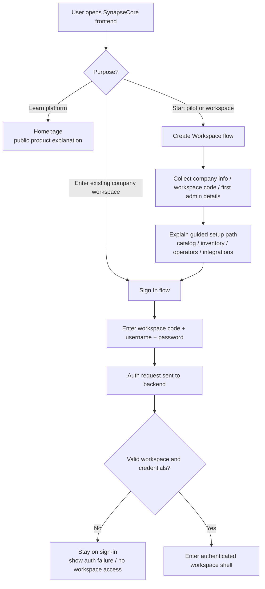

### What this part does

- explains the platform before login
- lets a new company understand the workspace model
- routes an existing operator into the authenticated workspace

### Failure modes

- wrong workspace code
- wrong password
- backend unavailable
- session endpoint unavailable

## 2. Auth And Session Flow

Auth is not only login. It also controls workspace access, session truth, and websocket trust.

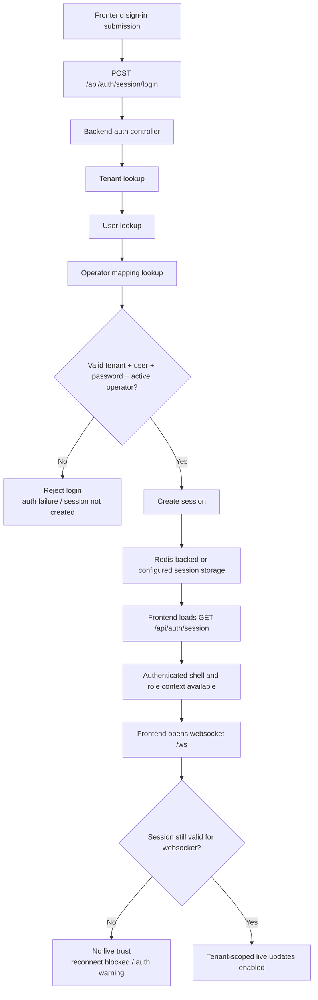

### What this part does

- establishes the tenant workspace context
- binds the signed-in user to operator roles
- makes backend API access and websocket trust possible

### Failure modes

- invalid credentials
- inactive user or operator
- Redis/session issue in production-like mode
- auth endpoint unavailable

## 3. Operational Processing Flow

This is the core business path for orders, inventory updates, connector actions, and most operational state changes.

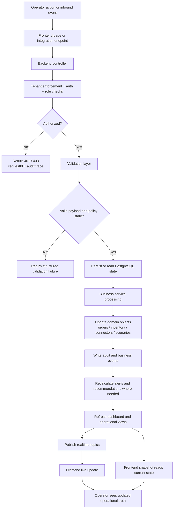

### What can enter here

- `POST /api/orders`
- `POST /api/inventory/update`
- `POST /api/integrations/orders/webhook`
- `POST /api/integrations/orders/csv-import`
- scenario approval or execution actions
- connector configuration actions

### What success produces

- persisted operational state
- audit trail
- business events
- alerts and recommendations when conditions warrant
- updated dashboard, orders, inventory, and other command-center surfaces

### Failure modes

- auth or role denial
- validation failure
- missing SKU or warehouse
- connector disabled
- backend/runtime unavailable

## 4. Approval Flow

Some actions are not allowed to go directly into live execution. They must pass through a governed approval lane.

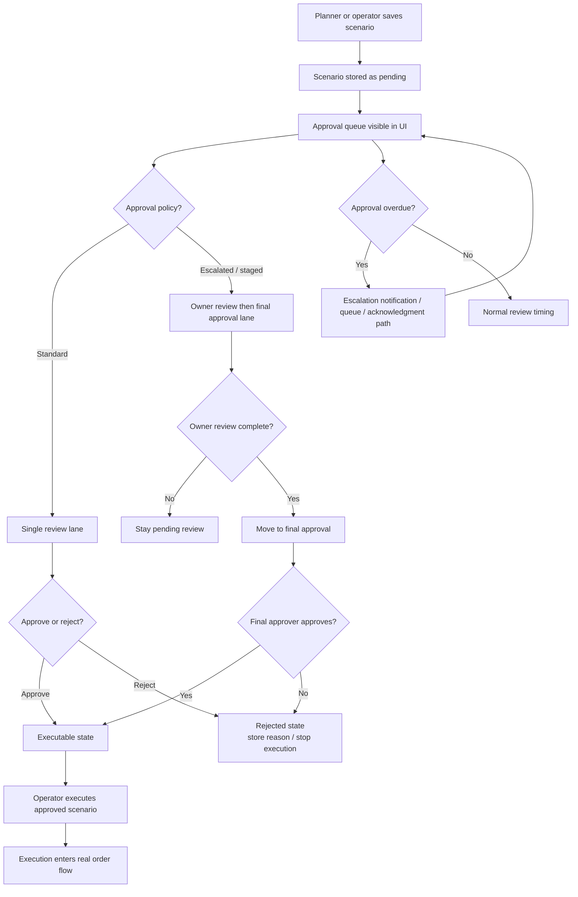

### What happens on approval

- the scenario becomes executable
- execution uses the real order and inventory path
- the decision stays visible in history, notifications, and audit

### What happens on rejection

- execution terminates
- rejection reason is stored
- the saved plan can be revised and resubmitted later

## 5. Alert And Recommendation Flow

Alerts and recommendations are a core branch of the operational loop.

They exist to answer:

- what is at risk
- how urgent it is
- what the next best action should be
- whether an operator should wait, replenish, transfer, approve, or escalate

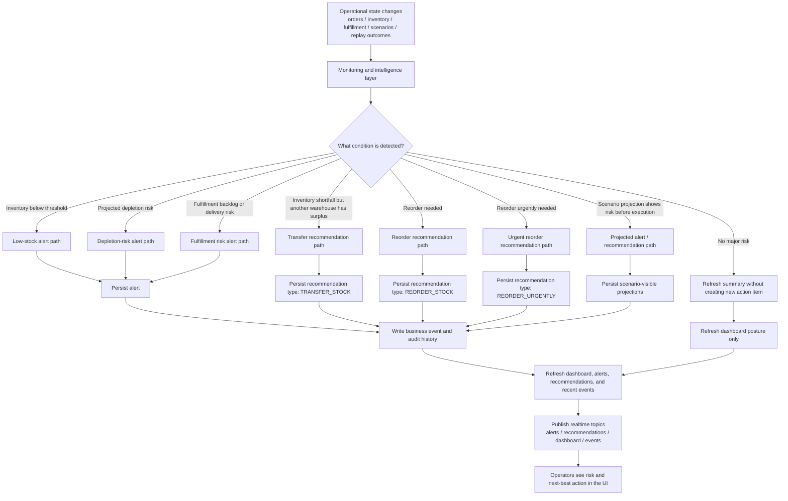

### Current explicit recommendation types

The current explicit recommendation types documented in the system are:

- `REORDER_STOCK`
- `REORDER_URGENTLY`
- `TRANSFER_STOCK`

### What can trigger recommendations

- low stock crossing threshold
- predicted near-term stockout pressure
- cross-warehouse surplus that can cover a shortfall
- scenario projection before live execution
- fulfillment pressure that changes operator urgency even when inventory is not the only issue

### What can trigger alerts

- low stock
- depletion risk
- fulfillment backlog growth
- delayed shipment or delivery pressure
- anomaly or repeated exception patterns where modeled
- runtime or trust degradation on the platform side

## 6. Replay And Recovery Flow

Replay exists because failed inbound work must remain visible and recoverable rather than disappearing into logs or manual cleanup.

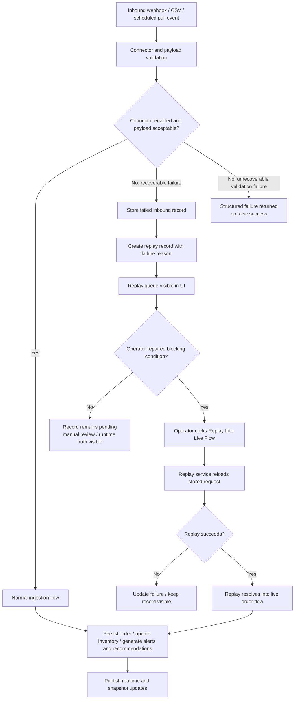

### What replay is for

- connector-disabled recovery
- recoverable inbound failures after configuration or data repair
- deliberate operator-owned recovery

### What replay is not for

- pretending malformed or unrecoverable data was safely ingested
- hiding failed inbound work

## 7. Realtime And Runtime Truth Flow

SynapseCore uses both snapshot reads and websocket updates. Runtime trust explains whether the live view is truly safe to act on.

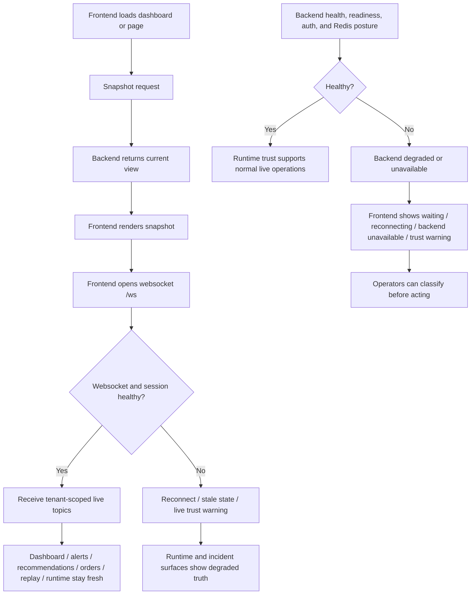

### What snapshot does

- gives the frontend a coherent current state
- supports initial loads and refreshes

### What websocket does

- pushes live tenant updates
- reduces the need for manual refresh

### What degraded-state UX does

- shows when live truth is stale or unavailable
- avoids fake success
- keeps runtime trust part of the product

## 8. Full Surface And Output Map

The easiest way to understand the whole system is to see where processed truth ends up.

```mermaid
flowchart TD
    A["Operational truth store<br/>PostgreSQL + runtime state"] --> B["Dashboard summary"]
    A --> C["Dashboard snapshot"]
    A --> D["Orders page"]
    A --> E["Inventory page"]
    A --> F["Catalog page"]
    A --> G["Alerts page"]
    A --> H["Recommendations page"]
    A --> I["Replay queue page"]
    A --> J["Integrations page"]
    A --> K["Scenario history page"]
    A --> L["Approvals page"]
    A --> M["Runtime and incidents page"]
    A --> N["Users / profile / settings pages"]
    A --> O["Recent events and audit history"]

    P["Realtime publisher"] --> B
    P --> G
    P --> H
    P --> D
    P --> E
    P --> I
    P --> J
    P --> K
    P --> L
    P --> M
    P --> O
```

### What each operational surface is fed by

#### Dashboard

Shows:

- summary metrics
- alerts
- recommendations
- inventory risk
- replay pressure
- connector posture
- recent events
- audit activity
- runtime trust cues

#### Orders

Shows:

- live order flow
- recent order processing
- warehouse and fulfillment context

#### Inventory

Shows:

- stock posture
- threshold risk
- projected urgency
- recommendation context

#### Catalog

Shows:

- product readiness
- import outcomes
- SKU-level prerequisites for operational flows

#### Alerts

Shows:

- active operational warnings
- severity
- recommended response

#### Recommendations

Shows:

- explicit next-best actions
- policy explanation
- priority and recency

#### Replay Queue

Shows:

- failed inbound records
- failure codes and reasons
- replay eligibility
- manual recovery path

#### Integrations

Shows:

- connector health
- enablement state
- import history
- replay pressure
- failure detail

#### Scenario History And Approvals

Shows:

- saved plans
- review stage
- approval or rejection state
- escalation state
- execution readiness

#### Runtime

Shows:

- health and readiness posture
- auth and websocket trust cues
- connector and replay diagnostics
- incident visibility

#### Users, Profile, Settings

Shows:

- workspace identity
- operator identity
- role and policy context
- admin and support controls

## 9. Proof And Testing Flow

Hosted proof exists to validate the real deployed frontend and backend together. It should stop when trust prerequisites are missing.

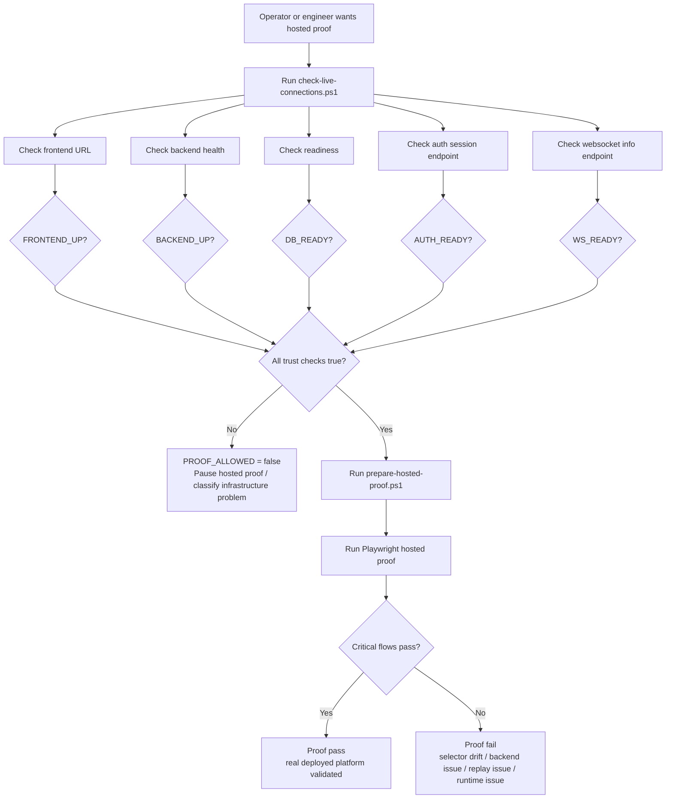

### What proof validates

- public and authenticated routes
- auth/session behavior
- dashboard and realtime behavior
- replay and recovery behavior
- approval and execution behavior
- runtime trust prerequisites

### When proof must not run

- frontend is up but backend is timing out
- readiness is down
- auth session is not responding
- websocket info is not responding
- DB or Redis are unavailable

## 10. Deployment And Environment Flow

The system can run locally or through Render-style hosted deployment, but the communication chain stays the same.

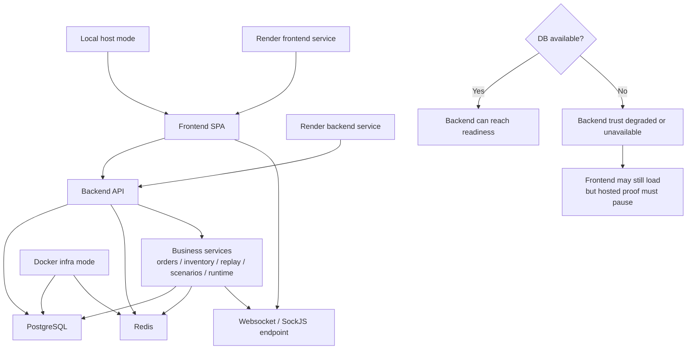

### Local paths

- frontend on `localhost:5173`
- backend on `localhost:8080`
- Postgres on `5432`
- Redis on `6379`

### Hosted paths

- frontend on Render
- backend on Render
- DB and Redis as backend dependencies

### Important current truth

- frontend can be reachable while backend is not trustworthy
- DB and Redis health affect readiness, auth, and websocket trust
- hosted proof is a validation step, not a wake-up command

## 11. Full Capability Path Summary

The platform can currently do all of these operational paths:

- public homepage education
- create workspace guidance
- company workspace sign-in
- tenant-safe session establishment
- dashboard snapshot loading
- websocket-based live updates
- catalog onboarding
- inventory update and risk reaction
- order ingestion
- webhook order ingestion
- CSV import ingestion
- scheduled pull ingestion
- fulfillment state and delay-risk reaction
- integration connector visibility
- structured inbound failure handling
- replay queue visibility
- manual replay into live flow
- scenario save, approval, rejection, escalation, and execution
- alerts and recommendations
- runtime and incident visibility
- audit and business-event traceability
- user, profile, and workspace administration
- local verification
- hosted proof when live trust is healthy

## What Operators See At The End

If the system is healthy and the action succeeds, operators should see:

- updated operational state
- dashboard changes
- orders or inventory changes
- alerts and recommendations adjusted
- audit and history updated
- realtime reflecting the new truth

If the action fails, operators should see:

- structured failure
- replay queue visibility if recoverable
- approval-blocked state if governance is required
- degraded runtime warning if the system itself is unhealthy

## Recommendations And What The System Can Do

The system can generate or support:

- low-stock alerts
- depletion-risk signals
- reorder recommendations
- urgent reorder recommendations
- transfer or replenishment guidance where modeled
- fulfillment and delay-risk alerts
- approval-required control gates
- escalation notifications
- connector degradation visibility
- replay and recovery guidance
- runtime trust warnings
- snapshot-based operational visibility
- websocket-based live operational freshness
- audit and business-event traceability

### Full operational consequence loop

For almost every important operational action, the system can:

1. accept or reject the action
2. validate workspace, role, and payload truth
3. persist the resulting state
4. classify success, failure, waiting, approval, replay, or degraded trust
5. write audit and business events
6. generate alerts or recommendations where conditions warrant
7. refresh dashboard and page-level views
8. publish realtime updates
9. expose the resulting truth to operators, planners, admins, runtime reviewers, and proof tooling

The important principle is that recommendations are part of an operational decision loop, not just passive dashboard decoration.

## Bottom Line

SynapseCore is a branching operational control system.

Data and actions do not simply arrive and get stored.
They move through:

- workspace trust
- validation
- persistence
- business processing
- approval and replay branches
- realtime and snapshot presentation
- runtime truth classification
- proof validation

That is what makes it an operations command platform rather than a simple CRUD or analytics application.
