# System Flow

This document explains how SynapseCore behaves as a full operational system.

It is not a marketing summary.
It is not only an architecture diagram.

It is the end-to-end flow map for:

- public entry
- workspace access
- auth and session handling
- order and inventory processing
- approvals and execution control
- integration ingestion
- replay and recovery
- realtime and snapshot updates
- runtime trust and degraded-state behavior
- hosted proof and validation

The goal is to show:

- what enters the system
- where it goes
- what processes it
- what happens on success
- what happens on failure
- what happens if approval is required
- what happens if replay is needed
- how operators see the result
- how proof validates the whole chain

## How To Read This

SynapseCore works through a layered operational model:

1. something enters the system
2. the frontend or API captures intent
3. the backend validates and classifies it
4. PostgreSQL stores operational truth
5. business logic updates the live operational state
6. alerts, recommendations, audit, and events react
7. websocket and snapshot surfaces show the result
8. if trust is degraded, the system should say so honestly

## Master End-To-End Operational Flow

```mermaid
flowchart TD
    A["External event or operator action"] --> B{"Public entry or authenticated action?"}

    B -->|Public entry| C["Frontend public pages<br/>Homepage / Create Workspace / Sign In"]
    B -->|Authenticated action| D["Frontend authenticated shell<br/>Dashboard / Orders / Inventory / Replay / Approvals / Runtime"]

    C --> E{"Create workspace or sign in?"}
    E -->|Create workspace| F["Workspace creation flow<br/>Company info / workspace code / first admin / setup guidance"]
    E -->|Sign in| G["Sign-in form<br/>workspace code + username + password"]
    F --> G

    G --> H["POST /api/auth/session/login"]
    H --> I{"Tenant and credentials valid?"}
    I -->|No| J["Auth failure<br/>Show error / stay unauthenticated / no websocket trust"]
    I -->|Yes| K["Create session<br/>Tenant context + user identity + operator mapping"]

    K --> L["Redis-backed or configured session posture"]
    L --> M["Frontend receives session state<br/>GET /api/auth/session"]
    M --> N["Authenticated workspace opens"]

    D --> O["Frontend action or page load"]
    N --> O

    O --> P{"Snapshot read or state-changing action?"}
    P -->|Snapshot read| Q["GET request<br/>dashboard / orders / inventory / replay / runtime / users / settings"]
    P -->|State-changing action| R["POST / PUT request<br/>orders / inventory / connectors / replay / scenarios / approvals"]

    Q --> S["Backend controller layer"]
    R --> S
    S --> T["Tenant enforcement + auth/session check + role check"]
    T --> U{"Authorized and tenant-safe?"}
    U -->|No| V["Reject request<br/>403 / 401 / requestId / audit visibility"]
    U -->|Yes| W["Validation layer<br/>payload shape / connector state / workspace rules / warehouse scope"]

    W --> X{"Valid?"}
    X -->|No| Y["Structured failure<br/>validation error / policy error / failure code"]
    X -->|Yes| Z["Persist or read operational truth in PostgreSQL"]

    Z --> AA["Business processing layer<br/>orders / inventory / integrations / replay / scenarios / runtime"]
    AA --> AB{"What kind of flow is this?"}

    AB -->|Normal success path| AC["Write operational state<br/>order / inventory / connector / scenario / alert / recommendation / audit / event"]
    AB -->|Approval-required path| AD["Save pending action<br/>approval status / stage / owner / due time"]
    AB -->|Integration failure path| AE["Store failed inbound work<br/>replay record / failure reason / connector context"]
    AB -->|Runtime unhealthy path| AF["Mark degraded trust posture<br/>readiness false / auth unavailable / websocket degraded"]

    AC --> AG["Operational fanout<br/>dashboard summary / recent orders / inventory posture / alerts / recommendations / events / audit"]
    AG --> AH["Realtime publisher / dispatch path"]
    AH --> AI["Websocket tenant topics update"]
    AG --> AJ["Snapshot surfaces read fresh state"]
    AI --> AK["Frontend live update without refresh"]
    AJ --> AK
    AK --> AL["Operator sees successful operational completion"]

    AD --> AM["Approval queue visible in UI"]
    AM --> AN{"Approved, rejected, or overdue?"}
    AN -->|Approved| AO["Move to executable state"]
    AN -->|Rejected| AP["Terminate action<br/>record reason / keep history / allow refinement"]
    AN -->|Overdue or escalated| AQ["Escalation path<br/>notification / acknowledgment / final approval lane"]
    AO --> AR["Execution action sent through real backend flow"]
    AR --> AC
    AQ --> AM

    AE --> AS["Replay queue visible in UI"]
    AS --> AT{"Blocking condition repaired?"}
    AT -->|No| AU["Stay pending<br/>manual review / degraded connector visibility / trust warning"]
    AT -->|Yes| AV["Operator chooses Replay Into Live Flow"]
    AV --> AW["Replay service reprocesses stored inbound request"]
    AW --> AX{"Replay succeeds?"}
    AX -->|No| AY["Replay remains failed or pending<br/>update failure reason / keep visibility"]
    AX -->|Yes| AZ["Recovered work enters normal live order flow"]
    AZ --> AC

    AF --> BA["Frontend shows degraded state<br/>waiting / reconnecting / backend unavailable / stale trust"]
    BA --> BB["Runtime and incident surfaces reflect trust warning"]
    BB --> BC["Operators can classify state before acting"]

    AI --> BD{"Websocket healthy?"}
    BD -->|Yes| BE["Live command-center freshness maintained"]
    BD -->|No| BF["Reconnect / stale snapshot / runtime trust warning"]
    BF --> BB

    BG["Hosted proof / validation scripts"] --> BH["Live connection checks"]
    BH --> BI{"Readiness + auth + websocket healthy?"}
    BI -->|No| BJ["PROOF_ALLOWED = false<br/>Pause hosted proof / classify backend dependency issue"]
    BI -->|Yes| BK["Prepare hosted proof"]
    BK --> BL["Playwright hosted proof"]
    BL --> BM{"Critical flows pass?"}
    BM -->|Yes| BN["Proof pass<br/>deployed system validated"]
    BM -->|No| BO["Proof fail<br/>selector drift / runtime issue / replay issue / backend issue"]
```

## 1. Public Entry Flow

Public entry is how a company or operator reaches SynapseCore before any protected operational action happens.

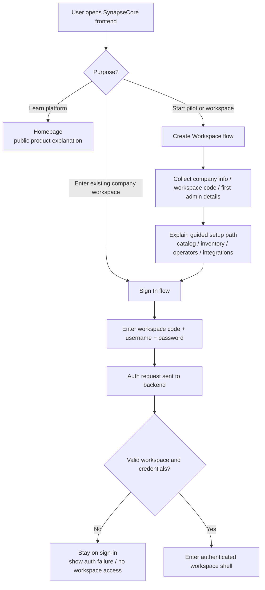

### What this part does

- explains the platform before login
- lets a new company understand the workspace model
- routes an existing operator into the authenticated workspace

### Failure modes

- wrong workspace code
- wrong password
- backend unavailable
- session endpoint unavailable

## 2. Auth And Session Flow

Auth is not only login. It also controls workspace access, session truth, and websocket trust.

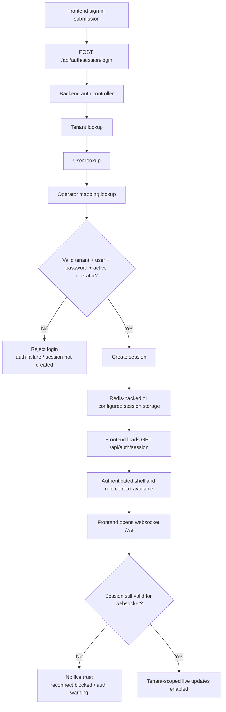

### What this part does

- establishes the tenant workspace context
- binds the signed-in user to operator roles
- makes backend API access and websocket trust possible

### Failure modes

- invalid credentials
- inactive user or operator
- Redis/session issue in production-like mode
- auth endpoint unavailable

## 3. Operational Processing Flow

This is the core business path for orders, inventory updates, connector actions, and most operational state changes.

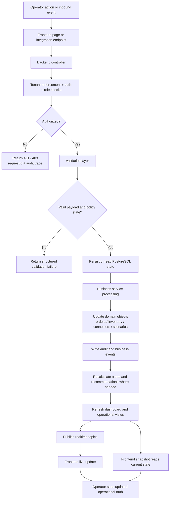

### What can enter here

- `POST /api/orders`
- `POST /api/inventory/update`
- `POST /api/integrations/orders/webhook`
- `POST /api/integrations/orders/csv-import`
- scenario approval or execution actions
- connector configuration actions

### What success produces

- persisted operational state
- audit trail
- business events
- alerts and recommendations when conditions warrant
- updated dashboard, orders, inventory, and other command-center surfaces

### Failure modes

- auth or role denial
- validation failure
- missing SKU or warehouse
- connector disabled
- backend/runtime unavailable

## 4. Approval Flow

Some actions are not allowed to go directly into live execution. They must pass through a governed approval lane.

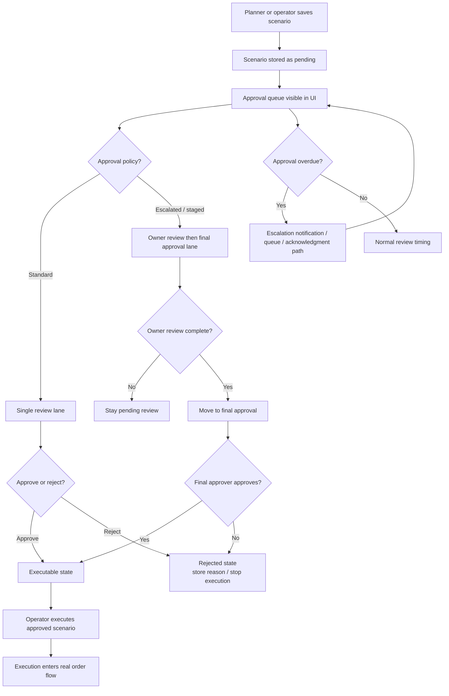

### What happens on approval

- the scenario becomes executable
- execution uses the real order and inventory path
- the decision stays visible in history, notifications, and audit

### What happens on rejection

- execution terminates
- rejection reason is stored
- the saved plan can be revised and resubmitted later

## 5. Alert And Recommendation Flow

Alerts and recommendations are a core branch of the operational loop.

They exist to answer:

- what is at risk
- how urgent it is
- what the next best action should be
- whether an operator should wait, replenish, transfer, approve, or escalate

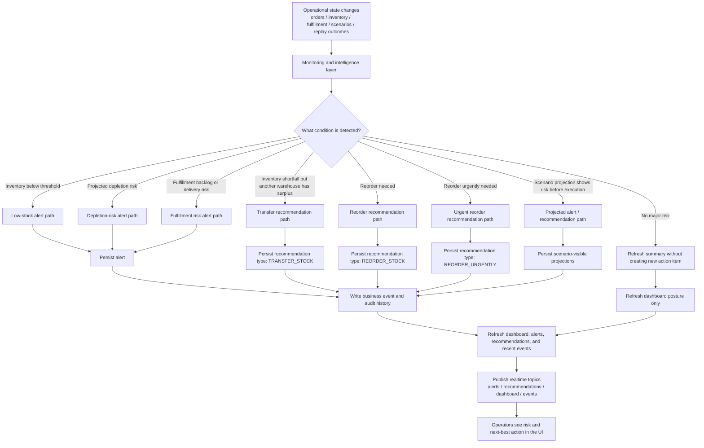

### Current explicit recommendation types

The current explicit recommendation types documented in the system are:

- `REORDER_STOCK`
- `REORDER_URGENTLY`
- `TRANSFER_STOCK`

### What can trigger recommendations

- low stock crossing threshold
- predicted near-term stockout pressure
- cross-warehouse surplus that can cover a shortfall
- scenario projection before live execution
- fulfillment pressure that changes operator urgency even when inventory is not the only issue

### What can trigger alerts

- low stock
- depletion risk
- fulfillment backlog growth
- delayed shipment or delivery pressure
- anomaly or repeated exception patterns where modeled
- runtime or trust degradation on the platform side

## 6. Replay And Recovery Flow

Replay exists because failed inbound work must remain visible and recoverable rather than disappearing into logs or manual cleanup.

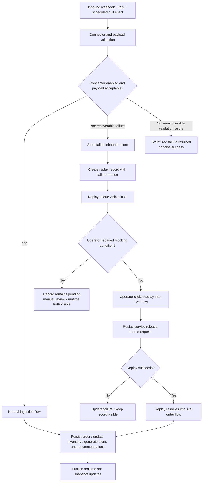

### What replay is for

- connector-disabled recovery
- recoverable inbound failures after configuration or data repair
- deliberate operator-owned recovery

### What replay is not for

- pretending malformed or unrecoverable data was safely ingested
- hiding failed inbound work

## 7. Realtime And Runtime Truth Flow

SynapseCore uses both snapshot reads and websocket updates. Runtime trust explains whether the live view is truly safe to act on.

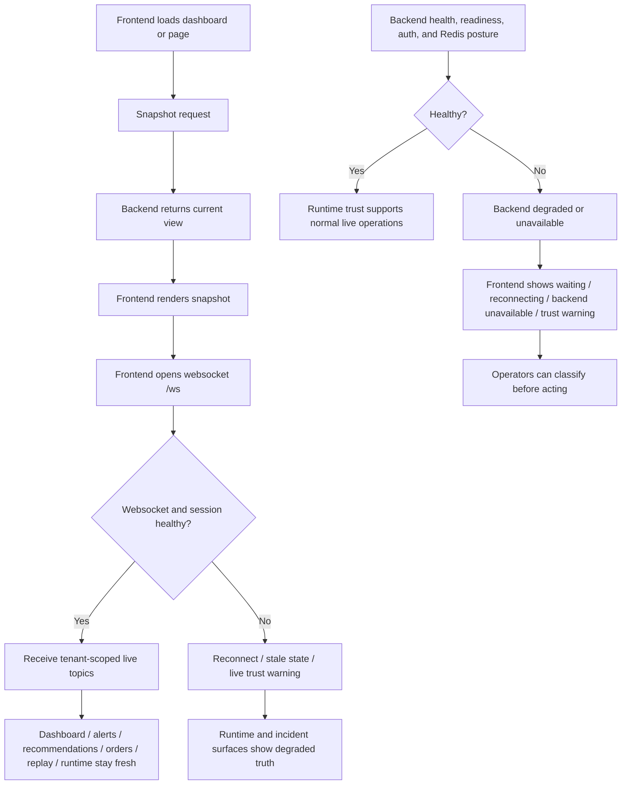

### What snapshot does

- gives the frontend a coherent current state
- supports initial loads and refreshes

### What websocket does

- pushes live tenant updates
- reduces the need for manual refresh

### What degraded-state UX does

- shows when live truth is stale or unavailable
- avoids fake success
- keeps runtime trust part of the product

## 8. Full Surface And Output Map

The easiest way to understand the whole system is to see where processed truth ends up.

```mermaid
flowchart TD
    A["Operational truth store<br/>PostgreSQL + runtime state"] --> B["Dashboard summary"]
    A --> C["Dashboard snapshot"]
    A --> D["Orders page"]
    A --> E["Inventory page"]
    A --> F["Catalog page"]
    A --> G["Alerts page"]
    A --> H["Recommendations page"]
    A --> I["Replay queue page"]
    A --> J["Integrations page"]
    A --> K["Scenario history page"]
    A --> L["Approvals page"]
    A --> M["Runtime and incidents page"]
    A --> N["Users / profile / settings pages"]
    A --> O["Recent events and audit history"]

    P["Realtime publisher"] --> B
    P --> G
    P --> H
    P --> D
    P --> E
    P --> I
    P --> J
    P --> K
    P --> L
    P --> M
    P --> O
```

### What each operational surface is fed by

#### Dashboard

Shows:

- summary metrics
- alerts
- recommendations
- inventory risk
- replay pressure
- connector posture
- recent events
- audit activity
- runtime trust cues

#### Orders

Shows:

- live order flow
- recent order processing
- warehouse and fulfillment context

#### Inventory

Shows:

- stock posture
- threshold risk
- projected urgency
- recommendation context

#### Catalog

Shows:

- product readiness
- import outcomes
- SKU-level prerequisites for operational flows

#### Alerts

Shows:

- active operational warnings
- severity
- recommended response

#### Recommendations

Shows:

- explicit next-best actions
- policy explanation
- priority and recency

#### Replay Queue

Shows:

- failed inbound records
- failure codes and reasons
- replay eligibility
- manual recovery path

#### Integrations

Shows:

- connector health
- enablement state
- import history
- replay pressure
- failure detail

#### Scenario History And Approvals

Shows:

- saved plans
- review stage
- approval or rejection state
- escalation state
- execution readiness

#### Runtime

Shows:

- health and readiness posture
- auth and websocket trust cues
- connector and replay diagnostics
- incident visibility

#### Users, Profile, Settings

Shows:

- workspace identity
- operator identity
- role and policy context
- admin and support controls

## 9. Proof And Testing Flow

Hosted proof exists to validate the real deployed frontend and backend together. It should stop when trust prerequisites are missing.

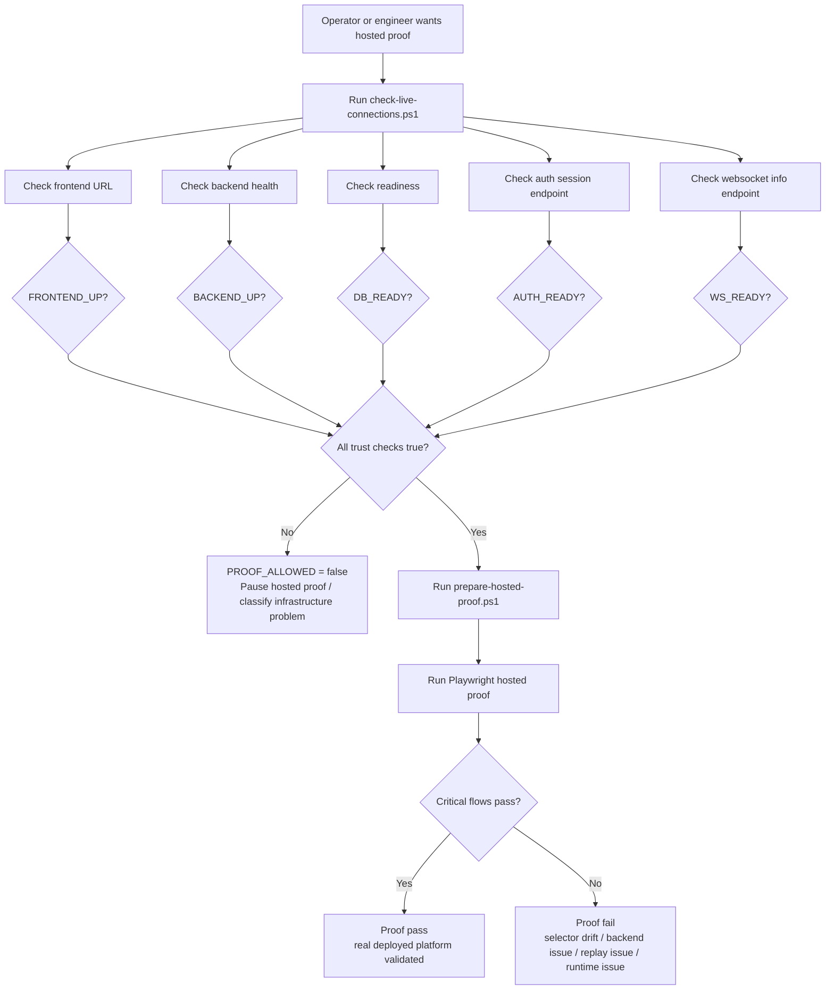

### What proof validates

- public and authenticated routes
- auth/session behavior
- dashboard and realtime behavior
- replay and recovery behavior
- approval and execution behavior
- runtime trust prerequisites

### When proof must not run

- frontend is up but backend is timing out
- readiness is down
- auth session is not responding
- websocket info is not responding
- DB or Redis are unavailable

## 10. Deployment And Environment Flow

The system can run locally or through Render-style hosted deployment, but the communication chain stays the same.

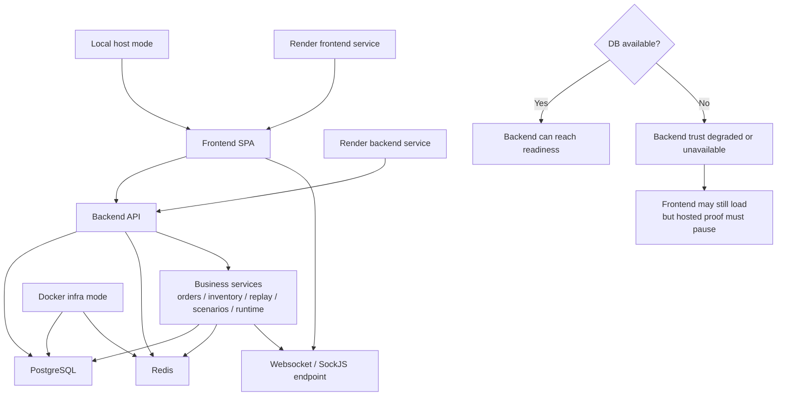

### Local paths

- frontend on `localhost:5173`
- backend on `localhost:8080`
- Postgres on `5432`
- Redis on `6379`

### Hosted paths

- frontend on Render
- backend on Render
- DB and Redis as backend dependencies

### Important current truth

- frontend can be reachable while backend is not trustworthy
- DB and Redis health affect readiness, auth, and websocket trust
- hosted proof is a validation step, not a wake-up command

## 11. Full Capability Path Summary

The platform can currently do all of these operational paths:

- public homepage education
- create workspace guidance
- company workspace sign-in
- tenant-safe session establishment
- dashboard snapshot loading
- websocket-based live updates
- catalog onboarding
- inventory update and risk reaction
- order ingestion
- webhook order ingestion
- CSV import ingestion
- scheduled pull ingestion
- fulfillment state and delay-risk reaction
- integration connector visibility
- structured inbound failure handling
- replay queue visibility
- manual replay into live flow
- scenario save, approval, rejection, escalation, and execution
- alerts and recommendations
- runtime and incident visibility
- audit and business-event traceability
- user, profile, and workspace administration
- local verification
- hosted proof when live trust is healthy

## What Operators See At The End

If the system is healthy and the action succeeds, operators should see:

- updated operational state
- dashboard changes
- orders or inventory changes
- alerts and recommendations adjusted
- audit and history updated
- realtime reflecting the new truth

If the action fails, operators should see:

- structured failure
- replay queue visibility if recoverable
- approval-blocked state if governance is required
- degraded runtime warning if the system itself is unhealthy

## Recommendations And What The System Can Do

The system can generate or support:

- low-stock alerts
- depletion-risk signals
- reorder recommendations
- urgent reorder recommendations
- transfer or replenishment guidance where modeled
- fulfillment and delay-risk alerts
- approval-required control gates
- escalation notifications
- connector degradation visibility
- replay and recovery guidance
- runtime trust warnings
- snapshot-based operational visibility
- websocket-based live operational freshness
- audit and business-event traceability

### Full operational consequence loop

For almost every important operational action, the system can:

1. accept or reject the action
2. validate workspace, role, and payload truth
3. persist the resulting state
4. classify success, failure, waiting, approval, replay, or degraded trust
5. write audit and business events
6. generate alerts or recommendations where conditions warrant
7. refresh dashboard and page-level views
8. publish realtime updates
9. expose the resulting truth to operators, planners, admins, runtime reviewers, and proof tooling

The important principle is that recommendations are part of an operational decision loop, not just passive dashboard decoration.

## Bottom Line

SynapseCore is a branching operational control system.

Data and actions do not simply arrive and get stored.
They move through:

- workspace trust
- validation
- persistence
- business processing
- approval and replay branches
- realtime and snapshot presentation
- runtime truth classification
- proof validation

That is what makes it an operations command platform rather than a simple CRUD or analytics application.

## 12. Role-By-Role Operational Flow

The platform is not one flat user experience.
Different actors enter different parts of the branching system and are allowed to continue only along the paths their workspace role supports.

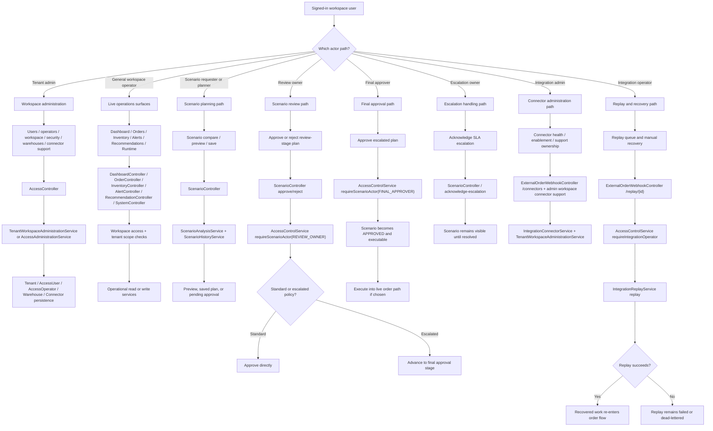

### Role path details

#### Tenant admin

Tenant admins can:

- create or update operators
- create or update users
- reset user passwords
- update workspace metadata
- update workspace security policy
- update workspace warehouses
- update workspace connector support ownership
- in some environments, create tenant workspaces through onboarding

Primary path:

- `AccessController`
- `AccessControlService.requireTenantAdmin(...)`
- `AccessAdministrationService`
- `TenantWorkspaceAdministrationService`
- `TenantOnboardingService`

#### General workspace operator

General workspace operators can:

- view dashboard summary and snapshot
- view alerts, recommendations, orders, inventory, runtime, incidents, recent events, and recent audit history
- perform only actions allowed by their assigned role and warehouse scope

Primary path:

- `AccessControlService.requireWorkspaceAccess(...)`
- role-specific write gates for inventory, operational writes, ingestion, replay, and governance
- `DashboardController`
- `InventoryController`
- `OrderController`
- `SystemController`
- `OperationalViewService`

#### Scenario requester or planner

Scenario requesters or planners can:

- create scenario previews
- compare alternatives
- save plans for approval
- load scenario requests back into the planner

Primary path:

- `ScenarioController`
- `ScenarioAnalysisService`
- `ScenarioHistoryService`

#### Review owner

Review owners can:

- approve assigned review-stage plans
- reject assigned review-stage plans with reasons
- move escalated plans into final approval
- execute only approved saved plans with stored request payloads

Primary path:

- `ScenarioController.approveScenarioPlan(...)`
- `AccessControlService.requireScenarioActor(REVIEW_OWNER, ...)`
- `ScenarioHistoryService.approvePlan(...)`
- `ScenarioHistoryService.executeScenario(...)`

#### Final approver

Final approvers can:

- approve assigned escalated plans that require a higher governance lane
- reject assigned final-stage plans when required
- execute only approved saved plans with stored request payloads

Primary path:

- `ScenarioController.approveScenarioPlan(...)`
- `AccessControlService.requireScenarioActor(FINAL_APPROVER, ...)`
- `ScenarioHistoryService.approvePlan(...)`
- `ScenarioHistoryService.executeScenario(...)`

#### Escalation owner

Escalation owners can:

- acknowledge assigned SLA escalations
- keep overdue review flows visible until resolved

Primary path:

- `ScenarioController.acknowledgeEscalation(...)`
- `ScenarioHistoryService.acknowledgeSlaEscalation(...)`

#### Integration admin

Integration admins can:

- create or update connectors
- manage connector visibility and support ownership
- control whether a connector is enabled for live ingestion
- perform human-session webhook and CSV ingestion
- perform direct operational order and fulfillment writes within scope
- replay eligible failed inbound work

Primary path:

- `ExternalOrderWebhookController.saveConnector(...)`
- `AccessControlService.requireIntegrationAdmin(...)`
- `AccessControlService.requireHumanIngestion(...)`
- `AccessControlService.requireOperationalWrite(...)`
- `IntegrationConnectorService.upsertConnector(...)`

#### Integration operator

Integration operators can:

- inspect replay queues
- perform human-session webhook and CSV ingestion
- perform direct operational order and fulfillment writes within scope
- manually replay eligible failed inbound work

Primary path:

- `AccessControlService.requireHumanIngestion(...)`
- `AccessControlService.requireOperationalWrite(...)`
- `ExternalOrderWebhookController.getReplayQueue(...)`
- `ExternalOrderWebhookController.replayFailedOrder(...)`
- `IntegrationReplayService.getReplayQueue(...)`
- `IntegrationReplayService.replay(...)`

## 13. Exact Capability Universe

This section lists the current state and classification vocabulary the system can actually emit today.

### Current recommendation types

- `REORDER_STOCK`
- `REORDER_URGENTLY`
- `TRANSFER_STOCK`
- `PRIORITIZE_FULFILLMENT`
- `ESCALATE_LOGISTICS`
- `INVESTIGATE_LOGISTICS_ANOMALY`

### Current alert types

- `LOW_STOCK`
- `DEPLETION_RISK`
- `FULFILLMENT_BACKLOG`
- `DELIVERY_DELAY_RISK`
- `FULFILLMENT_ANOMALY`

### Current order statuses

- `CREATED`
- `RECEIVED`
- `PROCESSING`
- `PARTIALLY_FULFILLED`
- `FULFILLED`
- `DELIVERED`
- `CANCELLED`
- `RETURNED`
- `FAILED`
- `BLOCKED`

### Current fulfillment statuses

- `QUEUED`
- `PICKING`
- `PACKED`
- `DISPATCHED`
- `DELAYED`
- `DELIVERED`
- `EXCEPTION`

### Current replay statuses

- `PENDING`
- `REPLAY_FAILED`
- `DEAD_LETTERED`
- `REPLAYED`

### Current inbound ingestion statuses

- `RECEIVED`
- `ACCEPTED`
- `REJECTED`
- `REPLAY_QUEUED`
- `REPLAYED`

### Current scenario approval statuses

- `NOT_REQUIRED`
- `PENDING_APPROVAL`
- `APPROVED`
- `REJECTED`

### Current scenario approval stages

- `NOT_REQUIRED`
- `PENDING_REVIEW`
- `PENDING_FINAL_APPROVAL`
- `APPROVED`
- `REJECTED`

### Current scenario approval policies

- `STANDARD`
- `ESCALATED`

### Current scenario actor roles

- `REQUESTER`
- `REVIEW_OWNER`
- `FINAL_APPROVER`
- `ESCALATION_OWNER`

### Current elevated workspace roles

- `TENANT_ADMIN`
- `REVIEW_OWNER`
- `FINAL_APPROVER`
- `ESCALATION_OWNER`
- `INTEGRATION_ADMIN`
- `INTEGRATION_OPERATOR`

### Current dispatch queue statuses

- `PENDING`
- `PROCESSING`
- `COMPLETED`
- `FAILED`

## 14. Microflow Appendix: Exact Controller -> Service -> Repository Paths

This is the most code-grounded view in the document.
It shows the primary request chains and where truth is stored or fanned out.

### 14.1 Public workspace creation

**User action**

- company admin submits create-workspace flow

**Frontend surface**

- public create workspace page

**Backend path**

- `POST /api/access/tenants`
- `AccessController.onboardTenant(...)`
- `TenantOnboardingService.onboardTenant(...)`

**Repositories touched**

- `TenantRepository`
- `AccessOperatorRepository`
- `AccessUserRepository`
- `WarehouseRepository`
- optionally `ProductRepository`
- optionally `InventoryRepository`

**Other services**

- `IntegrationConnectorService.seedStarterConnectors(...)`
- `AuditLogService`
- `OperationalMetricsService`

**User-visible result**

- tenant workspace created
- bootstrap admin created
- executive approver created
- starter warehouses created
- optional starter inventory / starter connectors seeded

**Failure modes**

- duplicate tenant code
- duplicate admin username
- missing bootstrap authorization

### 14.2 Sign-in and session truth

**User action**

- operator signs in with workspace code, username, and password

**Frontend surface**

- sign-in page

**Backend path**

- `POST /api/auth/session/login`
- `AuthController.signIn(...)`
- `AuthSessionService.signIn(...)`

**Repositories touched**

- `AccessUserRepository`
- `AuditLogRepository`

**Other services**

- `OperationalMetricsService`
- session storage through servlet session and production Redis-backed session posture

**Success result**

- tenant code stored in session
- actor and username stored in session
- session version and security policy version stored
- frontend can call `GET /api/auth/session`
- websocket trust becomes possible

**Failure modes**

- missing tenant code
- bad password
- inactive operator
- inactive tenant
- expired or invalidated session on later checks

### 14.3 Dashboard and snapshot read

**User action**

- operator opens dashboard or refreshes snapshot

**Frontend surface**

- dashboard

**Backend path**

- `GET /api/dashboard/summary`
- `GET /api/dashboard/snapshot`
- `DashboardController`
- `DashboardService.getSummary()` or `OperationalViewService.getSnapshot()`

**Repositories touched**

- `CustomerOrderRepository`
- `AlertRepository`
- `InventoryRepository`
- `RecommendationRepository`
- `WarehouseRepository`
- integration repositories through `OperationalViewService`
- scenario history through `ScenarioHistoryService`

**Other services**

- `FulfillmentService`
- Redis cache for dashboard summary when enabled

**User-visible result**

- summary cards
- alerts
- recommendations
- inventory health
- fulfillment overview
- recent orders
- recent events
- audit
- incidents
- connectors, imports, replay queue
- scenario notifications and escalations

**Failure modes**

- backend unavailable
- degraded snapshot freshness
- Redis cache miss or Redis cache bypass without breaking summary generation

### 14.4 Product and catalog onboarding

**User action**

- create one product or import many products from CSV

**Frontend surface**

- catalog page

**Backend path**

- `GET /api/products`
- `POST /api/products`
- `PUT /api/products/{productId}`
- `POST /api/products/import`
- `ProductController`
- `ProductService`

**Repositories touched**

- `ProductRepository`

**Other services**

- `IdentitySequenceMigrationService`
- `CatalogWriteConflictResolver`
- `BusinessEventService`
- `AuditLogService`
- `OperationalStateChangePublisher`
- `OperationalMetricsService`

**User-visible result**

- products appear in catalog
- import returns created / updated / failed row results
- dashboard and operational views can consume the catalog truth

**Failure modes**

- invalid or duplicate SKU
- CSV header issues
- write conflicts

### 14.5 Inventory update and operational signals

**User action**

- operator updates, receives, adjusts, or reconciles stock

**Frontend surface**

- inventory page

**Backend path**

- `POST /api/inventory/update`
- `POST /api/inventory/receive`
- `POST /api/inventory/adjust`
- `POST /api/inventory/reconcile`
- `InventoryController`
- `InventoryService`

**Repositories touched**

- `InventoryRepository`
- `ProductRepository`
- `WarehouseRepository`

**Other services**

- `InventoryMonitoringService`
- `InventoryIntelligenceService`
- `StockPredictionService`
- `BusinessEventService`
- `AuditLogService`
- `OperationalStateChangePublisher`

**Derived outputs**

- inventory posture updates
- low-stock or depletion-risk alert sync
- reorder, urgent reorder, or transfer recommendation generation
- dashboard refresh
- realtime publication

**Failure modes**

- warehouse or product not found in tenant scope
- attempted negative on-hand below reserved commitments
- reconciliation conflicts

### 14.6 Direct order ingestion

**User action**

- operator creates live order

**Frontend surface**

- orders page or scenario execution downstream

**Backend path**

- `POST /api/orders`
- `OrderController`
- `OrderService.createOrder(...)`

**Repositories touched**

- `CustomerOrderRepository`
- `FulfillmentTaskRepository`
- inventory rows through `InventoryService`

**Other services**

- `InventoryService.reserveStock(...)`
- `FulfillmentService.initializeForOrder(...)`
- `BusinessEventService`
- `AuditLogService`
- `OperationalMetricsService`
- `OperationalStateChangePublisher`

**User-visible result**

- order created
- inventory reserved
- fulfillment initialized
- dashboard/orders/alerts/recommendations update

**Failure modes**

- duplicate external order ID
- insufficient stock
- tenant-scope mismatch
- lock contention retries exhausted

### 14.7 Webhook ingestion path

**User action**

- external system sends order webhook

**Frontend surface**

- not initiated from UI; later visible in orders, integrations, replay, dashboard

**Backend path**

- `POST /api/integrations/orders/webhook`
- `ExternalOrderWebhookController.ingestOrderWebhook(...)`
- `ExternalOrderWebhookService.ingest(...)`

**Repositories touched**

- inbound record through `IntegrationInboundRecordService`
- replay record on failure through `IntegrationReplayRecordRepository`
- order persistence through `OrderService`

**Other services**

- `IntegrationInboundAccessService`
- `IntegrationConnectorService`
- `IntegrationConnectorPolicyService`
- `IntegrationImportRunService`
- `IntegrationReplayService`
- `OperationalMetricsService`

**Success path**

- connector authenticated or workspace authorized
- inbound record stored as received
- connector policy prepares normalized order request
- order created through normal order path
- inbound marked accepted
- import run recorded

**Failure path**

- connector invalid or disabled
- source mismatch
- payload invalid
- warehouse or SKU invalid
- order creation fails
- inbound marked rejected
- replay record queued
- import run recorded as rejected

### 14.8 CSV import path

**User action**

- operator or connector uploads CSV

**Frontend surface**

- integrations page

**Backend path**

- `POST /api/integrations/orders/csv-import`
- `ExternalOrderWebhookController.importOrdersFromCsv(...)`
- `ExternalOrderCsvImportService.ingest(...)`

**Repositories touched**

- inbound records
- import runs
- replay queue records
- customer orders through `OrderService`

**Success path**

- CSV parsed
- rows grouped into orders
- connector policy prepares normalized order
- each successful order enters the live order creation path
- import run summarizes success and failure counts

**Failure path**

- missing file
- oversized file
- missing header
- bad source system
- connector not configured or disabled
- grouped order rejected
- failed order added to replay queue

### 14.9 Replay and recovery path

**User action**

- integration operator opens replay queue and clicks `Replay Into Live Flow`

**Frontend surface**

- replay queue page

**Backend path**

- `GET /api/integrations/orders/replay-queue`
- `POST /api/integrations/orders/replay/{replayRecordId}`
- `ExternalOrderWebhookController`
- `IntegrationReplayService`

**Repositories touched**

- `IntegrationReplayRecordRepository`
- inbound record updates through `IntegrationInboundRecordService`

**Other services**

- `IntegrationConnectorService`
- `OrderService`
- `BusinessEventService`
- `AuditLogService`
- `OperationalMetricsService`
- `OperationalAlertHookService`
- `OperationalStateChangePublisher`

**Success result**

- replay record moves to `REPLAYED`
- inbound record can move to replayed/accepted state
- recovered order enters normal live order flow
- dashboard/events/audit/replay surfaces update

**Failure result**

- connector still disabled
- next eligible time not reached
- replay remains failed
- record can become dead-lettered after repeated failure
- operator still sees failure reason instead of false success

### 14.10 Scenario planning, approval, and execution

**User action**

- planner previews impact, saves a plan, review owners approve or reject, final approver handles escalations, approved plan executes into live order flow

**Frontend surface**

- recommendations
- scenario history
- approvals
- action consoles

**Backend path**

- `POST /api/scenarios/order-impact`
- `POST /api/scenarios/order-impact/compare`
- `POST /api/scenarios/save`
- `POST /api/scenarios/{id}/approve`
- `POST /api/scenarios/{id}/reject`
- `POST /api/scenarios/{id}/acknowledge-escalation`
- `POST /api/scenarios/{id}/execute`
- `GET /api/scenarios/history`
- `GET /api/scenarios/notifications`
- `ScenarioController`

**Primary services**

- `ScenarioAnalysisService`
- `ScenarioHistoryService`
- `ScenarioExecutionService`
- `ScenarioProjectionService`
- `ScenarioRiskPolicyService`
- `AccessControlService`

**Repositories touched**

- `ScenarioRunRepository`
- live order persistence through `OrderService` during execution

**Decision branches**

- preview only -> no approval required
- saved plan -> `PENDING_APPROVAL`
- standard policy -> review owner can approve directly
- escalated policy -> review owner advances to final approval
- rejected plan -> execution stops; planner must resubmit
- approved saved plan with stored request payload -> executable live order path
- preview -> loadable planning evidence only, not executable

**User-visible result**

- scenario request history
- approval queues
- escalation inbox
- executed scenarios recorded back into history

### 14.11 Runtime trust and incident visibility

**User action**

- operator opens runtime page

**Frontend surface**

- runtime page

**Backend path**

- `GET /api/system/runtime`
- `GET /api/system/incidents`
- `SystemController`
- `SystemRuntimeService`
- `SystemIncidentService`

**Repositories touched**

- `AlertRepository`
- `AuditLogRepository`
- `BusinessEventRepository`
- `FulfillmentTaskRepository`
- `IntegrationConnectorRepository`
- `IntegrationInboundRecordRepository`
- `IntegrationImportRunRepository`
- `IntegrationReplayRecordRepository`
- `OperationalDispatchWorkItemRepository`

**Other services**

- `RealtimeService`
- `OperationalDispatchQueueService`
- `OperationalMetricsService`
- `OperationalAlertHookService`

**User-visible result**

- overall status `UP`, `DEGRADED`, or `DOWN`
- liveness and readiness posture
- connector diagnostic summaries
- replay and inbound failure counts
- queue backlog / failed dispatch counts
- broker mode explanation

## 15. Failure, Degraded-State, and Proof-Surface Matrix

This section answers the practical question:
if something goes wrong, where does it stop, where does it surface, and what path is still open?

| Failure or decision point | Backend result | Data effect | Operator-visible surface | Realtime effect | Proof effect |
| --- | --- | --- | --- | --- | --- |
| Invalid workspace code or password | `AuthSessionService` rejects sign-in | no session created | sign-in failure on login page | websocket not trusted | auth proof fails |
| Session expired or tenant security policy changed | session invalidated during auth check | prior session no longer trusted | session-expired messaging, sign-in required again | websocket reconnect blocked or stale | auth proof blocked |
| Missing workspace access | `AccessControlService.requireWorkspaceAccess(...)` fails | no mutation | 401 or 403 style blocked state | no publish from rejected action | flow proof fails at auth or role gate |
| Missing tenant admin role | admin action denied | no admin mutation | users/settings/workspace actions blocked | none | admin proof path fails |
| Invalid product CSV | product import row rejected | partial import only | catalog import results show failed rows | no successful product fanout for failed rows | catalog proof may fail |
| Inventory adjustment below reserved floor | `InventoryService` throws conflict | no invalid stock write | inventory error message | no downstream realtime from rejected mutation | inventory proof fails on conflict branch |
| Insufficient inventory during order creation | `OrderService` rejects create | order not saved | order failure or replay failure depending on source | no order-flow success publish | order/replay proof fails |
| Webhook or CSV connector disabled | integration policy rejects request | inbound may be recorded, replay queued | integrations + replay queue show failure | integration topics may show replay pressure instead of success | replay proof expected to pause or fail |
| Replay attempted before `nextEligibleAt` | replay denied with conflict | replay record stays pending | replay queue still shows pending eligibility | no recovered order publish | replay proof fails |
| Replay succeeds | replay transitions to recovered state | replay + order history updated | replay queue and orders reflect recovery | integration/order topics publish fresh state | replay proof passes |
| Scenario requires escalated approval | plan remains pending final approval | scenario saved, not executed | approvals and scenario history show gated state | scenario notifications can update | execution proof must wait |
| Scenario rejected | scenario stops before execution | scenario history retains rejection | approvals/history show rejected plan | no live order fanout | scenario execution proof fails until resubmitted |
| Scenario approved then executed | execution creates live order | scenario execution history + order persisted | scenario history and orders update | order-flow and scenario notifications update | execution proof passes |
| Websocket broker degraded or disconnected | snapshots still possible, live push reduced | DB truth may still be correct | runtime warnings, reconnecting state, possibly stale UI | live freshness drops | websocket proof fails |
| Readiness false while liveness true | app booted but not ready for trusted traffic | data may be inconsistent or dependencies unavailable | runtime shows degraded trust | websocket/auth may not be safe | `PROOF_ALLOWED=false` |
| DB unavailable or suspended | backend may hang or fail readiness | no reliable persistence | frontend shell may load but login/actions fail | no trustworthy realtime | hosted proof must stop |
| Redis/session unavailable in production posture | session truth and fanout may degrade | session and cache posture degraded | runtime trust warning and auth issues | websocket/session instability possible | proof blocked on auth/ws trust |
| Backend unavailable but frontend up | SPA still serves shell | no live backend truth | public shell may render, authenticated actions fail | none or stale | proof paused immediately |

## 16. Recommendation, Alert, and Consequence Paths In One View

Recommendations are not decorative.
They are one of the main ways the system turns persisted operational truth into visible next-best action.

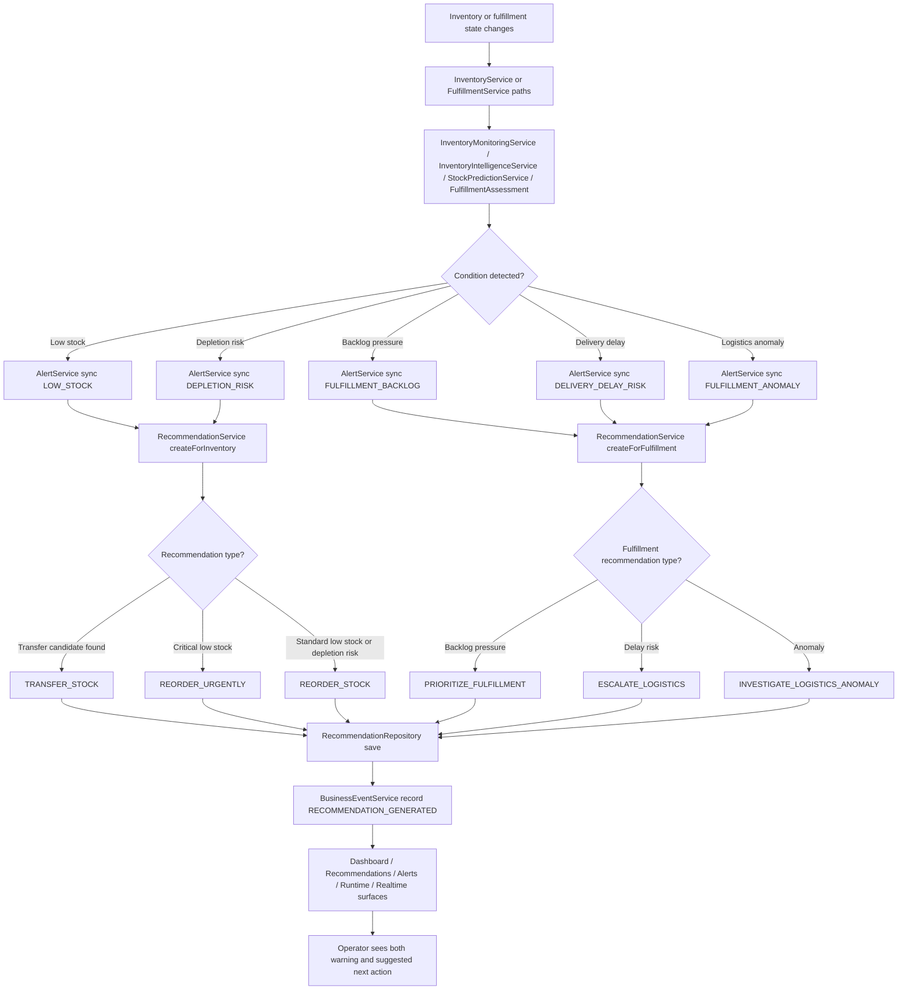

### Full recommendation and alert consequence loop

The system can currently move from raw operational truth to operator-visible guidance through all of these paths:

- inventory low stock -> alert -> reorder or transfer recommendation
- inventory depletion risk -> alert -> reorder recommendation
- critical low stock -> urgent reorder recommendation
- fulfillment backlog -> backlog alert -> prioritize fulfillment recommendation
- delivery delay -> delay alert -> logistics escalation recommendation
- anomaly or exception pressure -> anomaly alert -> investigate logistics anomaly recommendation
- scenario projection -> projected alerts and projected recommendations before live execution
- replay backlog or connector degradation -> visible operational pressure even before a live order is recovered

### Where the guidance finally appears

- dashboard summary and operational lanes
- alerts page
- recommendations page
- runtime trust view
- recent events and audit context
- scenario projections before approval or execution

## 17. Full Loop Recap

If someone wants the shortest possible truthful reread of the whole platform, it is this:

1. a company or operator enters through the public frontend
2. access moves through workspace code, user session, and tenant truth
3. requests hit real controllers, not fake demo paths
4. access checks, role checks, and warehouse checks decide whether the action may continue
5. business services persist truth in PostgreSQL
6. alerts, recommendations, audit, events, and scenario history react to that truth
7. realtime and snapshot surfaces expose the new state to operators
8. if a connector fails, the replay queue preserves recoverable work
9. if a plan is risky, approvals and escalation gates stop unsafe execution
10. if runtime trust degrades, the platform is supposed to say so explicitly
11. hosted proof only runs when readiness, auth, and websocket truth are healthy
12. success means visible operational completion; failure means visible, classifiable, recoverable truth

## 18. Full Frontend Participation Inventory

This section names the current first-party frontend files that participate in the system flow.
It exists so the document does not stop at backend and runtime logic only.

### Frontend bootstrap and root composition

- `main.jsx`
  - browser entry point
  - mounts the React application
- `App.jsx`
  - root application composition
  - connects the shell and route system into the browser app

### Frontend service adapters

- `services/api.js`
  - API request helper layer for backend HTTP communication
- `services/auth.js`
  - auth/session helper layer for login, logout, and session reads

### Frontend configuration files

- `config/pageRegistry.js`
  - route/page registration map
  - controls page metadata, navigation labels, and route identity
- `config/workspaceModel.js`
  - workspace-oriented frontend model configuration
  - helps define the shell and context structure

### Frontend state and operational hooks

- `hooks/useApi.js`
  - basic API request hook behavior
- `hooks/useAuth.js`
  - frontend auth/session state behavior
- `hooks/useCatalogActions.js`
  - catalog create/update/import action paths
- `hooks/useIntegrationActions.js`
  - connector, import, and replay action paths
- `hooks/useScenarioActions.js`
  - scenario save/approve/reject/execute action paths
- `hooks/useWorkspaceAdminActions.js`
  - workspace admin action paths
- `hooks/useWorkspaceAppModel.js`
  - aggregate workspace app state model
- `hooks/useWorkspaceBootstrap.js`
  - authenticated app bootstrap logic
- `hooks/useWorkspaceChrome.js`
  - shell chrome and page-frame behavior
- `hooks/useWorkspacePageContexts.js`
  - page-specific data context selection and shaping
- `hooks/useWorkspaceRealtime.js`
  - websocket/realtime subscription lifecycle and update handling
- `hooks/useWorkspaceSessionActions.js`
  - session-level actions such as login/logout/password/session handling
- `hooks/useWorkspaceShell.js`
  - shell orchestration for sidebar/topbar/page framing
- `hooks/useWorkspaceState.js`
  - broad workspace state management

### Frontend shell and layout files

- `layout/AppShell.jsx`
  - top-level authenticated page frame
- `layout/Sidebar.jsx`
  - navigation hierarchy and workspace route switching entry
- `layout/Topbar.jsx`
  - workspace identity, runtime status, operator posture
- `layout/WorkspacePageHeader.jsx`
  - per-page command header presentation
- `layout/WorkspaceUtilityRail.jsx`
  - auxiliary command/info rail presentation

### Frontend application composition components

- `components/AppRoutes.jsx`
  - route composition entry
- `components/WorkspaceApplication.jsx`
  - workspace-scoped application composition
- `components/WorkspaceAuthenticatedApp.jsx`
  - authenticated workspace application entry
- `components/WorkspaceRouteSwitch.jsx`
  - page routing switcher inside workspace shell
- `components/WorkspaceNotices.jsx`
  - runtime, degraded-state, and operational notice rendering

### Frontend shared operational UI components

- `components/ActionPanel.jsx`
  - action grouping and control surface
- `components/ActivityFeed.jsx`
  - recent events / audit-like timeline rendering
- `components/Card.jsx`
  - reusable card surface
- `components/DataGrid.jsx`
  - tabular data rendering and sort behavior
- `components/EmptyState.jsx`
  - empty/no-data surface
- `components/LoadingState.jsx`
  - loading/skeleton posture
- `components/Panel.jsx`
  - reusable content panel surface
- `components/ScenarioDecisionConsole.jsx`
  - scenario review/execution action console
- `components/ScenarioEditor.jsx`
  - scenario input/editing surface
- `components/StatusBadge.jsx`
  - normalized status/severity/health badge rendering

### Frontend public entry pages

- `pages/PublicExperience.jsx`
  - homepage and public platform framing
- `pages/CreateWorkspace.jsx`
  - create-workspace guided onboarding surface
- `pages/SignIn.jsx`
  - workspace code + username + password sign-in flow

### Frontend authenticated operational pages

- `pages/Dashboard.jsx`
  - command-center summary, executive signals, activity rail, guidance
- `pages/Orders.jsx`
  - live order operations and selected-order detail
- `pages/Inventory.jsx`
  - inventory health, stock posture, replenishment and risk context
- `pages/Catalog.jsx`
  - product onboarding, create/edit/import, import result clarity
- `pages/Alerts.jsx`
  - operational warning center
- `pages/Recommendations.jsx`
  - decision intelligence and next-best action surface
- `pages/Replay.jsx`
  - failed inbound recovery and replay queue operations
- `pages/Integrations.jsx`
  - connector visibility, status, health, and import/replay context
- `pages/Fulfillment.jsx`
  - fulfillment-specific posture and task-related visibility
- `pages/ScenarioPlanner.jsx`
  - scenario planning and request composition
- `pages/ScenarioHistory.jsx`
  - scenario memory, saved plans, approvals, execution history
- `pages/ScenarioControl.jsx`
  - scenario control and execution-related operations
- `pages/Approvals.jsx`
  - approval queues and action console
- `pages/Escalations.jsx`
  - escalated scenario and operational review flow
- `pages/Runtime.jsx`
  - runtime trust, readiness, incidents, and diagnostics
- `pages/Audit.jsx`
  - audit-history-facing surface

### Frontend authenticated support and admin pages

- `pages/Users.jsx`
  - tenant users and operator administration
- `pages/Profile.jsx`
  - signed-in identity and password/session posture
- `pages/Settings.jsx`
  - company workspace settings and operational policy
- `pages/Locations.jsx`
  - warehouse/location posture
- `pages/Tenants.jsx`
  - tenant listing / platform-facing access surface
- `pages/PlatformAdmin.jsx`
  - broader support/admin operational layer
- `pages/SystemConfig.jsx`
  - system configuration posture
- `pages/Releases.jsx`
  - release/build-facing operational surface

### Frontend styling layers

- `design-system.css`
  - primary design tokens and shared command-center visual patterns
- `styles.css`
  - legacy/supporting route and layout styling bridge

## 19. Full Backend Participation Inventory

This section names the current backend packages, classes, DTO groups, entities, repositories, configuration classes, and migrations that participate in the operational system.

### API controller layer

These classes are the request-entry layer for backend flows:

- `AccessController`
  - tenant onboarding
  - operator management
  - user management
  - workspace settings
  - workspace security
  - workspace warehouse and connector support updates
- `AlertController`
  - alert feed reads
- `AuditController`
  - recent audit history reads
- `AuthController`
  - session read
  - login
  - logout
  - password change
- `DashboardController`
  - dashboard summary
  - dashboard snapshot
- `DevToolsController`
  - local reseed path for development flows
- `EventController`
  - recent business event reads
- `FulfillmentController`
  - fulfillment overview and updates
- `InventoryController`
  - inventory update
  - receive
  - adjust
  - reconcile
  - inventory overview reads
- `OperationalPolicyController`
  - tenant operational policy read and update
- `OrderController`
  - create order
  - transition order
  - recent orders
- `ProductController`
  - product list
  - product create
  - product update
  - product import
- `RecommendationController`
  - recommendation reads
- `ScenarioController`
  - order impact analysis
  - comparison
  - save
  - approve
  - reject
  - acknowledge escalation
  - execute
  - request load
  - history
  - notifications
- `ServiceStatusController`
  - basic service status entrypoint
- `SystemController`
  - runtime status
  - incidents
- `WarehouseController`
  - warehouse list reads
- `FrameworkErrorController`
  - framework error routing
- `ApiExceptionHandler`
  - structured exception mapping
- `ApiErrorResponse`
  - standard API error payload shape

### Access package

The access package controls who may do what and when:

- `AccessAdministrationService`
  - tenant user/operator CRUD administration
- `AccessControlService`
  - role checks
  - workspace checks
  - warehouse checks
  - session-vs-header-fallback access decisions
- `AccessDirectoryService`
  - active tenant/operator lookup
  - warehouse access checks
- `BootstrapAccessService`
  - initial bootstrap gate
- `PlatformAdministrationAccessService`
  - platform admin gate for privileged onboarding
- `TenantOnboardingService`
  - tenant/workspace creation and bootstrap seeding
- `TenantWorkspaceAdministrationService`
  - workspace settings/security/warehouse/connector support updates
- `SynapseAccessRole`
  - tenant/system role vocabulary
- `SynapseActorContext`
  - current actor role context wrapper
- `access/dto/*`
  - `AccessOperatorResponse`
  - `AccessOperatorUpsertRequest`
  - `AccessUserCreateRequest`
  - `AccessUserPasswordResetRequest`
  - `AccessUserResponse`
  - `AccessUserUpdateRequest`
  - `TenantOnboardingRequest`
  - `TenantOnboardingResponse`
  - `TenantResponse`
  - `TenantWorkspaceConnectorSupportUpdateRequest`
  - `TenantWorkspaceResponse`
  - `TenantWorkspaceSecuritySettings`
  - `TenantWorkspaceSecuritySettingsRequest`
  - `TenantWorkspaceSupportActivity`
  - `TenantWorkspaceSupportDiagnostics`
  - `TenantWorkspaceSupportSummary`
  - `TenantWorkspaceUpdateRequest`
  - `TenantWorkspaceWarehouseUpdateRequest`

### Auth package

The auth package controls session truth:

- `AuthSessionService`
  - sign-in
  - session validation
  - password change
  - sign-out
  - session timeout and security-policy-version enforcement
- `FastAuthFailureException`
  - auth failure helper
- `StarterAccessUsers`
  - seeded starter credential support definitions
- `auth/dto/*`
  - `AuthSessionRequest`
  - `AuthSessionResponse`
  - `AuthSessionPasswordChangeRequest`

### Tenant package

Tenant protection is centralized here:

- `TenantContextService`
  - current tenant resolution
- `TenantOwnershipAssertions`
  - tenant ownership validation helpers
- `TenantScopeGuard`
  - ensures domain objects belong to the correct tenant/workspace

### Security package

The security package shapes browser/API trust:

- `ApiCorsResponseFilter`
  - API-side CORS response handling
- `SecurityRateLimitFilter`
  - request throttling edge behavior
- `SecurityRateLimitService`
  - rate-limit decision support

### Audit package

The audit package gives request and action traceability:

- `AuditLogService`
  - success/failure audit writes
  - recent audit log reads
- `RequestTraceContext`
  - per-request actor/tenant/request-id context
- `RequestTraceFilter`
  - injects or normalizes request trace state

### Domain service package

These are the main business services:

- `ProductService`
  - product CRUD and CSV import
- `InventoryService`
  - stock baseline, receive, adjust, reconcile, reserve, release, fulfill
- `OrderService`
  - create, transition, synchronize, cancel, return orders
- `DashboardService`
  - dashboard summary and cache posture
- `OperationalViewService`
  - aggregate snapshot/read surfaces for alerts, recs, inventory, orders, events, audit, incidents, connectors, replay, scenarios
- `SystemRuntimeService`
  - runtime truth, readiness/liveness-facing diagnostics, connector and queue posture
- `SystemIncidentService`
  - active incident view support
- `TenantOperationalPolicyService`
  - tenant policy read/update support
- `WarehouseService`
  - warehouse-related domain behavior
- `SeedService`
  - seeding support
- `DataInitializer`
  - startup data initialization support
- `IdentitySequenceMigrationService`
  - identity sequence safety before writes
- `InventorySchemaMigrationService`
  - schema-alignment support
- `CatalogTenantOwnershipMigrationService`
  - catalog ownership migration support
- `CatalogWriteConflictResolver`
  - product/catalog conflict interpretation
- `CoreIdentityWriteIsolationService`
  - identity write isolation support

### Domain repository package

These repositories persist operational truth:

- `AccessOperatorRepository`
- `AccessUserRepository`
- `AlertRepository`
- `AuditLogRepository`
- `BusinessEventRepository`
- `CustomerOrderRepository`
- `FulfillmentTaskRepository`
- `IntegrationConnectorRepository`
- `IntegrationImportRunRepository`
- `IntegrationInboundRecordRepository`
- `IntegrationReplayRecordRepository`
- `InventoryRepository`
- `OperationalDispatchWorkItemRepository`
- `OrderItemRepository`
- `ProductRepository`
- `RecommendationRepository`
- `ScenarioRunRepository`
- `TenantOperationalPolicyRepository`
- `TenantRepository`
- `WarehouseRepository`

### Domain entity package

These entities and enums define the current persisted model and state vocabulary:

- `AccessOperator`
- `AccessUser`
- `Alert`
- `AlertSeverity`
- `AlertStatus`
- `AlertType`
- `AuditLog`
- `AuditStatus`
- `BusinessEvent`
- `BusinessEventType`
- `CustomerOrder`
- `FulfillmentStatus`
- `FulfillmentTask`
- `IntegrationConnector`
- `IntegrationConnectorType`
- `IntegrationImportRun`
- `IntegrationImportStatus`
- `IntegrationInboundRecord`
- `IntegrationInboundStatus`
- `IntegrationReplayRecord`
- `IntegrationReplayStatus`
- `IntegrationSyncMode`
- `IntegrationTransformationPolicy`
- `IntegrationValidationPolicy`
- `Inventory`
- `OperationalDispatchStatus`
- `OperationalDispatchWorkItem`
- `OrderItem`
- `OrderStatus`
- `Product`
- `Recommendation`
- `RecommendationPriority`
- `RecommendationType`
- `ScenarioApprovalPolicy`
- `ScenarioApprovalStage`
- `ScenarioApprovalStatus`
- `ScenarioReviewPriority`
- `ScenarioRun`
- `ScenarioRunType`
- `Tenant`
- `TenantOperationalPolicy`
- `Warehouse`

### Domain DTO package

These DTOs carry domain request/response payloads across the UI/API boundary:

- `AlertFeedResponse`
- `AlertResponse`
- `AuditLogResponse`
- `BusinessEventResponse`
- `DashboardSnapshotResponse`
- `DashboardSummaryResponse`
- `FulfillmentOverviewResponse`
- `FulfillmentStatusResponse`
- `FulfillmentUpdateRequest`
- `InventoryAdjustmentRequest`
- `InventoryReceiptRequest`
- `InventoryReconciliationRequest`
- `InventoryStatusResponse`
- `InventoryUpdateRequest`
- `OrderCreateRequest`
- `OrderItemRequest`
- `OrderItemResponse`
- `OrderLifecycleTransitionRequest`
- `OrderResponse`
- `ProductImportResponse`
- `ProductImportRowResult`
- `ProductResponse`
- `ProductUpsertRequest`
- `RecommendationResponse`
- `SeedResetResponse`
- `SystemBackboneSummary`
- `SystemBuildInfo`
- `SystemConnectorDiagnosticSummary`
- `SystemDiagnosticsSummary`
- `SystemIncidentResponse`
- `SystemIncidentSeverity`
- `SystemIncidentType`
- `SystemMetricsSummary`
- `SystemRuntimeResponse`
- `SystemTelemetrySummary`
- `TenantOperationalPolicyRequest`
- `TenantOperationalPolicyResponse`
- `WarehouseResponse`

### Integration package

This package owns connector ingestion, import history, and replay:

- `ExternalOrderWebhookController`
  - integration API edge for webhook, CSV import, connectors, recent imports, replay queue, replay action
- `ExternalOrderWebhookService`
  - webhook mapping, connector policy application, order handoff, failure recording
- `ExternalOrderCsvImportService`
  - CSV parsing, grouping, connector normalization, order handoff, failure recording
- `IntegrationConnectorService`
  - connector lookup, enablement enforcement, connector upsert, tenant resolution
- `IntegrationConnectorPolicyService`
  - source-specific connector policy preparation before live order creation
- `IntegrationInboundAccessService`
  - connector token/authenticated ingress decisions
- `IntegrationInboundRecordService`
  - received / accepted / rejected / replay-linked inbound record handling
- `IntegrationImportRunService`
  - recent import run summaries
- `IntegrationReplayService`
  - replay queue, manual replay, automated replay batch logic, dead-letter decisions
- `IntegrationReplayAutomationService`
  - automation-related replay support
- `IntegrationScheduledPullWorkerService`
  - scheduled inbound pull support
- `IntegrationValidationException`
  - integration validation failure type
- `IntegrationFailureCode`
  - normalized failure-code vocabulary
- `IntegrationFailureCodes`
  - failure-code extraction and structured error creation
- `package-info.java`
  - package documentation boundary
- `integration/dto/*`
  - `ExternalOrderCsvImportFailure`
  - `ExternalOrderCsvImportOrderResult`
  - `ExternalOrderCsvImportResponse`
  - `ExternalOrderItemRequest`
  - `ExternalOrderWebhookRequest`
  - `ExternalOrderWebhookResponse`
  - `IntegrationConnectorHealthStatus`
  - `IntegrationConnectorRequest`
  - `IntegrationConnectorResponse`
  - `IntegrationImportRunResponse`
  - `IntegrationReplayRecordResponse`
  - `IntegrationReplayResultResponse`

### Scenario package

This package owns preview, governance, escalation, and execution:

- `ScenarioActorRole`
  - scenario-side actor vocabulary
- `ScenarioAnalysisService`
  - order impact and comparison analysis
- `ScenarioProjectionService`
  - projected alert/recommendation/inventory consequence modeling
- `ScenarioRiskAssessment`
  - calculated risk result model
- `ScenarioRiskPolicyService`
  - approval and review-priority policy decisions
- `ScenarioHistoryService`
  - save, approve, reject, escalate, history, notifications, request reload
- `ScenarioExecutionService`
  - executes approved scenario into live order flow
- `scenario/dto/*`
  - `ScenarioAlertProjection`
  - `ScenarioApprovalRequest`
  - `ScenarioApprovalResponse`
  - `ScenarioCompareRequest`
  - `ScenarioComparisonResponse`
  - `ScenarioComparisonSummary`
  - `ScenarioEscalationAcknowledgementRequest`
  - `ScenarioExecutionResponse`
  - `ScenarioHistoryFilter`
  - `ScenarioNotificationResponse`
  - `ScenarioNotificationType`
  - `ScenarioOrderImpactResponse`
  - `ScenarioRecommendationProjection`
  - `ScenarioRejectionRequest`
  - `ScenarioRejectionResponse`
  - `ScenarioRequestResponse`
  - `ScenarioRunResponse`
  - `ScenarioSaveRequest`
  - `ScenarioSaveResponse`

### Alert, recommendation, intelligence, prediction, and fulfillment packages

These packages transform operational state into warnings, guidance, and downstream movement:

- `AlertService`
  - syncs live alerts for inventory and fulfillment
  - resolves or refreshes active alerts
- `RecommendationService`
  - creates inventory and fulfillment recommendations
- `InventoryMonitoringService`
  - low-stock and operational inventory condition monitoring
- `InventoryIntelligenceService`
  - inventory insight calculation
- `InventoryInsight`
  - inventory risk result model
- `StockPredictionService`
  - stockout/depletion projection
- `StockPrediction`
  - prediction result model
- `FulfillmentService`
  - fulfillment lifecycle and overview
- `FulfillmentAssessment`
  - backlog/delay/anomaly assessment result

### Event and realtime packages

These packages convert persisted truth into live fanout:

- `BusinessEventService`
  - records domain events
- `BusinessEventQueryService`
  - reads recent events
- `OperationalStateChangePublisher`
  - creates operational state changed events and dispatch work items
- `OperationalStateChangeListener`
  - event reaction layer
- `OperationalStateChangedEvent`
  - event payload model
- `OperationalUpdateType`
  - update-category vocabulary such as order flow or integration state
- `OperationalDispatchQueueService`
  - queueing/dispatch support for operational updates
- `RealtimeService`
  - publishes tenant-scoped dashboard, alert, recommendation, inventory, order, audit, event, incident, integration, and scenario topics
- `RealtimePublisher`
  - broker abstraction
- `StompRealtimePublisher`
  - STOMP publishing implementation
- `RedisRealtimeEnvelope`
  - Redis fanout wrapper
- `RealtimeBrokerMode`
  - broker mode vocabulary

### Observability package

- `OperationalMetricsService`
  - records auth, tenant, integration, catalog, and other operational metrics
- `OperationalAlertHookService`
  - alert-hook / notification integration support

### Configuration package

These classes shape runtime behavior even when they are not business services themselves:

- `AsyncExecutionConfig`
  - async execution setup
- `AuthConfig`
  - auth/security wiring
- `CorsConfig`
  - CORS configuration wiring
- `RedisConfig`
  - Redis wiring
- `RedisRealtimePubSubConfig`
  - Redis-backed realtime fanout wiring
- `RedisUrlEnvironmentPostProcessor`
  - environment URL normalization for Redis
- `RenderDatabaseUrlEnvironmentPostProcessor`
  - environment URL normalization for Render DB connections
- `SchedulingConfig`
  - scheduled worker wiring
- `SchemaExportRunner`
  - schema export support
- `SynapseAccessProperties`
  - access/header fallback properties
- `SynapseBootstrapProperties`
  - bootstrap behavior flags
- `SynapseCorsProperties`
  - allowed-origin and browser trust properties
- `SynapseObservabilityProperties`
  - observability-related properties
- `SynapseRealtimeProperties`
  - realtime properties
- `SynapseSecurityProperties`
  - security-related properties
- `SynapseStarterProperties`
  - starter/demo/bootstrap feature flags
- `WebSocketConfig`
  - websocket endpoint and broker configuration

### Bootstrap and application root

- `SynapseCoreApplication`
  - Spring Boot app entrypoint
- `SchemaBootstrapExitRunner`
  - startup/schema bootstrap exit behavior

### Database migration layer

These are first-party schema evolution steps for the current database:

- `V1__inventory_stock_columns`
- `V2__catalog_operational_tables_alignment`
- `V3__operational_event_schema_hardening`
- `V4__operational_enum_constraint_alignment`
- `V5__full_schema_baseline`
- `V6__payload_column_type_alignment`
- `V7__integration_constraint_alignment`

### Simulation package

- `simulation/`
  - currently present as a package directory with no active runtime class in the current codebase

## 20. What “Fully Covered” Means In This Document

This document now covers:

- the full product-level operational loop
- the current first-party frontend participation map
- the current first-party backend participation map
- the current state vocabulary
- the current controller -> service -> repository paths
- the current decision branches for auth, approval, replay, realtime, runtime trust, and proof gating

What it still does not inline line-by-line:

- third-party framework internals from Spring, Redis clients, SockJS, React, or Vite
- every private helper statement inside every class method
- every DTO field-by-field serialization detail

Those are implementation details inside the code, not additional system branches.
For the owned SynapseCore system itself, this document now accounts for the current runtime-capable files and the main way they participate in the end-to-end flow.
